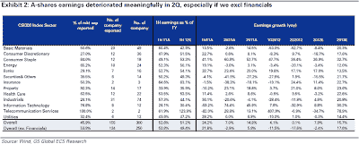

<!--yml
category: 未分类
date: 2024-05-18 04:02:27
-->

# Humble Student of the Markets: Buy Canada, sell Australia

> 来源：[https://humblestudentofthemarkets.blogspot.com/2012/08/buy-canada-sell-australia.html#0001-01-01](https://humblestudentofthemarkets.blogspot.com/2012/08/buy-canada-sell-australia.html#0001-01-01)

I read with some interest the report by Jonathan Tepper of Variant Perception, highlighted by

[John Mauldin](http://www.investorsinsight.com/blogs/john_mauldins_outside_the_box/archive/2012/08/27/australia-running-out-of-luck-down-under.aspx)

and Isabella Kaminska at

[FT Alphaville](http://ftalphaville.ft.com/blog/2012/08/28/1134681/is-australia-in-the-same-boat-as-europe/)

, about the likely long term path for Australia. The report is entitled

[Australia: The Unlucky Country](http://www.variantperception.com/australia-report)

.

In a nutshell, Tepper believes that Australia's problems has two components. The first component consists of too much financial leverage and an over-reliance on external financing, i.e. the kindness of others, which makes its economy an accident waiting to happen. The second component, or the likely trigger of the pending accident, are "a domestic housing market that is one of the most overvalued in the world and a reliance on the Chinese fixed asset investment craze". Should China's growth, in particular its infrastructure growth, slow significantly, then the effects on the Australian economy could be ugly.

Here are a few selected highlights from the report that makes Australia particularly vulnerable to a devastating downturn:

> **Australia net external debt levels resemble those seen in the European periphery**; the currency is fundamentally vulnerable. Australia has been running a persistent current account deficit since 1980 and the country's negative net international investment position is one of the largest in the world. On this background, the strong currency makes no sense and fundamentally the currency is very vulnerable to capital flight from the banking system.
> 
> **Australian banks and corporates rely heavily on foreign funding; the RBA will have to provide liquidity through LTROs.** Structural global deleveraging and stop-go flows add volatility for Australian banks. As the housing market continues to correct, it may be difficult for Australian banks to fund themselves. Lowering interest rates will hurt the margins of the banks, and the RBA will likely be forced into domestic liquidity operations to prop up its banks.
> 
> **Australia's commodity sector is tied to a structurally slowing Chinese economy**. The commodity sector remains a force to be reckoned with in Australia and will remain cyclically tied to China. Still, the Chinese economy is structurally slowing down and this will impact the growth rate of mining and resource related activities in China. Australia is likely sitting on significant overcapacity in the mining sector which will be difficult to transfer to other sectors.

**What's next for China?**

If the economy Down Under is so tied to China, then the obvious question is, "What's next for the Chinese economy?" As I wrote before, it appears that the Chinese authorities are determined to stimulate their economy with the same old formula of infrastructure and export growth, instead of re-balancing economic growth toward their household sector as called for by their latest five year plan (see

[Why is Shanghai falling?](http://humblestudentofthemarkets.blogspot.com/2012/08/why-is-shanghai-falling.html)

)

Premier

[Wen Jiabao's recent statement](http://www.bloomberg.com/news/2012-08-26/wen-says-china-need-measures-to-promote-export-growth.html)

about the urgency to boost export growth is a sign of that

~~desperation~~

determination:

> China’s Premier Wen Jiabao urged extra measures to support exports and help meet economic targets as a decline in industrial companies’ profits added to evidence that the nation’s slowdown is deepening.
> 
> “The third quarter is a crucial period for realizing full-year targets on export growth,” Wen said during an inspection tour of Guangdong, the nation’s biggest exporting province, the official Xinhua News Agency said Aug. 25\. Industrial profits fell 5.4 percent in July from a year earlier, the statistics bureau said today.

As a consequence, I wrote that while top-line revenue growth for Chinese companies have remained relatively healthy, bottom-line profits have fallen - that's why we see the divergence between commodity prices, which have been stable, and the Shanghai Composite, which has been in a downtrend. Also Spracht Analyst confirms my observation by pointing out that

[Chinese corporate earnings have collapsed](http://www.alsosprachanalyst.com/economy/chinese-corporate-earnings-have-been-destroyed.html)

:

> The chart below from Goldman Sachs illustrates the point perfectly. It shows that for A-share companies (CSI 300) which have reported their second quarter earnings, earnings growth on a year-on-year basis for second quarter of 2012 is now hugely negative if we exclude the financials. Meanwhile, profits for MSCI China in the first half increased by a mere 1% yoy, or –5% yoy when financials are excluded.

|  |
| (Click to enlarge) |

**A better way to play Australia**

If investors are so worried about Australia, but want to have exposure to the global sectors that it represents, there is a better way - Canada. The equity markets of both countries are structurally similar, with similar degrees of weighting in resources (though Canada is more energy heavy and Australia is more tilted towards mining).

The chart below of the relative performance of the US-listed Australian (EWA) and Canadian (EWC) equity market ETFs show that EWA at the top of the trading range against EWC. Moreover, we have see a recent turnaround in the relationship in favor of Canadian equities.

A glance at the AUDCAD cross-rate shows a similar level of turnaround in favor of the Canadian Dollar against the Australian Dollar:

Moreover, the Variant Perception report highlighted Australia's vulnerability to external financing and compared its position to eurozone peripheral countries. By contrast, Canada's net international investment position (NIIP) is far better than Australia's and makes it less sensitive to foreign funding needs [the chart annotation is mine]:

> The crisis-stricken economies along the eurozone periphery share one key characteristic: their external debt is too high and their net international investment position (NIIP) - measuring the difference in stock value between assets held abroad and asset held domestically by foreigners - is deeply negative.
> 
> Yet, a closer look and you will find Australia and its neighbour New Zealand in the same company, with negative NIIPs well above countries such as Turkey and Brazil.

Australia sounds like it may be an accident waiting to happen. As for the timing of a downturn, I have no idea when China's economy will hit a serious air pocket, but when it does the Australian economy is going to be toast. For investors looking to get exposure to those global sectors represented by the Australian stock market, Canada is a better bet given the their recent relative performance and risk profiles.

In short, it's may be time to buy Canada and sell Australia and, for the adventurous, buy Canada and short Australia.

*Cam Hui is a portfolio manager at [Qwest Investment Fund Management Ltd](http://www.qwestfunds.com/). ("Qwest"). This article is prepared by Mr. Hui as an outside business activity. As such, Qwest does not review or approve materials presented herein. The opinions and any recommendations expressed in this blog are those of the author and do not reflect the opinions or recommendations of Qwest.* *None of the information or opinions expressed in this blog constitutes a solicitation for the purchase or sale of any security or other instrument. Nothing in this article constitutes investment advice and any recommendations that may be contained herein have not been based upon a consideration of the investment objectives, financial situation or particular needs of any specific recipient. Any purchase or sale activity in any securities or other instrument should be based upon your own analysis and conclusions. Past performance is not indicative of future results. Either Qwest or Mr. Hui may hold or control long or short positions in the securities or instruments mentioned.*