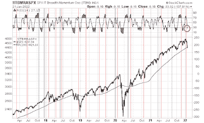

<!--yml
category: 未分类
date: 2024-05-18 01:48:54
-->

# Humble Student of the Markets: Buy the dip, or sell the dead cat bounce?

> 来源：[https://humblestudentofthemarkets.blogspot.com/2022/01/buy-dip-or-sell-dead-cat-bounce.html#0001-01-01](https://humblestudentofthemarkets.blogspot.com/2022/01/buy-dip-or-sell-dead-cat-bounce.html#0001-01-01)

**Preface: Explaining our market timing models** 

We maintain several market timing models, each with differing time horizons. The "

**Ultimate Market Timing Model**

" is a long-term market timing model based on the research outlined in our post, 

[Building the ultimate market timing model](https://humblestudentofthemarkets.com/2016/01/26/building-the-ultimate-market-timing-model/)

. This model tends to generate only a handful of signals each decade.

The 

**Trend Asset Allocation Model**

 is an asset allocation model that applies trend following principles based on the inputs of global stock and commodity price. This model has a shorter time horizon and tends to turn over about 4-6 times a year. The performance and full details of a model portfolio based on the out-of-sample signals of the Trend Model can bsoe found

[here](https://humblestudentofthemarkets.com/trend-model-report-card/)

.

My inner trader uses a 

**trading model**

, which is a blend of price momentum (is the Trend Model becoming more bullish, or bearish?) and overbought/oversold extremes (don't buy if the trend is overbought, and vice versa). Subscribers receive real-time alerts of model changes, and a hypothetical trading record of the email alerts is updated weekly 

[here](https://humblestudentofthemarkets.com/trading-track-record/)

. The hypothetical trading record of the trading model of the real-time alerts that began in March 2016 is shown below.

The latest signals of each model are as follows:

*   Ultimate market timing model: Buy equities*
*   Trend Model signal: Bullish*
*   Trading model: Bearish*

** The performance chart and model readings have been delayed by a week out of respect to our paying subscribers.***Update schedule**

: I generally update model readings on my 

[site](https://humblestudentofthemarkets.com/)

 on weekends and tweet mid-week observations at @humblestudent. Subscribers receive real-time alerts of trading model changes, and a hypothetical trading record of those email alerts is shown 

[here](https://humblestudentofthemarkets.com/trading-track-record/)

.

Subscribers can access the latest signal in real-time 

[here](https://humblestudentofthemarkets.com/my-inner-trader/)

.

**Estimating downside risk**

Last week, I highlighted a sell signal from the intermediate-term breadth momentum oscillator (ITBM). The 14-day RSI of ITBM had recycled from an overbought condition, which was a sell signal for the stock market. In the past, ITBM sell signals have resolved with 5-10% drawdowns and the market bottomed with the ITBM RSI fell to an oversold or near oversold condition.

The S&P 500 fell -5.8% since the sell signal and RSI is oversold. Does this indicate a short-term bottom, or is this the start of a major bear leg?

The full post can be found

[here](https://humblestudentofthemarkets.com/2022/01/23/buy-the-dip-or-sell-the-dead-cat-bounce/)

.