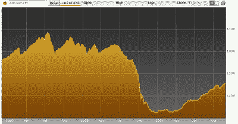

<!--yml
category: 未分类
date: 2024-05-18 00:42:03
-->

# Humble Student of the Markets: Buying hedge funds is still the risk trade

> 来源：[https://humblestudentofthemarkets.blogspot.com/2009/11/buying-hedge-funds-is-still-risk-trade.html#0001-01-01](https://humblestudentofthemarkets.blogspot.com/2009/11/buying-hedge-funds-is-still-risk-trade.html#0001-01-01)

Does the pattern of this chart look familiar? It’s the performance of the HFRX Global Hedge Fund Index, but it could just as well have been the stock market.

This is the two-year anniversary of this blog. My first post was entitled

[what exactly are hedge funds hedging](http://humblestudentofthemarkets.blogspot.com/2007/11/what-exactly-are-hedge-funds-hedging.html)

? I showed that there was a high level of correlation of hedge fund returns to equities and that pattern hasn’t changed.

**Hedge fund bounce-back a facade**

Despite the recovery in performance, not all is well in hedge fund land. The

[Wall Street Journal](http://online.wsj.com/article/SB10001424052748703811604574533532860067804.html)

reports that many managers still can’t charge performance fees. About two-thirds of hedge funds have not recovered from losses of 2008 and are not ready to declare a profit on which managers can take fees, according to a report by Hedge Fund Research. About one-quarter of these funds were 20% short of their best level of performance last year.

Even worse, hedge fund due diligence remain problematical as studies have suggested that

[one in five hedge fund managers are lying](http://dealbreaker.com/2009/10/is-your-hedge-fund-manager-lyi.php)

.

**Fool me once, shame on you...**

Today, hedge funds still represent the risk trade and risk can be proxied in some ways by equities. Should the market correct, then it’s a safe bet that hedge fund returns would turn south as well.

So can someone please remind me why investors are paying 2 and 20 for beta exposure that can be so easily replicated?