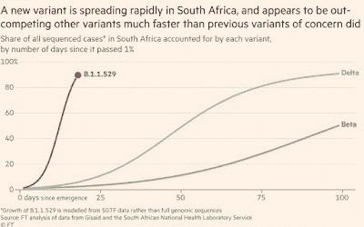

<!--yml
category: 未分类
date: 2024-05-18 01:51:10
-->

# Humble Student of the Markets: COVID Crash 2.0?

> 来源：[https://humblestudentofthemarkets.blogspot.com/2021/11/covid-crash-20.html#0001-01-01](https://humblestudentofthemarkets.blogspot.com/2021/11/covid-crash-20.html#0001-01-01)

**Preface: Explaining our market timing models** 

We maintain several market timing models, each with differing time horizons. The "

**Ultimate Market Timing Model**

" is a long-term market timing model based on the research outlined in our post, 

[Building the ultimate market timing model](https://humblestudentofthemarkets.com/2016/01/26/building-the-ultimate-market-timing-model/)

. This model tends to generate only a handful of signals each decade.

The 

**Trend Asset Allocation Model**

 is an asset allocation model that applies trend following principles based on the inputs of global stock and commodity price. This model has a shorter time horizon and tends to turn over about 4-6 times a year. The performance and full details of a model portfolio based on the out-of-sample signals of the Trend Model can be found

[here](https://humblestudentofthemarkets.com/trend-model-report-card/)

.

My inner trader uses a 

**trading model**

, which is a blend of price momentum (is the Trend Model becoming more bullish, or bearish?) and overbought/oversold extremes (don't buy if the trend is overbought, and vice versa). Subscribers receive real-time alerts of model changes, and a hypothetical trading record of the email alerts is updated weekly 

[here](https://humblestudentofthemarkets.com/trading-track-record/)

. The hypothetical trading record of the trading model of the real-time alerts that began in March 2016 is shown below.

The latest signals of each model are as follows:

*   Ultimate market timing model: Buy equities*
*   Trend Model signal: Bullish*
*   Trading model: Bullish*

** The performance chart and model readings have been delayed by a week out of respect to our paying subscribers.***Update schedule**

: I generally update model readings on my 

[site](https://humblestudentofthemarkets.com/)

 on weekends and tweet mid-week observations at @humblestudent. Subscribers receive real-time alerts of trading model changes, and a hypothetical trading record of those email alerts is shown 

[here](https://humblestudentofthemarkets.com/trading-track-record/)

.

Subscribers can access the latest signal in real-time 

[here](https://humblestudentofthemarkets.com/my-inner-trader/)

.

**COVID panic!**

Global markets took a risk-off tone on Friday when news of a heavily mutated coronavirus variant labeled B.1.1.529, or Omicron, emerged from Southern Africa.

[Nature](https://www.nature.com/articles/d41586-021-03552-w)

reports that South African scientists recently identified a new strain.

> Researchers in South Africa are racing to track the concerning rise of a new variant of the coronavirus that causes COVID-19\. The variant harbours a large number of mutations found in other variants, including Delta, and it seems to be spreading quickly across South Africa.
> 
> A top priority is to follow the variant more closely as it spreads: it was first identified in Botswana this month and has turned up in travellers to Hong Kong from South Africa. Scientists are also trying to understand the variant’s properties, such as whether it can evade immune responses triggered by vaccines and whether it causes more or less severe disease than other variants do.
> 
> “We’re flying at warp speed,” says Penny Moore, a virologist at the University of Witwatersrand in Johannesburg, whose lab is gauging the variant’s potential to dodge immunity from vaccines and previous infections. There are anecdotal reports of reinfections and cases in vaccinated individuals, but “at this stage it’s too early to tell anything,” Moore adds.
> 
> “There’s a lot we don’t understand about this variant,” Richard Lessells, an infectious disease physician at the University of KwaZulu-Natal in Durban, South Africa, said at a press briefing organized by South Africa’s health department on 25 November. “The mutation profile gives us concern, but now we need to do the work to understand the significance of this variant and what it means for the response to the pandemic.”

When COVID-19 first came out of nowhere in early 2020, the global economy shut down and the markets crashed. Could we be seeing the start of COVID Crash 2.0?

The full post can be found

[here](https://humblestudentofthemarkets.com/2021/11/28/covid-crash-2-0/)

.