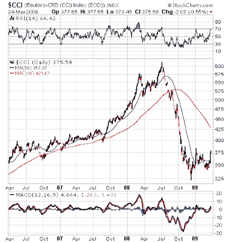

<!--yml
category: 未分类
date: 2024-05-18 00:56:30
-->

# Humble Student of the Markets: CTA performance is another sign of healing

> 来源：[https://humblestudentofthemarkets.blogspot.com/2009/03/cta-performance-is-another-sign-of.html#0001-01-01](https://humblestudentofthemarkets.blogspot.com/2009/03/cta-performance-is-another-sign-of.html#0001-01-01)

I have always been a proponent of understanding models and understanding the assumptions behind models as there are

[no models for all seasons](http://humblestudentofthemarkets.blogspot.com/2008/11/there-are-no-models-for-all-seasons.html)

. Knowing when a model might perform well or not perform well can give an investor insights into the market environment.

I have been watching the performance of the trend following models, as proxied by the returns of the commodity trading advisors, or CTAs. The CTAs, as measured by the

[FTSE CTA Managed Futures Index](http://www.bloomberg.com/apps/quote?ticker=FTHFCTAM%3Aind)

, was one of the few groups of hedge funds that showed positive returns in 2008\. This year their performance has turned negative.

No wonder. A look at the Continuous Commodity Index, which is the continuation of the old CRB Index before its

[re-balancing in 2005](http://www.jefferies.com/cositemgr.pl/html/OurFirm/NewsRoom/PressReleases/2005/20050509press.shtml)

to give greater weight to the more liquid energy complex, shows that commodities prices appear to be stabilizing as a whole. When commodities prices go from trending to flat, trend following models based on moving averages will naturally struggle as they get whipsawed in and out of positions.

Of course, CTAs don’t just invest in commodities, but currencies, interest rate futures, equity indices, etc. Their negative performance YTD is another indication that the financial markets and world economy have stopped their freefall and undergoing a bottoming process (see my previous analysis

[here](http://humblestudentofthemarkets.blogspot.com/2009/03/how-to-spot-bottom.html)

).

There are some caveats to this analysis. First, the FTSE CTA Managed Futures Index is not a perfect proxy for CTA performance. The

[CS/Tremont Managed Futures Index](http://www.bloomberg.com/apps/cbuilder?ticker1=HEDGFUTR%3AIND)

, which reports monthly instead of daily for the FTSE index, showed a different pattern of returns for 2008 but both indices are negative for 2009 so far. Moreover, this indicator was far too early and gave false signals in the equity run-up as the CTAs began to struggle in 2005 and part of 2006, long before the S&P 500 peak in 2007.

**Signs of long-term healing**

In addition to the

[durable goods](http://www.marketwatch.com/news/story/Durable-goods-orders-jump-February/story.aspx?guid=%7BF6B658F2%2DACC6%2D4E1D%2DB5A4%2D3F4A6E38739C%7D)

and

[new home sales](http://www.marketwatch.com/News/Story/new-home-sales-rebound-47-february/story.aspx?guid=%7B86C56D5D%2DCB27%2D4865%2DA082%2DE04F12F17883%7D)

data yesterday, the performance of the CTA and their trend following models is another piece of the mosaic that indicates that we are undergoing a process of global economic healing. While the big picture is suggestive that disaster does not loom ahead, this form of analysis cannot be relied on for short-term market timing and

[does not sound the all-clear signal](http://www.marketwatch.com/news/story/Should-you-stay-market-go/story.aspx?guid=%7BEE6101C6%2D96D1%2D4227%2D9DE8%2D93892DC427B3%7D)

for equity bulls. The equity markets will likely trade sideways with volatile ups and downs over the next few months before a new secular bull can be launched.