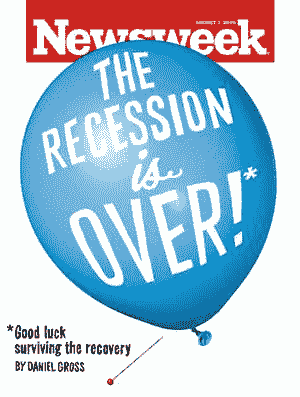

<!--yml
category: 未分类
date: 2024-05-18 00:49:17
-->

# Humble Student of the Markets: Capitulation

> 来源：[https://humblestudentofthemarkets.blogspot.com/2009/07/capitulation.html#0001-01-01](https://humblestudentofthemarkets.blogspot.com/2009/07/capitulation.html#0001-01-01)

The latest Newsweek cover says it all:

**Rosie turns grudgingly bullish?**

In addition, perennial economic bear David Rosenberg allowed in his latest missive that the economy

*might*

be turning around [emphasis mine]:

> [T]here is no doubt that after the sharpest downturn in housing, production and employment since the 1930s, that the laws of gravity themselves prevent the economy from any further deterioration. Nothing is going to zero, and there is always the chance that housing sales edge back up towards their demographic levels, auto sales recover to their replacement demand levels (plus GM getting back into the leasing game), and inventories get rebuilt in line with spending levels. The government has its hands in 40% of the economy and when public sector officials can influence how banks can value their assets, how mortgage servicers should be doing their business, who shall fail in the financial industry and who shall not; and when we have a central bank that is not just the lender but the market of last resort, even for RVs, and a government willing to run up its deficit to levels that would have made FDR blush, ***then*** ***perhaps we can end up seeing a recovery occur sooner than we had thought.***

You can almost hear the agony in his voice as he penned those last few words.

On top of that, Mark Hulbert reported about a week ago that [newsletter market timers were getting too bullish](http://www.marketwatch.com/story/sentiment-rises-back-up-to-dangerous-levels-2009-07-24).

As the S&P 500 rally tests the magic 1,000 level, it’s worthwhile to think about these sentiment data points.