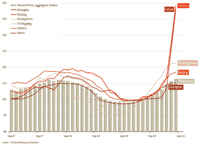
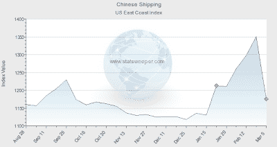
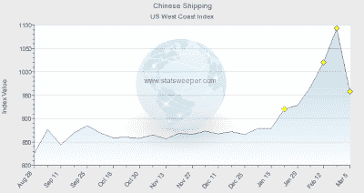

<!--yml
category: 未分类
date: 2024-05-18 00:36:49
-->

# Humble Student of the Markets: China and the double dip recession

> 来源：[https://humblestudentofthemarkets.blogspot.com/2010/03/china-and-double-dip-recession.html#0001-01-01](https://humblestudentofthemarkets.blogspot.com/2010/03/china-and-double-dip-recession.html#0001-01-01)

Further to my last

[post](http://humblestudentofthemarkets.blogspot.com/2010/03/perennial-bear-turns-sanguine.html)

about Stephen Roach turning more sanguine on China and her property bubble, a number of items have created further concerns about the risks of a double-dip recession.

First, the

[WSJ](http://humblestudentofthemarkets.blogspot.com/2010/03/perennial-bear-turns-sanguine.html)

resports that Premier Wen Jiabao warned that the world economy might face a double-dip recession, given financial-system risks and continued high unemployment in some countries.

Meanwhile, there are more and more stories about the Chinese property bubble. Consider this

[tidbit](http://www.businessinsider.com/the-mindblowing-bubble-in-the-miami-of-china-2010-3)

about the Miami-like parabolic move in property prices in Haikou.

**Haikou: The "Miami" of China?**

…or how even

[Time magazine](http://www.time.com/time/magazine/article/0,9171,1971284,00.html)

has picked up the story about the Chinese property bubble. (If Time is focusing on the story, is this contrarian bullish?)

**What pricks the bubble?**

Even though prices may be stratospheric, they may not necessarily come back to earth. Overbought assets can become more overbought, as value investors found out during the Tech craze of the late 1990’s. The question then becomes one of what is the catalyst that pricks the bubble?

Here are some data points that may be of concern. Recent

[data from shipping indices](http://www.oilprice.com/article-shipping-indices-highlight-a-potential-commodities-sell-off.html)

indicates that rates for shipments from China to US East Coast fell 13%

... and to the West Coast fell 12.3%:

Does slowing trade with the US dragging down Chinese exports induce a crash in Chinese property? Or should we

[short a country with $2T in foreign exchange reserves](http://www.nytimes.com/2010/01/13/opinion/13friedman.html)

?

Stay tuned.