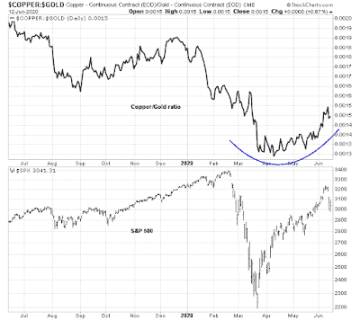

<!--yml
category: 未分类
date: 2024-05-18 02:15:54
-->

# Humble Student of the Markets: China's tough policy choices

> 来源：[https://humblestudentofthemarkets.blogspot.com/2020/06/chinas-tough-policy-choices.html#0001-01-01](https://humblestudentofthemarkets.blogspot.com/2020/06/chinas-tough-policy-choices.html#0001-01-01)

The

[Buttonwood column](https://www.economist.com/finance-and-economics/2020/06/11/the-reasons-behind-the-spectacular-rally-in-metal-prices)

in The Economist had this to say about the recovery in metal prices (before the most recent risk-off episode):

> A pattern in markets is that a lot happens by rote. China’s response to a weak economy is to build; investors’ response to the Fed’s easing is to buy stocks; the algorithms’ response to a weaker dollar is to buy commodities. Higher prices beget higher prices. The sceptics, the too-sooners, note that this also works in reverse. Quite so. But the momentum is now with the believers.

Even as the copper/gold ratio recovers, there are reasons to be skeptical. As a reminder, this ratio is a useful indicator of global cyclicality. Both copper and gold are commodities, and respond to hard asset inflationary pressures. Copper has more industrial uses, and therefore the ratio can be a way of filtering out the hard asset inflation element out of copper prices.

> There is a speculative element to the rise in metal prices, too. Buying or selling copper futures is a popular way to express a view about the world economy. Indeed copper can be all about belief, says Max Layton of Citigroup, a bank. Many of the bets laid on it are by trading algorithms, which mechanically respond to financial signals that have worked well in the past. The dollar, which has fallen by 6% against a basket of currencies since March, is usually part of the semaphore. A weaker dollar allows for easier terms of finance in emerging markets. Anything that helps emerging-market economies is generally good for commodity prices. So the algorithms buy.
> 
> The complex of price changes becomes self-reinforcing. Higher ore prices bring higher-cost producers back to the market. But their profit margins are then squeezed as their home currency appreciates, because that raises the cost of labour in dollars, in which commodities are priced. To restore margins, prices must go up. Moreover, marginal costs rise when the prices of steel (used for mining parts) and oil (used for energy and chemicals) go up. These higher costs push up prices further, says Mr Layton.

What policy choices does China have to revive its economy?

The full post can be found

[here](https://humblestudentofthemarkets.com/2020/06/15/chinas-tough-policy-choices/)

.