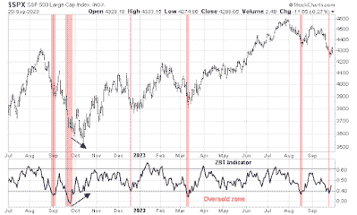

<!--yml
category: 未分类
date: 2024-05-18 01:24:44
-->

# Humble Student of the Markets: Comparing the S&P 500 today to the October bottom

> 来源：[https://humblestudentofthemarkets.blogspot.com/2023/10/comparing-s-500-today-to-october-bottom.html#0001-01-01](https://humblestudentofthemarkets.blogspot.com/2023/10/comparing-s-500-today-to-october-bottom.html#0001-01-01)

**Preface: Explaining our market timing models** 

We maintain several market timing models, each with differing time horizons. The "

**Ultimate Market Timing Model**

" is a long-term market timing model based on the research outlined in our post, 

[Building the ultimate market timing model](https://humblestudentofthemarkets.com/2016/01/26/building-the-ultimate-market-timing-model/)

. This model tends to generate only a handful of signals each decade.

The 

**Trend Asset Allocation Model**

 is an asset allocation model that applies trend-following principles based on the inputs of global stock and commodity prices. This model has a shorter time horizon and tends to turn over about 4-6 times a year. The performance and full details of a model portfolio based on the out-of-sample signals of the Trend Model can be found

[here](https://humblestudentofthemarkets.com/trend-model-report-card/)

.

My inner trader uses a 

**trading model**

, which is a blend of price momentum (is the Trend Model becoming more bullish, or bearish?) and overbought/oversold extremes (don't buy if the trend is overbought, and vice versa). Subscribers receive real-time alerts of model changes, and a hypothetical trading record of the email alerts is updated weekly 

[here](https://humblestudentofthemarkets.com/trading-track-record/)

. The hypothetical trading record of the trading model of the real-time alerts that began in March 2016 is shown below.

The latest signals of each model are as follows:

*   Ultimate market timing model: Buy equities (Last changed from “sell” on 28-Jul-2023)*
*   Trend Model signal: Bullish (Last changed from “neutral” on 28-Jul-2023)*
*   Trading model: Bullish (Last changed from “neutral” on 22-Sep-2023)*

** The performance chart and model readings have been delayed by a week out of respect to our paying subscribers.***Update schedule**

: I generally update model readings on my 

[site](https://humblestudentofthemarkets.com/)

 on weekends. I am also on X/Twitter at @humblestudent. Subscribers receive real-time alerts of trading model changes, and a hypothetical trading record of those email alerts is shown 

[here](https://humblestudentofthemarkets.com/trading-track-record/)

.

Subscribers can access the latest signal in real time 

[here](https://humblestudentofthemarkets.com/my-inner-trader/)

.

#### How much downside risk from here?

The recent downdraft in stock prices left many indicators in severely oversold territory. But how oversold, as oversold markets have been known to fall further. I compare the current technical conditions to the market bottom of October 2022.

Consider, for example, the Zweig Breadth Thrust Indicator. The ZBT buy signal is triggered when the ZBT Indicator moves from oversold to overbought within 10 trading days, which is a rare display of price momentum. Nevertheless, investors can use the ZBT Indicator as a short-term trading signal to spot entry points on the long side. As the accompanying chart shows, oversold conditions on this indicator always resolved in a short-term bounce, with no guarantee of a sustainable rally. The market did become oversold on this indicator last week, but levels were not as severe as the October bottom. In fact, the October bottom was a complex bottom, with the market becoming initially oversold, rallied, fell to another oversold condition, rallied again and weakened to the final bottom. The bottom was signaled by a positive divergence in the ZBT Indicator. None of that is in evidence today.

 

If we were to define the October low readings as the floor, does that mean the market has more downside potential?

The full post can be found [here](https://humblestudentofthemarkets.com/2023/10/01/comparing-the-sp-500-today-to-the-october-bottom/).