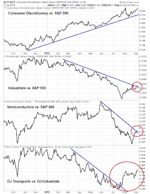
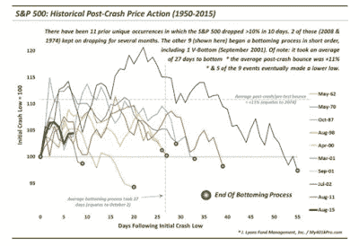

<!--yml
category: 未分类
date: 2024-05-18 03:16:23
-->

# Humble Student of the Markets: Constructive on stocks, but waiting for the re-test

> 来源：[https://humblestudentofthemarkets.blogspot.com/2015/09/constructive-on-stocks-but-waiting-for.html#0001-01-01](https://humblestudentofthemarkets.blogspot.com/2015/09/constructive-on-stocks-but-waiting-for.html#0001-01-01)

**Trend Model signal summary**

Trend Model signal: Risk-off (downgrade)

Trading model: Bearish (downgrade)

The Trend Model is an asset allocation model which applies trend following principles based on the inputs of global stock and commodity price. In essence, it seeks to answer the question, "Is the trend in the global economy expansion (bullish) or contraction (bearish)?"

My inner trader uses the trading model component of the Trend Model seeks to answer the question, "Is the trend getting better (bullish) or worse (bearish)?" The history of actual out-of-sample (not backtested) signals of the trading model are shown by the arrows in the chart below. In addition, I have a trading account which uses the signals of the Trend Model. The last report card of that account can be found

[here](http://humblestudentofthemarkets.blogspot.com/2015/08/trend-model-july-report-card-47.html)

.

**Trend Model signal history**

**Update schedule**

: I generally update Trend Model readings on

[my blog](http://humblestudentofthemarkets.blogspot.com/)

on weekends and tweet any changes during the week at @humblestudent.

**Green shoots**

The Trend Model has finally turned bearish, but one drawback of this class of models is they can be late in reacting to market conditions. Despite the bearish outlook, I am starting to seen "green shoots" indicating that US equities are setting up for a bullish reversal.

We all know the story by now. The markets got spooked by weakness emanating from China. Indeed, both the Shanghai stock market and the stock indices of China's major Asian trading partners all look grim - so grim that every index is in a downtrend and trading below its 200 day moving average (dma).

The market's fear is that Chinese economic weakness will leak abroad and slow global growth. In spite of these fears, I am seeing anomalous behavior from the cyclical parts of the US stock market. Consider these charts of the relative performance of different US sectors and industries below. If the global economy is tanking so badly, why are Consumer Discretionary stocks (top panel) on a tear? More curious are the relative performance of the cyclically sensitive Industrial and Semiconductors, which have rallied out of relative downtrends and appearing to be stabilizing. Last but not least, we mustn't forget the DJ Transports, which was the subject of much angst as its poor performance sparked a Dow Theory sell signal. As the bottom panel shows, the DJTA has turned up and started to outperform the DJIA. Do these look like the signs of a recessionary downturn in the US economy?

Let us not forget commodity prices, which is a key component of the Trend Model as they are sensitive barometers of global growth. While the charts below show that commodity prices have been falling, both the highly cyclically sensitive industrial metals and the more broadly based CRB Index have rallied out of downtrends and started to turn up.

I know that there are lots of bears out there, but how freaked out should we be about China? Is China about to become the Greece of 1H 2015?

**Crowded shorts = Low downside risk**

Further support of my sanguine view comes from sentiment models, which are flashing high levels of fear. While sentiment is not a precise market timing indicator, the weight of the evidence suggests that downside risk is limited and equity buyers are likely to see higher prices on a 6-12 month time frame.

Rather that analyzing surveys of investor outlook, I prefer to focus on data that measures real dollar flows and what people are doing with their money. The latest report from 

[NAAIM](http://www.naaim.org/newsresources/naaim-exposure-index/)

of RIA equity exposure indicates that fear is rising, which is contrarian bullish.

Rydex fund flows are also indicating panic among retail investors. I would note, however, that Rydex data is an imprecise market timing tool. Past instances of such crowded short readings have not indicated THE BOTTOM, Instead, they have resulted in stock markets that have chopped around sideways for several weeks (shaded area) before ultimately rising again.

On the other hand, "smart investors" like insiders continue to buy hand over fist (via

[Barron's](http://www.barrons.com/public/page/9_0210-instrans.html)

).

While any single indicator may be faulty and fail, but taken as a whole, does this look like the start of a bear market to you?

**No bear, just a Panic**

My conclusion is that the current stock market downdraft is a correction, or market panic and does not represent the start of a major bear market. This analysis from JP Morgan Asset Management (via

[Business Insider](http://www.businessinsider.com/characteristics-of-past-bear-markets-2015-7)

) shows the causes of past bear markets, which were marked by recessions or overly aggressive Fed tightening, such as the two raises in September 1987 just before the Crash. None of these conditions are in place today.

[New Deal democrat](http://community.xe.com/blog/xe-market-analysis/weekly-indicators-us-domestic-economy-remains-strong-edition)

, who has monitored the US economy with his interpretation of high frequency economic data, wrote this week that any weakness is concentrated outside the US and the US economy continues to grow (emphasis added):

> This week highlighted the difference between those portions of the US economy most exposed to global forces, which have all turned negative, and those most insulated from global problems, which are all positive, and even strengthening. I suspect that the globe, as a whole, is in recession. ***The bottom line as to the U.S. remains that with good numbers in housing and vehicle sales, and especially with gas prices declining again, I still remain positive through the first half of next year.***

US equity fundamentals continue to be supportive of equity prices. The latest update from

[John Butters](http://www.factset.com/websitefiles/PDFs/earningsinsight/earningsinsight_9.4.15)

of Factset shows that forward EPS estimates are still rising.

Even in 2011, which was the last major corrective episode in US stocks, forward EPS estimates ticked down. Today, forward EPS have flattened out slightly but they continue to rise.

For investors with a time horizon of more than a few weeks, what I have presented is unabashedly good news for stock prices. My inner investor continues to have a buy weakness mindset.

**Waiting for a re-test of previous lows**

For traders, however, the picture is a little bit more clouded. Far too much technical damage has been done to the major averages for the stock market to quickly turn around. A technical opportunity for a V-shaped bottom presented itself last week, but the rally attempt fizzled out (see

[A possible, but rare bull market signal](http://humblestudentofthemarkets.blogspot.com/2015/08/a-possible-but-rare-bull-market-signal.html)

).

A more likely template for the market is likely 2011 or 1998, when stock prices chopped around for several weeks before finally strengthening.

[Dana Lyons](http://jlfmi.tumblr.com/post/128314766925/what-happens-after-a-crash)

 presented analysis of 11 past market "crashes". 2 of 11 fell further (bear markets in 1974 and 2008). One formed a V-shaped bottom (2001) and the other 8 chopped around for an average of 27 days. 

I took the non-bear market instances cited by Lyons and constructed my own chart, with the market bottom indexed at 100 with a 1 standard deviation band around the average and the performance so far in 2015\. If we were to discount the possibility of a prolonged bear market, this analysis of a choppy market is a reasonable approximate roadmap for the current stock market for days and weeks ahead. While this chart does show multiple tests of the bottom in the past, bear in mind that there was a V-shaped bottom in that sample and in 1998 the market came back and tested support only once before rallying again - so don't count on multiple re-tests of the bottom.

Technical analysis of the SPX reveals that negative momentum remains dominant. As the chart below shows, both RSI(5) and RSI(14) remain in downtrends and until those trends are broken, I am inclined to give the bearish view the benefit of the doubt. 

My base case scenario calls for a re-test of the August lows and possibly the October 2014 lows, which translates to a support and target zone of 1820 to 1860\. My inner trader went to cash last week and stepped aside, especially ahead of the binary risk posed by the US Employment Report. He is inclined to short into strength, but mindful of the fact that a bullish reversal is likely to be at hand in the weeks ahead. Given the kind of volatility that we have been seeing, it would not be a total surprise to see the market hit the downside support levels this week and therefore it pays for traders to stay on their toes and define their pain thresholds well ahead of time.