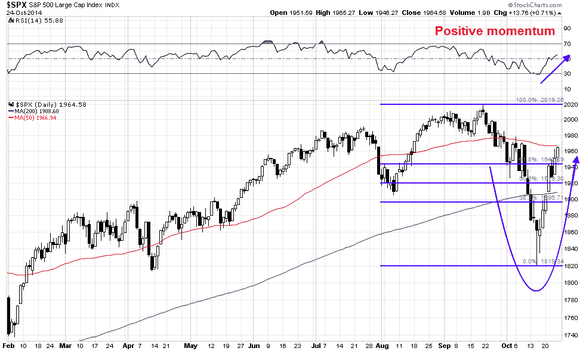

<!--yml
category: 未分类
date: 2024-05-18 03:30:44
-->

# Humble Student of the Markets: Correction, what correction?

> 来源：[https://humblestudentofthemarkets.blogspot.com/2014/10/correction-what-correction.html#0001-01-01](https://humblestudentofthemarkets.blogspot.com/2014/10/correction-what-correction.html#0001-01-01)

**Trend Model signal summary**

Trend Model signal: Risk-off

Direction of last change (trading model): Positive (upgrade)

The actual historical (not back-tested) buy and sell signals of the Trend Model are shown in the chart below:

**Update schedule**

: I generally update Trend Model readings on 

[my blog](http://humblestudentofthemarkets.blogspot.com/)

 on weekends and tweet any changes during the week at @humblestudent. In addition, I have been trading an account based on the signals of the Trend Model. The last report card of that account can be found 

[here](http://humblestudentofthemarkets.blogspot.com/2014/10/trend-model-september-report-1-year-401.html)

.

**A fast-money inspired correction?**

OK, I was wrong (see recent posts

[Getting close to a bottom, but not yet](http://humblestudentofthemarkets.blogspot.com/2014/10/getting-close-to-bottom-but-not-yet.html)

and

[A Bold Forecast: Today was not the bottom](http://humblestudentofthemarkets.blogspot.com/2014/10/a-bold-forecast-today-was-not-bottom.html)

). The Trend Model trading call reversed itself and moved from a bearish to a bullish reading this week (see my tweet

[here](https://twitter.com/HumbleStudent/status/525349757339041792)

). I had been applying a technical analysis approach to the latest round of market weakness when that framework was inadequate for the job.

For the last few weeks, I have been struggling with a rationale for the most recent episode of stock market weakness. Until we can diagnose what went wrong, it's virtually impossible to map of the road ahead. I believe that

[Gavyn Davies](http://blogs.ft.com/gavyndavies/2014/10/19/what-is-global-market-turbulence-telling-us/)

had the most reasonable explanation of what happened:

> Overall, then, three separate factors have probably been at work:
> 
> *   a reversal of speculative positions, which has had temporary effects on asset prices;
> *   a contractionary and deflationary demand shock in the euro area;
> *   an oil shock that will also be deflationary, but will be expansionary for many economies.
> 
> The combined effects of all this should be unequivocally supportive for bonds, but ambiguous or even supportive for some global equity markets.

Note the first point Davies raised about a reversal of speculative positions. In the past week, I have seen a couple of indications that the weakness was attributable to hedge fund re-positioning their portfolios. At the Robin Hood Investors Conference, leading hedge fund investor Paul Tudor Jones was quoted as attributing the recent downdraft to "position clearing" and that he expected further near term volatility (via

[Business Insider](http://www.businessinsider.com/paul-tudor-jones-and-druckenmiller-panel-2014-10#ixzz3HB54S6iD)

):

> As for last week's market activity, Jones said that on Thursday we saw a five standard deviation (that's a volatility measure) kind of movement in one day. He said we would see this kind of volatility in the future.
> 
> Speaking of the volatility of the past two to three weeks, he said that was due to position clearing and that it was similar to October 1998\. (Our source pointed out that's when the Long-Term Capital Management event happened. Jones didn't explicitly say that, though.)

Dan Leob more or less said the same thing. Hedge funds had to de-risk because too many trades were going against them (via

[Zero Hedge](http://www.zerohedge.com/news/2014-10-22/recent-liquidation-avalanche-explained-dan-loeb-and-why-he-back-shorting-stocks-agai)

, emphasis added):

> In early October, a confluence of events transpired in relatively short order, including weaker economic data, political uncertainty, a potential global plague, and bureaucratic meddling, which caused fear to spike, sentiment to decline, and investors to de-leverage. The month got off to an especially rocky start for hedge funds when a court dismissed a claim in connection with the Fannie Mae/Freddie Mac GSE complex. ***Many investors were oversized in this trade and their forced selling kicked off the “de-risking” cycle. Next, oil prices declined sharply and many funds who had large positions in E+P companies suffered enormous losses***. ***Then last week, AbbVie halted its announced inversion transaction with Shire, inflicting great pain on the arbitrage community.*** Opaquely blaming mysterious “meetings with the Treasury Department”, AbbVie walked away from an entirely lawful deal that it had touted as enormously accretive and strategic as recently as two weeks ago, incurring a substantial $1.6 billion break-up fee. A rational conclusion is that instead of a legislative solution that might require comprehensive tax reform, this Administration has decided to unilaterally curb inversions using whatever means are available. Needless to say, this regulatory uncertainty (along with prior detours from the rule of law) will be a wet blanket on top of investors until transparency and a level playing field are restored to the markets.

The hedge fund inspired correction thesis was partly confirmed by comments from

[Credit Suisse](http://www.thefinancialist.com/the-return-of-volatility/)

 (emphasi:

> The de-risking sentiment that prompted investors to dump stocks, however, is likely to lose steam sooner, according to Credit Suisse Head of Flow Equity Derivatives Trading Khoa Le. “A lot of people were caught on the wrong side of market volatility, and ***the majority of flows we saw were essentially closing positions***,” he said on a recent conference call. “***Effectively, you had the buy-side community saying, ‘******We’re out***.’” If volatility spikes again soon, they’ll probably stay out. But if it remains subdued, they will likely feel pressure to come back in.

Against this backdrop, European growth continued to slow. The BoAML Fund Manager Survey showed that institutional managers were overweight eurozone equities and were in the process of reducing their positions.

When the fast money crowd (read: hedge funds) were forced to de-risk and reduce their position sizes, the expectations of slower global growth set off a stampede for the exits.

The panic spread to NAAIM managers, who are RIAs managing individual investors' assets, to panic. They reduced equity exposures to historically low levels, which have since recovered, The last episode of panic and recovery was in 2011\. The key question then becomes, "Can the uptrend in equities continue?"  (via

[Ryan Detrick](http://stocktwits.com/message/28424498)

annotations in white are mine):

The fast money market reaction is exemplified by the events on Thursday night and Friday. Late Thursday, news came across the wire that a

[New York doctor had been diagnosed with Ebola](http://www.bloomberg.com/news/2014-10-23/new-york-gets-first-ebola-case-as-man-brought-to-hospital.html)

. ES futures moved down by about 0.5% virtually instantly, driven no doubt partly by trading algos monitoring news services for keywords and pushing a thin overnight futures market downwards. By contrast, the markets virtually ignored the story about a

[shooting at a high school just north of Seattle](http://www.bloomberg.com/news/2014-10-24/student-opens-fire-at-high-school-near-seattle-two-dead.html)

. (What if the news wires had reported shooter was a local 14 year-old boy who converted to Islam, would the algos have reacted differently?)

**Earnings, earnings, earnings!**

If the scenario that I outlined is correct, then we need to more or less throw out all the technical analysis around the brief correction as it was only a momentary panic. It's time to get back to fundamentals and the real world.

Where does the market stand today? Last week, I highlighted analysis from John Butters of Factset on the US earnings season and outlook. Here is the updated

[Factset](http://www.factset.com/websitefiles/PDFs/earningsinsight/earningsinsight_10.24.14)

chart of how consensus forward 12 month EPS estimates are evolving (annotations in red are mine).

I have highlighted in red previous episodes when the forward 12 month EPS estimates have rolled over. These periods have been associated with either bear markets or corrections as the market digests an uncertain earnings outlook. Further, Butters reported that while both the EPS and revenue beat rates have been better than the historical average, the guidance rate has been negative:

> **Earnings Scorecard:** Of the 208 companies that have reported earnings to date for Q3 2014, 75% have reported earnings above the mean estimate and 60% have reported sales above the mean estimate.
> 
> **Earnings Guidance:** For Q4 2014, 29 companies have issued negative EPS guidance and 8 companies have issued positive EPS guidance.

For investors, the current period of stalling forward EPS growth is not a signal for panic, as forward EPS does not appear to lead the stock market. Rather it seems to be, at best, a coincidental indicator.

Where is the EPS weakness coming from? Diving further into the latest earnings reports and company conference calls, it seems to be coming mostly from worries about European growth. US large cap companies derive a significant portion of their sales overseas and global weakness inevitably weighs down the earnings outlook. Butters highlights company comments about the US, Europe and China. The US outlook remains robust (emphasis added):

> On a quarter-over-quarter basis (SAAR), U.S. economic growth has been inconsistent in recent quarters. In Q4 2013, Q1 2014, and Q2 2014, quarter-over-quarter (SAAR) GDP growth rates for the U.S. were 3.5%, -2.1%, and 4.6%. According to FactSet Economic estimates, quarter-over-quarter (SAAR) GDP growth for the third quarter is estimated to be 3.0%. ***Despite the inconsistency, a number of companies to date have reported strong results from the U.S. and North America in their third quarter earnings releases and conference calls, or see continued strength going forward.***

The worries are mainly about Europe:

> On a quarter-over-quarter basis, economic growth in Europe has been weak in recent quarters. In Q4 2013, Q1 2014, and Q2 2014, quarter-over-quarter GDP growth rates in the Eurozone were 0.3%, 0.2%, and 0.0%. According to FactSet Economic estimates, economic growth in the Eurozone is expected to remain weak, as quarter-over-quarter GDP growth in the Eurozone is estimated to rise 0.2% for the third quarter. ***Companies have generally provided mixed comments regarding Europe. Some companies have commented on deteriorating conditions in Europe.***

Surprisingly, American corporations are not that concerned about growth in China despite the signs of a slowdown:

> On a year-over-year basis, economic growth in China has been declining in recent quarters. In Q3 2013, Q4 2013, and Q1 2014, year-over-year growth GDP growth rates in China were 7.8%, 7.7%, and 7.4%. In Q2 2014, there was a slight uptick in GDP growth to 7.5%. However, year-over-year GDP growth in China dipped back to 7.3% for the third quarter. ***Despite the slowing growth, most companies have been positive in their comments regarding China in their third quarter earnings releases and conference calls.***

**Watch Europe, not just the Fed**

In the coming week, most American investors will be watching the FOMC announcement for clues as to the direction of future policy. While Fed policy is important to the markets, I will be keeping an eye on Europe for clues as to the longer term equity market outlook.

Indeed, the Federal Reserve has shifted its gaze overseas as well as domestically to determine monetary policy. In an unusual turn, New York Fed governor Bill Dudley recently referred to the US Dollar exchange rate in a comment about Fed policy (via the

[WSJ](http://blogs.wsj.com/economics/2014/10/08/grand-central-dudley-elevates-the-strong-dollar-in-the-feds-policy-outlook/)

, emphasis added):

> ***Mr. Dudley has elevated the strength of the dollar and soft global growth as factors affecting the Fed’s policy thinking. He said the strong dollar puts downward pressure on U.S. inflation and dims U.S. near-term export prospects, factors that keep the Fed patient about raising rates even as the job market improves.*** It’s unusual for a senior Fed official to speak so directly about the impact of the currency on his thinking, in part because the currency is supposed to be the domain of the U.S. Treasury.

In a recent 

[speech to the IMF](http://www.federalreserve.gov/newsevents/speech/fischer20141011a.htm)

, Fed vice-chair Stanley Fischer discussed how and why the Fed pays attention to what happens outside US borders:

> ***In a progressively integrating world economy and financial system, a central bank cannot ignore developments beyond its country's borders, and the Fed is no exception.*** This is true even though the Fed's statutory objectives are defined as specific goals for the U.S. economy. In particular, the Federal Reserve's objectives are given by its dual mandate to pursue maximum sustainable employment and price stability, and our policy decisions are targeted to achieve these dual objectives.Hence, at first blush, it may seem that there is little need for Fed policymakers to pay attention to developments outside the United States.
> 
> But such an inference would be incorrect. ***The state of the U.S. economy is significantly affected by the state of the world economy. A wide range of foreign shocks affect U.S. domestic spending, production, prices, and financial conditions. To anticipate how these shocks affect the U.S. economy, the Federal Reserve devotes significant resources to monitoring developments in foreign economies, including emerging market economies (EMEs), which account for an increasingly important share of global growth.*** The most recent available data show 47 percent of total U.S. exports going to EME destinations. And of course, actions taken by the Federal Reserve influence economic conditions abroad. Because these international effects in turn spill back on the evolution of the U.S. economy, we cannot make sensible monetary policy choices without taking them into account.

America is not an economic island:

> Although the effect of the U.S. economy on other countries is of vital importance to this audience, I will briefly digress to remind you that developments in other economies also can have significant spillovers to the United States, which in turn prompt reactions from U.S. policymakers. For example, in the past few years, the deflationary environment in Japan, together with the fallout from the euro-area fiscal crisis, has entailed persistent weakness in those economies, which historically have been among our most important trading partners, are major recipients of our foreign investments, and loom large in the international credit exposures of U.S. banks. These effects have weighed on global growth, which needs to be taken into account in the setting of U.S. monetary policy.

Monetary policy has global spillovers. What the ECB does affects the US and what the Fed does affects the rest of the world:

> Although much of the recent commentary on spillovers has focused on the United States, it bears mentioning that other countries' monetary policy announcements can leave an imprint on international asset prices, with market reactions to new initiatives announced by the European Central Bank (ECB) in the past few weeks the most recent example.13 However, event studies tend to find larger international interest rate spillovers for U.S. policy announcements than for those of other central banks.

No doubt, Fed officials are keeping a close eye on the events in Europe (also see my recent post

[The Draghi Grand Plan 2.0](http://humblestudentofthemarkets.blogspot.com/2014/10/the-draghi-grand-plan-20.html)

 which featured a video of a Mario Draghi speech where he shared the stage with, surprise!, Stanley Fischer).

**A crucial week in Europe**

To put European problems into context,

[Anatole Kaletsky](http://blogs.reuters.com/anatole-kaletsky/2014/10/16/why-markets-ignore-good-news-from-u-s-to-focus-on-bad-news-from-europe/)

wrote that the markets were disappointed by the ECB`s failure to follow the Fed and implement QE:

> The European Central Bank bitterly disappointed investors who had expected the bank to follow the Federal Reserve’s example and announce dramatic monetary measures, combined with a convincing recapitalization of the European banking system, at European Central Bank President Mario Draghi’s press conference on Oct. 2.
> 
> The rout in global stock markets began the day after. Meanwhile, the German government has continued to demand immediate spending cuts from France and Italy while hobbling German industries with Russian sanctions — despite the evidence that both its European austerity drive and diplomatic policies were economically damaging and counterproductive.
> 
> It has begun to look as if Europe may stubbornly refuse to follow the U.S. roadmap for economic recovery. If that happens, the improving U.S. economy can no longer be treated as a leading indicator of European recovery.
> 
> With this, the prospects for the global economy would be much diminished. While the chances of a renewed financial crisis in the euro zone are greatly increased.

Europe is starting to look like 2011 all over again. To be sure, the eurozone was facing an existential crisis in 2011 as it appeared that Greece could have exited the euro during its debt crisis. Then, we saw the crisis and disagreements erupt publicly as summits progressed on an almost weekly basis.

Today, the problem is far more mundane as it faces a period of slowing growth and possibly deflation. While the threat isn`t immediate, the eurozone may be in for a Japanese style Lost Decade. In a separate

[column](http://blogs.reuters.com/anatole-kaletsky/2014/10/24/europes-economic-and-political-future-will-be-determined-in-the-next-few-days/)

 written last Friday, Kaletsky outlined why the next week is crucial to the future of Europe:

> Europe is at a make or break moment. Two very different events on Sunday, occurring at opposite ends of Europe, will largely determine the entire continent’s direction for years ahead: the parliamentary election in Ukraine and the bank “stress tests” and Asset Quality Review conducted by the European Central Bank. Before explaining the significance of these two events, and their unexpected linkage, I need to mention a third announcement, due next Wednesday: the European Commission’s verdict on the budget for 2015 submitted last week by the French government.
> 
> The Commission will next week have to come up with a Solomonic judgment that somehow reconciles the French government’s determination to stimulate its economy by cutting taxes with the German-imposed “fiscal compact” that former-President Nicolas Sarkozy rashly accepted in a moment of desperation in the 2012 euro crisis and which requires France to raise taxes or drastically cut spending in order to reduce its budget deficit to 3 percent of GDP. The fiscal compact rules, if applied literally, would make economic recovery in France a mathematical impossibility. Yet bending these rules will provoke a German public backlash, and perhaps even a constitutional court challenge, that could even force Angela Merkel to renege on her commitment to support the rest of the euro-zone.
> 
> Depending on how these three events turn out, Europe will either be on the road to a moderate economic recovery next year or it will condemned to permanent stagnation, possibly leading to the break-up the euro or even the European Union as a whole.

Personally, I would downplay the threat from the first two events. The markets have largely discounted the Russia-Ukraine situation, much like it has discounted the Hong Kong pro-democracy protests. Nevertheless, there appears to be an upside surprise here as the latest reports indicate that pro-European coalition led by Poroshenko will dominate the new Ukrainian parliament.

> Starting with the Ukrainian election, a victory for President Poroshenko’s moderate party should allow EU leaders to launch a genuine peace process that recognises the loss of Crimea as irreversible and acknowledges Russia’s vital interests in maintaining the military neutrality of its immediate neighbours. Once these basic conditions are satisfied, a rapprochement with Russia should become possible, allowing sanctions to be gradually dismantled or at least confirming that sanctions will expire by mid-2015, as currently legislated. Removing the threat of war or further sanctions in eastern Europe will have a major beneficial effect on businesses in Germany and Italy, which been hurt much more by the confrontation with Russia than European leaders expected.

The Asset Quality Review is important because it is a necessary pre-condition for launching QE:

> Sunday’s completion of the AQR has always looked like a necessary, though not sufficient, condition for a substantial improvement in monetary policy. This is because the ECB wants to stimulate private borrowing, as Britain did with the sub-prime mortgage subsidies it announced in March 2013, rather than supporting public debt, as in U.S. and Japanese quantitative easing. For this plan to work, European banks must be recapitalized and cleaned up, which the AQR is designed to achieve. If Sunday’s AQR plan proves convincing (admittedly still a big “if”) the stage will be set for the ECB to announced some serious monetary stimulus at its next meeting on Nov. 6.

Since he wrote those words, the AQR results have been published and 25 banks failed the tests but 12 have already taken steps to address the capital shortfalls since then. The good news is there are no big German or French banks on either list and the problem banks are concentrated in the troubled peripheral countries, with Spain as the outperforming outlier. All that needs to be raised is €9.5 billion, which is in the low end of estimates.

Kaletsky thinks that we could also see an upside surprise when the Commission reviews the French budget. No doubt, we will at some point see the usual European grand bargain struck behind closed doors, where the letter of the rules are respected but possibly not their intent.

> Finally, a U-turn on fiscal austerity is highly probable when the Commission delivers its verdict on the French budget on Oct. 29, or failing that, in mid-November after a symbolic “re-negotiation” leading to some cosmetic strengthening of French structural reforms.

**Back to 2011?**

If the events of 2011 are to serve as a template for the markets of 2014, then the big question becomes one of where are we in 2011\. Are the markets in the shaded area when stocks tanked, rallied and chopped up and down during the period of uncertainty? Or have we seen, or about to see, the policy response like the LTRO announcement that eventually propelled equity prices to another bull phase?

On one hand, we have started to see a policy response from the authorities. The ECB announced that

[it may consider asset purchases of corporate debt](http://www.reuters.com/article/2014/10/21/us-markets-forex-idUSKCN0IA0CY20141021)

. While it is technically not QE, which buys government debt and a no-no for the Germans, such an action does open the door to the expansion of the ECB balance sheet. As well, we saw a policy response from the Chinese the

[PBoC indicated that it would inject liquidity to the tune of 200 billion yuna](http://www.businessweek.com/news/2014-10-19/china-swaps-drop-a-sixth-day-in-longest-stretch-in-six-months)

on October 17\. At about the same time, St. Louis Fed Governor

[James Bullard](http://www.bloomberg.com/news/2014-10-16/bullard-says-fed-should-consider-delay-in-ending-qe.html)

surprised the market by saying that the Fed should consider delaying the end of QE. Is that enough of a policy response?

The chances of a thaw in the icy Draghi-Merkel relationship may be forthcoming. On one hand, this

[Reuters](http://uk.reuters.com/article/2014/10/23/uk-ecb-germany-insight-idUKKCN0IC1U720141023?feedType=RSS&feedName=everything&virtualBrandChannel=11708)

story outlined Draghi's break with Berlin:

> This tension is most obvious in the relationship between Draghi and Bundesbank President Jens Weidmann, which according to numerous officials who spoke to Reuters on the understanding they would not be identified, has almost broken down. But it goes further than that.
> 
> According to German officials, Merkel felt betrayed by Draghi's speech at a central banking conference in Jackson Hole, Wyoming in August in which he pressed Berlin for looser fiscal policy to stimulate the economy.
> 
> Her entourage is also deeply sceptical about Draghi's plan to buy up asset-backed securities (ABS) and covered bonds in the hope of encouraging commercial banks to lend.
> 
> Most of all, politicians in Berlin worry that if this scheme doesn't work, the ECB president will be tempted to launch full-blown government bond buying, or quantitative easing. This is a taboo in Germany and a step Merkel's allies fear would play into the hands of the country's new anti-euro party, the Alternative for Germany (AfD).

On the other hand, this

[Reuters](http://www.reuters.com/article/2014/10/24/eu-summit-merkel-draghi-idUSB4N0NR01W20141024?irpc=932)

story last Friday indicated that Merkel is softening her stance on fiscal stimulus and went out of her way to praise Draghi and the ECB:

> German Chancellor Angela Merkel thanked ECB President Mario Draghi for spelling out to leaders at an EU summit that governments must play a role in boosting the faltering euro zone economy, and said it was their firm intention to do so.
> 
> "I am very thankful to Mario Draghi for holding up a mirror for us once again," Merkel told a news conference in Brussels on Friday, a day after Reuters reported tensions in the relationship between Berlin and the Italian ECB president.
> 
> "Monetary policy can do some things, that is the job of the independent European Central Bank. But if fiscal policy doesn't react simultaneously, if we don't improve our economic policies, our competitiveness and our investment climate, then we won't come out of this unsatisfactory situation," Merkel said.
> 
> She added that leaders had expressed their "clear intention" to do all this in response to the weak economy.

You have to love European theatre!

**The week ahead**

As we approach the week ahead, the SPX has rallied strongly from a V-shaped bottom. It sliced through the 200 day moving average resistance in a single day and it's now approaching the 50 dma. Momentum indicators remain positive and the 14-day RSI is not yet in overbought territory. Given the violence of the recent up and down moves, I would not be surprised to see some degree of consolidation in the week ahead with pullbacks to test any of the Fibonacci retracement levels or the 200 dma, though a further advance cannot be ruled out. In effect, the markets are normalizing after the downdraft and reversion of the last few weeks.

The behavior of the small cap stocks have also normalized as well. The relative performance chart below of the Russell 2000 against the SPX tells the story. The shaded area shows the outperformance of small caps during the market swoon and their reversal soon after. This pattern is consistent with the hedge fund re-positioning thesis. Many long-short funds buy individual favored stocks and then hedge with short positions in the Russell 2000\. If forced to reduce their positions, they would naturally buy back their Russell 2000 short positions, which put upward pressure on the small cap index during the unwind. When they finished, the relative downtrend of small caps relative to large caps continued.

My inner trader is nervously long and prepared for volatility. My inner investor is asking, "Correction, what correction?"

**Disclosure:**

Long TQQQ