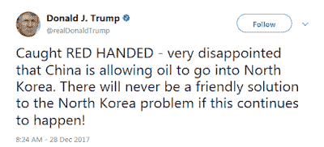

<!--yml
category: 未分类
date: 2024-05-18 02:45:49
-->

# Humble Student of the Markets: Could a Trump trade war spark a bear market?

> 来源：[https://humblestudentofthemarkets.blogspot.com/2018/01/could-trump-trade-war-spark-bear-market.html#0001-01-01](https://humblestudentofthemarkets.blogspot.com/2018/01/could-trump-trade-war-spark-bear-market.html#0001-01-01)

**Preface: Explaining our market timing models**

We maintain several market timing models, each with differing time horizons. The "

**Ultimate Market Timing Model**

" is a long-term market timing model based on the research outlined in our post,

[Building the ultimate market timing model](https://humblestudentofthemarkets.com/2016/01/26/building-the-ultimate-market-timing-model/)

. This model tends to generate only a handful of signals each decade.

The

**Trend Model**

is an asset allocation model which applies trend following principles based on the inputs of global stock and commodity price. This model has a shorter time horizon and tends to turn over about 4-6 times a year. In essence, it seeks to answer the question, "Is the trend in the global economy expansion (bullish) or contraction (bearish)?"

My inner trader uses the

**trading component**

of the Trend Model to look for changes in the direction of the main Trend Model signal. A bullish Trend Model signal that gets less bullish is a trading "sell" signal. Conversely, a bearish Trend Model signal that gets less bearish is a trading "buy" signal. The history of actual out-of-sample (not backtested) signals of the trading model are shown by the arrows in the chart below. Past trading of the trading model has shown turnover rates of about 200% per month.

The latest signals of each model are as follows:

*   Ultimate market timing model: Buy equities*
*   Trend Model signal: Bullish*
*   Trading model: Bullish*

** The performance chart and model readings have been delayed by a week out of respect to our paying subscribers.* **Update schedule**

: I generally update model readings on my

[site](https://humblestudentofthemarkets.com/)

on weekends and tweet mid-week observations at @humblestudent. Subscribers will also receive email notices of any changes in my trading portfolio.

**Staying ahead of the curve**

It is gratifying to be ahead of the curve and anticipate the changes in the market narrative. The two

*themes du jour*

 are

[Jeremy Grantham's call for a market melt-up](https://www.gmo.com/docs/default-source/research-and-commentary/strategies/asset-allocation/viewpoints---bracing-yourself-for-a-possible-near-term-melt-up.pdf)

(see

[Embrace the blow-off, but with a stop-loss discipline](https://humblestudentofthemarkets.com/2017/11/26/embrace-the-blow-off-but-with-a-stop-loss-discipline/)

), and concerns about rising inflation, which I have been writing about endlessly (as an example, see

[Five steps, where's the stumble?](https://humblestudentofthemarkets.com/2017/12/17/five-steps-wheres-the-stumble/)

).

What's next?

How about the risk of rising protectionism? The news site

[Axios](https://www.axios.com/trump-unchained-2520671086.html)

reported that 2018 will bring “full Trump”, with a dramatic change in policy tone after the legislative tax cut victory:

> Trump keeps asking for tariffs — on steel and aluminum, in particular. He wants a trade war, and has for many years. His economic and diplomatic advisers persuaded him to delay trade actions in 2017.
> 
> *   Those advisers recognize that the day of reckoning will come in 2018, regardless of whether economic adviser Gary Cohn and Secretary of State Rex Tillerson — who advocated restraint — stay or go.
> *   Cohn and Treasury Secretary Steve Mnuchin successfully persuaded Trump not to do anything rash while tax reform was being negotiated.
> *   Trump also saw the advantage of trying to use that as leverage with China to get help on North Korea. He said yesterday in an interview with the N.Y Times: "China's hurting us very badly on trade, but I have been soft on China because the only thing more important to me than trade is war. O.K.?"
> *   And he tweeted yesterday, in response to Chinese ships secretly delivering oil to North Korea: "Caught RED HANDED - very disappointed that China is allowing oil to go into North Korea. There will never be a friendly solution to the North Korea problem if this continues to happen!"

The

[Washington Post](https://www.washingtonpost.com/news/wonk/wp/2017/12/27/trump-readying-shock-and-awe-response-on-china-trade-for-2018/)

also reported that the Trump Administration is close to imposing trade sanctions on China in January:

> The Trump administration is setting the stage to unveil tough new trade penalties against China early next year, moving closer to an oft-promised crackdown that some U.S. business executives fear will ignite a costly battle.
> 
> Several corporate officials and analysts closely tracking trade policy said that President Trump is expected to take concrete actions on a range of disputes involving China within weeks.
> 
> Trump is due by the end of January to render his first decision in response to petitions from U.S. companies seeking tariffs or import quotas on Chinese solar panels and washing machines manufactured in China and its neighbors.

The Trump Administration’s newly unveiled National Security Strategy reframes the China relationship in an adversarial fashion. As a result, the latest anticipated pivot on trade policy is therefore not an unexpected development, though the scale of the reaction is likely to surprise the market:

> White House action is due on a separate Commerce Department probe triggered by worries about the national security impact of rising imports of Chinese steel and aluminum.
> 
> “Their intent is to bring shock and awe,” said Scott Kennedy, an expert on Chinese trade at the Center for Strategic and International Studies. “They’re not kidding around.”

My base-case scenario calls for an equity market melt-up, supported by a combination of fundamental growth momentum and technical price momentum. It would end with aggressive Federal Reserve action to cool an overheated economy. In other words, an equity bear market would begin with a classic Fed-induced slowdown.

What if the economic slowdown is not caused by monetary policy but by trade policy? What would happen if the growth outlook slowed because of a trade war? What would be the damage, both to the economy and stock prices?

While I am not forecasting a trade war-induced bear market, good investors engage in scenario modeling in order to be prepared for different possibilities. I explore the ramifications of a trade war as an exercise in investor preparation.

The full post can be found at our new site

[here](https://humblestudentofthemarkets.com/2018/01/07/could-a-trump-trade-war-spark-a-bear-market/)

.