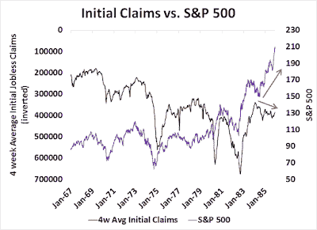

<!--yml
category: 未分类
date: 2024-05-18 03:13:03
-->

# Humble Student of the Markets: Could the job market derail the equity bull?

> 来源：[https://humblestudentofthemarkets.blogspot.com/2015/11/could-job-market-derail-equity-bull.html#0001-01-01](https://humblestudentofthemarkets.blogspot.com/2015/11/could-job-market-derail-equity-bull.html#0001-01-01)

Recently, I have seen more and more concerns raised about the state of the employment market. Specifically, this chart of weekly initial unemployment claims (inverted scale) has had a tight inverse correlation with stock prices. As weekly initial claims are already at 20 year lows  claims will inevitably turn up at some point in the future. Will that rollover derail the stock bull?

[Doug Short](http://www.advisorperspectives.com/dshort/updates/Weekly-Unemployment-Claims.php)

put this data set into much better context with this chart of initial claims normalized by the size of the civilian labor force, which is another indication of how tight the labor market has become.

[Tom McClellan](http://www.mcoscillator.com/learning_center/weekly_chart/housing_starts_-_lumbers_message/)

raised concerns too, though he was looking at the data through the lens of weekly claims compared to lumber prices as an economic barometer.

Regardless, the conclusion is the same. Weekly initial claims are poised to start rising in the very near future.

**Don't go Zero Hedge on me!**

I think everyone should relax and take a deep breath. Sure, the 20 year chart of weekly initial claims data has been highly correlated with stock prices, but this correlation hasn't been as strong in other past periods. I went back to 1965, which was the start of the initial claims data history and analyzed the 1965-1986 period. Stock prices had a rough inverse correlation for much of this study period. Then something funny happened in the mid-1980s as the recovery took hold - stock prices and claims went their separate ways as the inverse correlation broke down. Put it another way, the economy was improving and the labor market tightened, but the stock market shrugged off the labor market effects because of an improving growth outlook.

Fast forward to the 1986-2003 era, we can see this historic relationship breaking down even more. Initial claims started to rise (recall the inverse scale) in the late 1980s, but stock prices did not break down until about a year afterwards. Claims were mostly flat in the 1990s, but stock prices went on a tear. Moreover, there was another episode about 1995 when claims rose but stock prices went up - until the inverse correlation re-asserted itself after the NASDAQ crash.

Here is the chart of the entire history, does anyone really want to rely on this relationship to make an investment conclusion? So relax and don't panic and go all Zero Hedge on me.

Recency bias, anyone?

**A late cycle market**

Here is what I think is going on. I concur with the more nuanced interpretation of current labor market conditions from

[New Deal democrat](http://bonddad.blogspot.com/2015/11/jolts-hires-and-quits-turn-negative-yoy.html)

when he wrote that he was underwhelmed by the JOLTS report because hires were not rising along with job openings.

His key conclusion is the economy is past mid-cycle (translation: late cycle):

> While job openings have skyrocketed, both actual hires and quits stalled, and this month both turned negative YoY for the first time since the 1-month 2012 pause.
> 
> This is an important indication that we are past mid-cycle.

He continued:

> I have also recently started paying more attention to the Fed's Labor Market Conditions Index (blue in the graph below), which appears to be a good leading indicator for YoY payroll growth (red):
> 
> While there were some huzzahs! that there were upward revisions to the last 6 months in this index, the above graph shows that, in context, it is not pointing to strong payrolls growth in the months ahead. Rather, I expect each such report to be lower than the conquerable report one year ago. This simply reinforeces the argument that we are past mid-cycle (as the YoY% growth in jobs generally peak near mid-cycle).

In other words, expect NFP to start weakening and weekly initial claims to start rising. This is all normal behavior for a late cycle economy.

Investors should not panic. In a late cycle market, inflationary pressures start to rise, such as wages which lead to cost-push inflation. Investors should therefore be positioned accordingly in late cycle sectors such as the capital goods and hard asset/resource sectors of the market (see my post 

[Profiting from a late cycle market](http://humblestudentofthemarkets.blogspot.com/2015/11/profiting-from-late-cycle-market.html)

).

The bull is still alive - at least for a few more months.

**Blog Notice**

As regular readers are aware, this

***Humble Student of the Markets***

blog will become a subscription driven site on December 1 (see

[Why this isn't investment advice (and a site update)](http://humblestudentofthemarkets.blogspot.com/2015/11/why-this-isnt-investment-advice-and.html)

). I have an Early Bird discount offer to readers and you can get on the list for that offer if you email me at cam at humblestudentofthemarkets dot com. (If you have already emailed me in the past or responded through my previous survey, there is no need to do so.)

Media, press professionals and blog aggregators with email domains confirming their affiliations are invited to apply for free subscription access (cam at humblestudentofthemarkets dot com).

Please watch this space for more updates as they are available.