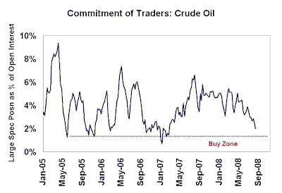
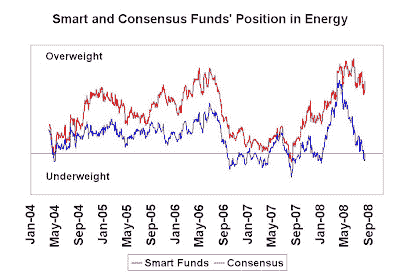

<!--yml
category: 未分类
date: 2024-05-18 01:06:15
-->

# Humble Student of the Markets: Crude oil close to a bottom

> 来源：[https://humblestudentofthemarkets.blogspot.com/2008/08/crude-oil-close-to-bottom.html#0001-01-01](https://humblestudentofthemarkets.blogspot.com/2008/08/crude-oil-close-to-bottom.html#0001-01-01)

In contrast to my

[last post on gold](http://humblestudentofthemarkets.blogspot.com/2008/08/gold-correction-has-further-to-run.html)

indicating that the correction in bullion has further to go, the sentiment picture for crude oil is far more constructive. I now have doubts as to whether my near term

[$100 oil call](http://humblestudentofthemarkets.blogspot.com/2008/07/100-oil-before-150-but-200-before-50.html)

will come to pass.

**Investor sentiment now very negative** 

Sentiment

[surveys](http://www.sentimentrader.com/subscriber/charts/WEEKLY/SURVEY_CRUDEOIL.htm)

on crude oil show that readings are now at bearish extremes, which is contrarian bullish. In addition, the CFTC Commitment of Traders

[data](http://www.cftc.gov/marketreports/commitmentsoftraders/index.htm)

shows that large speculators, or hedge funds, have sold down their crude oil positions near levels where bottoms are seen. Indeed,

[COT Timer](http://cotstimer.blogspot.com/2008/08/new-signals-for-crude-bullish-russell.html)

has flashed a buy signal for crude oil this week.

My estimate of mutual fund positioning is also encouraging for the energy sector. Consensus mutual funds have sold down their energy holdings to a market weight from an overweight position. By contrast,

[smart funds](http://humblestudentofthemarkets.blogspot.com/2008/02/smart-money-postured-for-recession.html)

remain overweight the sector.

**Long term bullish on oil**

I have stated the case to be long-term bullish on oil

[before](http://humblestudentofthemarkets.blogspot.com/2008/08/more-constructive-on-crude-oil.html)

. In addition to those reasons, Barry Ritholtz at

[Big Picture](http://bigpicture.typepad.com/comments/2008/08/chart-of-the-da.html)

found a great chart showing the growth path of world GDP and oil demand as another reason to be long-term bullish on crude.

**Volatility a function of tight supply?**

Commodities have always been volatile. Recently the oil price has been more volatile than usual with the market seeing regular $3-5 daily swings. Kurt Cobb postulated that

[queueing theory could explain oil's wild price swings](http://resourceinsights.blogspot.com/2008/08/does-queueing-theory-explain-oils-wild.html)

. You could also argue that the current tight supply condition is acting like an inventory control model. The shifts in demand and the fact that incremental production can be brought on at much lower pricing, though with a lead time, suggest that the level of minimum inventory is highly variable. Include the fact that some of the investments are highly levered also adds to the volatility of minimum inventory level.

**Buy oil/short gold?**

Given these conditions on

[gold](http://humblestudentofthemarkets.blogspot.com/2008/08/gold-correction-has-further-to-run.html)

and oil traders could consider buying crude oil and shorting gold. Note that this is a

***tactical trading call***

and there are considerable risks involved. Most notably, the chart of the oil to gold ratio below shows that oil is already extended in favor of oil.