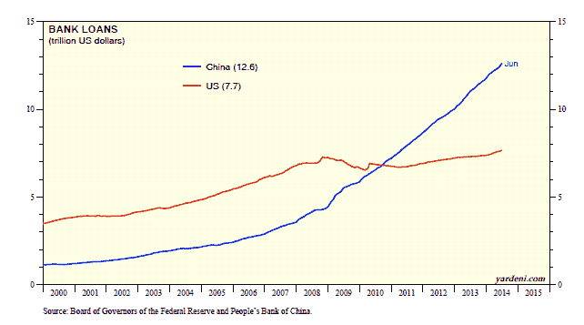

<!--yml
category: 未分类
date: 2024-05-18 03:36:34
-->

# Humble Student of the Markets: Dissecting the bull case for China

> 来源：[https://humblestudentofthemarkets.blogspot.com/2014/07/dissecting-bull-case-for-china.html#0001-01-01](https://humblestudentofthemarkets.blogspot.com/2014/07/dissecting-bull-case-for-china.html#0001-01-01)

Regular readers will know that I have been relatively cautious on the outlook for China. But despite recent dire headlines such as

[China debt surges to 251% of GDP](http://www.businessinsider.com/chinas-total-debt-surges-to-251-of-gdp-2014-7)

, China has not crashed. What`s more, I have seen a number of bullish calls on Chinese and Asian equities. Here is one example (via

[CNBC](http://www.cnbc.com/id/101794428)

):

> "We have been cautious on China for most of the past three years," Guy Stear, head of research for Asia at Societe Generale, told CNBC.
> 
> But this year, he's been "very impressed" by the government's reform measures.
> 
> "That's made us a little more comfortable that the valuations are worth it," he said, adding that Societe Generale has turned bullish. "The valuations are quite cheap," Stear said.
> 
> Comparing valuations between U.S. and China shares on a price-to-book and medium-term economic growth basis, "you're probably talking about a valuation difference of four to one," he said.

A

[Morningstar interview](http://www.morningstar.com/cover/videocenter.aspx?id=651971&lineup=mutualfunds)

with Oppenheimer manager Justin Leverenz indicates that he is bullish on the China growth theme:

> I think the most interesting theme at the moment is everything associated with the great concern about China. And those have many different facets.
> 
> What we've seen, of course, is that China has been this unbelievable growth story for the last decade, but equities have been probably the worst major bourse in the world. And selectively, we're now starting to see some opportunities emerge alongside this because the pessimism is far too great, and there are some really extraordinary companies, which is really what we're focused on.
> 
> The second issue in terms of China is opportunities for extraordinary global businesses that have a large part of their franchise in China. As you know, I typically have about 10% of my fund in developed-markets companies that domiciled in developed markets, but have their principal growth engines or principal assets and earnings and cash flow associated with the developing world, largely China in many cases.
> 
> Companies like Pernod or Prada have some really extraordinary prices associated with, again, concerns about the Chinese durability of the economy. Actually there are more recent concerns about anti-austerity measures which have taken away part of the gifting market in that segment. But these are incredibly durable businesses with relatively low penetration. And I think one of the great themes in the world is not the emerging-markets middle class, but the Chinese middle class, and part of that's associated with tourism and increased leisure and spending.
> 
> So, I think all things related to pessimism about China really is maybe the most interesting near-term theme we're looking at, or subtheme.

From a technical viewpoint, Peter Brandt wrote that

[Asia — The Tigers are Ready to Roar](http://peterlbrandt.com/asia-tigers-ready-roar/)

. Here is the key conclusion:

> Asian equity markets are on the verge of explosive advances. Investors and traders need to find ways suitable to their investment strategy to have significant long exposure in Asian equities.

[The Short Side of Long](http://shortsideoflong.com/2014/07/global-stock-markets/)

recently pointed to the rising bearishness over China but the resilience of the Shanghai Composite as an indication to turn cautiously bullish:

> The truth is, Chinese mainland stock market is incredibly oversold. After peaking in 2007 at around 6000 points, the index finds itself 66% lower 7 long years later. Furthermore, since 2009, Shanghai Composite has failed to staged a multi-quarter rally. Constantly bombard by bad news and a sideways trending market, investors have surely forgotten that Chinese stocks can actually go up, too.

While I remain somewhat cautious on China, every good investor should always examine the other side of his views and this post is an attempt to review the bull case for the Middle Kingdom.

**China's policy dilemma**

I have outlined Beijing's policy dilemma before (see

[China, beyond the hard/soft landing debate](http://humblestudentofthemarkets.blogspot.com/2012/07/china-beyond-hardsoft-landing-debate.html)

). Here are the basics:

> **The roots of China's growth**
> The China miracle was fueled mainly by two factors:
> 
> 1.  Access to a cheap source of labor and the willingness to use it as a source of competitive advantage to grow the economy; and
> 2.  The CNYUSD currency peg.
> 
> While the currency peg allowed Chinese labor to be highly competitive, it also created all sorts of nasty side effects. First and foremost, China was stuck with America's monetary policy, which was inappropriate for China. As the Chinese economy heated up and inflation rose, Chinese interest rates could not rise with inflation and inflationary expectations because of the currency peg. Thus, real interest rates went negative.
> 
> Negative real interest rates created winners and losers. The winners were the companies with easy access to capital, which were mostly the SOEs at the expense of private businesses, which are often referred to as Small and Medium Enterprises (SMEs). An academic paper called [A Model of China’s State Capitalism](http://papers.ssrn.com/sol3/papers.cfm?abstract_id=2061521) (h/t [Michael Pettis](http://www.mpettis.com/2012/06/19/debating-growth-in-china/)) that shows that the dominance of SOEs and their superior growth is largely attributable to their monopolistic or semi-monopolistic positions in the Chinese economy, e.g. telecom, oil refining. etc. John Hempton called this arrangement [a kleptocracy](http://brontecapital.blogspot.com.au/2012/06/macroeconomics-of-chinese-kleptocracy.html) because Party insiders have become enormously wealthy at the expense of the ordinary citizen.
> 
> Negative interest rates also meant very low or negative cost of capital. As Japanese companies found out in the late 1980's, it's easy to make money when your cost of capital is that low. You borrow as much as you can and invest in something, anything with a positive real return. If you are positioned properly, you can make obscene profits - and they did.
> 
> **Currency peg = Financial repression**
> The biggest loser in China, on a relative basis, was the household sector. The ordinary Chinese who worked hard and managed to squirrel away savings had few places to put their money other than the banking system. The Chinese bond market is not sufficiently large. The stock market is very small and undeveloped compared to major industrialized countries and is regarded mostly as a casino. The household sector was forced to put money into the banking system at negative interest rates. Carmen Reinhart calls that ***financial repression***. Here is the definition from [Wikipedia](http://en.wikipedia.org/wiki/Financial_repression):
> 
> > Reinhart and Sbrancia characterise financial repression as consisting of the following key elements:
> > 
> > > 1.Explicit or indirect capping of, or control over, interest rates, such as on government debt and deposit rates (e.g., Regulation Q).
> > > 2.Government ownership or control of domestic banks and financial institutions with simultaneous placing of barriers before other institutions seeking to enter the market.
> > > 3.Creation or maintenance of a captive domestic market for government debt, achieved by requiring domestic banks to hold government debt via reserve requirements, or by prohibiting or disincentivising alternative options that institutions might otherwise prefer.
> > > 4.Government restrictions on the transfer of assets abroad through the imposition of capital controls.
> 
> John Hempton at [Bronte Capital](http://brontecapital.blogspot.com.au/2012/06/macroeconomics-of-chinese-kleptocracy.html) outlined the dilemma of the Chinese household well:
> 
> > The Chinese lower income and middle class people have extremely limited savings options. There are capital controls and they cannot take their money out of the country. So they can't invest in any foreign assets.
> > 
> > Their local share market is unbelievably corrupt. I have looked at many Chinese stocks listed in Shanghai and corruption levels are similar to Chinese stocks listed in New York. Expect fraud.
> > 
> > What Chinese are left with is bank deposits, life insurance accounts and (maybe) apartments.
> 
> For those ordinary Chinese citizens who could afford it, the only logical place for savings is in real estate. Real estate became a form of money and savings poured into it. In effect, the CNYUSD peg was indirectly responsible for China's property boom.
> 
> **Where we are today**
> Fast forward to today. China's growth has hit a slow patch. One of the objectives in the Party's latest five-year plan calls for a re-balancing of growth away from heavy infrastructure spending, which has benefited SOEs, to the consumer (read: household sector). [Andy Xie](http://articles.marketwatch.com/2012-07-02/economy/32506934_1_tax-cuts-asset-slowdown) described the slowdown and how the authorities have managed to contain the worst effects of the downturn:
> 
> > There are no widespread bankruptcies. The main reason for this is government-owned banks not foreclosing on delinquent businesses. Of course, banks may have more bad assets down the road, which is the cost for achieving a soft landing.
> 
> SOEs, the vehicle of wealthy Party insiders, have been hit hard:
> 
> > State-owned enterprises (SOEs) reported 4.6% net profit margin on sales and 7.4% return on net asset in 2011\. Both are very low by international standards. In the first five months of 2012, SOEs reported a 10.4% decline in profits but 11.3% increase in sales.
> > SOE performance indicators are low and declining. This is despite the fact that SOEs have such favorable access to financing and monopolistic market positions.
> 
> Xie also echoed Hempton's kleptocracy claims, though in a less dramatic fashion:
> 
> > Closer observation gives clues as to why SOEs are so inefficient. Their fixed investment often costs 20% to 30% more than that for private companies and take about 50% longer to complete. The leakage through overpriced procurement and outsourcing and underpriced sales is enormous. SOE leakage can explain much of the anomalies in China.
> 
> In addition to the problems presented by slowing growth, the financial system is teetering because of an over-expansion of the shadow banking system (see my previous comment [Ominous signs from China](http://humblestudentofthemarkets.blogspot.ca/2012/06/ominous-signs-from-china.html)). Left unchecked, it could have the potential for a crash landing, i.e. negative GDP growth, which is not in anybody's spreadsheet model.

**How do you end financial repression?**

The key to re-balancing growth is to end, or at least, ease the effects of financial repression on the household sector. But ending financial repression would directly hit the wallets of Party cadres. Consider, as an example, this

[Bloomberg](http://www.bloomberg.com/news/2014-07-01/chinese-families-pay-16-000-for-kids-to-pass-army-entrance-exam.html)

story of how people try to bribe their way into the People's Liberation Army, or PLA:

> “It’s impossible to weed out corruption at the basic level, because it’s embedded in the culture,” said retired Major General Xu Guangyu, a senior researcher at Beijing-based research group the China Arms Control and Disarmament Association. “The central leadership knows corruption is the number one enemy the army faces, and if strong-handed measures aren’t taken, it would weaken the army’s capabilities to fight a modern war.”

That's because the incentives for corruption is ever present (emphasis added):

> While entering the military provides a stable income, the incentive for corruption after joining remains. New recruits get a yearly package of around 25,000 yuan ($4,031) in Beijing and 15,600 yuan in rural areas such as Haiyan county in Zhejiang province, according to state media. ***Inspectors in April in two major military regions -- Beijing and Jinan -- said they found “irregularities” in the handling of promotions, construction and allocation of military buildings, and misuse of assets, especially land, the official Xinhua News Agency reported.***

Notwithstanding what happens in the PLA, the temptation and opportunities for Party officials to line their own pockets is even bigger in SOEs. Sara Hsu, writing in

[The Diplomat,](http://thediplomat.com/2014/06/chinas-changing-state-owned-enterprise-landscape/)

outlined the problem of Chinese SOEs:

> The tight interconnection between state apparatus and economically critical firms has had other repercussions besides low efficiency. The National Audit Office recently uncovered fraud in 11 SOEs, finding that some managers spent company funds on luxury goods and entertainment. This is in addition to 35 cases of bribery and embezzlement uncovered earlier this year. Corruption associated with SOEs and, more broadly, state assets owned by the “princelings” and other cronies has recently been exposed in a comprehensive state crackdown on corruption.

**"Reform" starts with an anti-corruption drive**

Many western analysts misunderstand the term "reform" when it comes to China. They think in terms of westernized institutions, such as transparency, property rights, democracy, etc. For Beijing and President Xi Jinping in particular, reforms starts with a consolidation of power through an anti-corruption drive. Otherwise, no financial reforms are possible because Beijing would issue edicts and the bureaucracy would resist.

In a recent

[WSJ](http://online.wsj.com/news/articles/SB10001424052702304587704579585811299776036?mg=reno64-wsj&url=http%3A%2F%2Fonline.wsj.com%2Farticle%2FSB10001424052702304587704579585811299776036.html)

article, Anne Stevenson-Yang and Ken DeWoskin explained these concepts:

> China analysts have missed the story by peering at the landscape of reform and trying to find step-by-step progress toward economic liberalization. The disjunction between foreign and domestic understanding of what constitutes "reform," in fact, illuminates a fundamental misunderstanding of foreign commercial involvement. In today's post Third Plenum China, "reform" means to sideline and squash institutionalized bureaucracy and inject personal power into a sclerotic system. It means cutting through the layers of paperwork that invite bribery.
> But what China has never had and never meant by its use of the word "reform" is the codification in law and practice of rules to govern transparently and at scale a growing economy. Rules are seen as stultifying, an impediment to the ability of the core ruling class to impose its will. The color of China's huge library of new laws, rules, and regulations is gray, leaving broad license for administrators to enforce them. The consequence is a large measure of chaos in the actual regulation of industry and commerce.

The true "reform" came from the concentration of power in the hands of Xi Jinping:

> Yet the true and dramatic reforms are already laid out in plain sight; observers were simply looking for the wrong thing. The most sweeping of changes was a major restructuring of power, the formation of two new super-ministerial committees, one for foreign and domestic security and one for economic reforms, which, in actuality, were designed to override the machinery of government. After a period of lively speculation about who would head these committees, it was announced that Xi Jinping would head them both.

**The hopeful bull case for China**

That`s where the hopeful bull case for China begins. In the past, the leadership has launched "show" anti-corruption campaigns. This time, it seems to be real and the aim is to consolidate power at the top so that Xi can launch the real "reform" campaign of economic liberalization to re-balance economic growth.

Consider these stories that have come across my desk in the past few weeks. From

[Foreign Policy](http://www.foreignpolicy.com/articles/2014/07/03/China_officials_purge)

:

> In late June, the Chinese Communist Party [expelled](http://www.nytimes.com/2014/07/01/world/asia/china-moves-against-one-of-its-top-leaders.html?_r=0) Xu Caihou, who before his retirement in 2012 was one of the highest ranking members of China's military the People’s Liberation Army (PLA). Xu had been accused of taking bribes, and "gravely violating party discipline." A former vice-chairman of the Central Military Commission, the body that oversees the PLA, Xu is the highest ranking military official to be publically accused of corruption in at least 35 years. Simply put, this is a big deal.
> 
> Xu’s ouster comes on the heels of a host of dismissals and investigations of other occupants of top political offices since Xi Jinping became China’s leader a year and a half ago. A top Chinese investigative magazine Caixin recently published a [graphic list](http://english.caixin.com/2014-07-01/100698219.html) of these key targets in Xi’s anti-corruption campaign; Chinafile has adapted it, adding its own research, to create this interactive timeline.

From

[Bloomberg](http://www.bloomberg.com/news/2014-06-23/china-charges-former-planning-ministry-head-over-large-bribes-.html)

:

> China filed graft charges against the former deputy director of the economic planning ministry, saying he illegally received money and goods in bribes.
> 
> Liu Tienan, 59, former deputy head of the National Development and Reform Commission, was accused of seeking gain for others, a statement on the Supreme People’s Procuratorate said yesterday. The case was filed with the People’s Intermediate Court in Langfang city in central China’s Hebei province, it said. The procuratorate described the bribes as “extremely large.”

From the

[South China Morning Post](http://www.scmp.com/comment/insight-opinion/article/1136841/chinas-household-registration-system-tool-corrupt-officials)

:

> An ancient Chinese aphorism says a wily hare has three burrows. Gong Aiai , a former bank executive in Shaanxi's Shenmu county, went one better, using four identities to build up a Beijing property portfolio worth more than one billion yuan (HK$1.24 billion).
> 
> At first, internet users revealed that the 49-year-old former deputy chief of Shenmu Rural Commercial Bank had used two names, two identity cards and two hukou (registered household addresses) to buy 20 properties in the capital.
> 
> Gong, once reputed to be the coal mining county's richest woman, said she thought it was auspicious to have two names and she had just been silly and ignorant. She said the properties were bought with her family, using money from coal mining.
> 
> Shenmu police said it was a registration error and the extra hukou was revoked.
> 
> People found this hard to swallow and they were proved right when further tip-offs led the media to report that Gong actually had four ID cards and four hukou, three in Shenmu county and one in Beijing.

Another tale of corruption of Party officials from the

[South China Morning Post](http://www.scmp.com/news/china/article/1555302/graft-ridden-ex-party-bosses-xining-and-kunming-ejected-communist-party)

:

> China's ruling Communist Party said today it had expelled two more former senior officials for corruption, laying the way for their prosecution, as the government continues a high-profile campaign against deep-rooted graft.
> 
> The party's anti-corruption watchdog said in brief statements that Mao Xiaobing, former party boss of the western city of Xining, and Zhang Tianxin, former party chief of the southwestern city of Kunming, had “serious discipline problems”.
> 
> “The investigation found that Mao Xiaobing took advantage of his post to seek profits for others, demanded and took a huge amount of bribes and committed adultery,” the watchdog said in a statement.
> 
> Party members, especially senior officials, are supposed to be morally upstanding and adulterous affairs are considered a serious breach of party discipline.
> 
> Mao, whose investigation was announced in April, will be handed over to judicial authorities for prosecution, the watchdog said. He has also been sacked.
> 
> The former Kunming official, Zhang, also abused his official position, with his dereliction of duty causing “a loss of state assets”, the party said.
> 
> It did not say if he had been handed over to the prosecutors, but that is the most likely next step.

The anti-corruption campaign appears to be in full swing. The

[Washington Post](http://www.washingtonpost.com/world/asia_pacific/secretive-agency-leads-most-intense-anti-corruption-effort-in-modern-chinese-history/2014/07/02/48aff932-cf68-11e3-937f-d3026234b51c_story.html)

reported Xi has relied on a special anti-corruption group to pursue wrongdoers:

> The institution has an obscure name — the Central Commission for Discipline Inspection. But in the year and a half since Xi Jinping became China’s leader, it has become his main weapon in an anti-corruption campaign that has gone further than any other in the country’s modern history.
> 
> The campaign is meant to clean up the party’s image — so soiled by graft that some leaders fear public contempt could threaten their grip on power. It also appears aimed at consolidating Xi’s power. He has used the commission to weaken rival factions and, more broadly, to warn off anyone who might challenge his agenda.

The commission has extraordinary powers, much in the way the

~~Holy Inquisition~~

 *ahem* 

[Congregation of the Doctrine of the Faith](http://en.wikipedia.org/wiki/Congregation_for_the_Doctrine_of_the_Faith)

 had powers:

> The Chinese commission has far more latitude than those U.S. agencies and is much more politicized. It operates entirely outside the legal system, as a Communist Party justice mechanism. Its investigators need no warrants to seize evidence. And it has the power to imprison and interrogate any party official.
> 
> Although the worst official punishment the commission can mete out is booting cadres from the party, its investigations are often transferred after the fact to the judicial branch, where the expelled officials usually receive heavy sentences.
> 
> The commission now appears poised to take down its biggest target yet: [Zhou Yongkang](http://www.washingtonpost.com/world/chinese-vice-minister-under-investigation-by-communist-party-in-anti-corruption-campaign/2013/12/20/fa639cfc-6996-11e3-ae56-22de072140a2_story.html), once a member of the top standing committee headed by Xi.

The takedown of Zhou Yongkang is unprecedented in modern Chinese history. One analyst likened it to the Obama Administration taking down the circle of Dick Cheney with criminal, tax and other investigations, starting with his friends, his associates, his family (e.g., Liz Cheney) and finally the former vice-president himself.

**The next step is easing financial repression**

The anti-corruption drive is a necessary first step to end, or at least ease, the effects of financial repression for the household sector in China. Since the state-owned sector has reaped the lion's share of the benefits from past growth, it appears that Xi needs to curtail their power before the real task of financial liberalization can begin.

This Bloomberg story entitled

[China’s Repression of Savers Eases](http://www.bloomberg.com/news/2014-07-01/china-s-repression-of-savers-eases.html)

shows that the process is already underway:

> The extra interest Yin Xuelan earned last year by socking her savings into wealth management products instead of bank deposits paid for a tour of Taiwan and a microwave oven.
> 
> “I didn’t need to go to Taiwan and I didn’t need to buy a microwave oven, but with this extra money, why not?” said retired schoolteacher Yin, 60, as she put receipts into her pink purse at an Industrial + Commercial Bank of China Ltd. branch in central Beijing. “It’s like free money.”
> 
> Yin is a beneficiary of an easing in China’s financial repression, a term that describes the way savers have suffered artificially low returns on deposits in order to provide cheap loans for investment. Measures used for the size of the toll -- such as inflation-adjusted deposit rates, the gap between rates on loans and the pace of economic growth -- have shifted in favor of savers in the past four years.
> 
> The burden has dropped to the equivalent of about 1 percent of gross domestic product annually from 5 percent to 8 percent as recently as three to four years ago, estimates Michael Pettis, a finance professor at Peking University. (618) That’s a shift of as much as 2.6 trillion yuan ($420 billion) to households from borrowers from 2010 to 2013\.

The effects of financial repression are easing and SOEs are bearing a greater burden:

> Financial repression, a concept detailed in 1973 by Stanford University economists Ronald McKinnon and Edward Shaw, refers to policies that force savers to accept returns below the rate of inflation and that enable banks to provide cheap loans to companies and governments, reducing the burden of their debt repayments.
> 
> A sustained easing would channel more of China’s wealth to the average person while squeezing bank margins and the debt-fueled investment that’s evoked comparisons with the excesses that generated Japan’s lost decades and the Asian financial crisis. On the flip side, slimmer bank profits may add to risks for an industry grappling with the fallout from record lending in the aftermath of the global financial crisis.
> 
> “Many local governments and state enterprises have made low-return investments based on the low-cost funding,” said David Dollar, a former U.S. Treasury Department official in China who is now a senior fellow at the Brookings Institution in Washington. “As the cost of capital rises, some of them no doubt will have difficulty servicing their debts and may even be pushed into bankruptcy.”

One of the goals is to move the economy towards a more market based economy:

> Chinese authorities are transitioning from a system of state-directed credit to one where markets play what Communist Party leaders term a “decisive” role in pricing capital. A floor was removed from lending rates in July 2013 and People’s Bank of China Governor Zhou Xiaochuan said in March that deposit rates will be liberalized in one to two years.

**China's short-term challenges**

In short, what I have outlined are the hopeful bullish signs for China's growth outlook. The anti-corruption drive throws the bureaucracy off-balance and enables the Beijing leadership to effect market-based reforms and to re-balance the source of growth from the same-old-same-old credit driven infrastructure driven growth to consumer-driven growth. To do that, Xi needs a re-distribution of wealth from the state-owned sector and Party insiders to the household sector. It will be a challenging task.

As if that is not enough, China has to deal with a credit-driven overhang of excessive investment in property and infrastructure.

[Bloomberg](http://www.bloomberg.com/news/2014-07-18/china-home-prices-fall-in-record-number-of-cities-on-price-cuts.html)

reported that a record number of cities (55 of 70) saw property prices fall.

This chart from

[George Magnus](https://twitter.com/georgemagnus1/status/486127022285279232?refsrc=email)

illustrates the magnitude of the supply and demand problem in real estate:

These problems are not totally intractable, but there are no easy answers. The trillions in foreign exchange reserves held by the PBoC cannot solve the problem without unwanted consequences (see my previous post

[China's new paper tiger?](http://humblestudentofthemarkets.blogspot.com/2014/06/chinas-new-paper-tiger.html)

). Just because the central government has a deep pocket, it cannot assume the loss for those non-productive assets built during the boom without some form of blow-back.

[Michael Pettis](http://blog.mpettis.com/2014/07/bad-debt-cannot-simply-be-socialized/)

explained in a recent post:

> To the extent that China has significant hidden losses embedded in the balance sheets of the banks and the shadow banks, over the next several years Beijing must decide how to assign the losses. If it assigns them to the household sector, it will put significant downward pressure both on household income growth (which will be less than GDP growth) and, consequently, on consumption growth. Rebalancing means effectively that consumption growth (and household income growth) must exceed GDP growth, which means that even if GDP growth slows to 3-4%, as I expect, household income can continue growing at 5-6%. This explains why, contrary to the consensus, a more slowly growing, rebalancing China will not lead to social unrest.

Who eats the loss? If it's the household sector, then it means a return to financial repression and the end of re-balancing:

> If the losses are assigned to the household sector, China cannot rebalance and it will be more than ever dependent on investment to drive growth. This is why I reject absolutely the argument that because China resolved the last banking crisis “painlessly”, it can do so again.

If the SME, or private, sector takes the loss, then the government is seriously penalizing a key engine of economic growth:

> Beijing can also assign the losses to SMEs. In effect this is what it started to do in 2010-11 when wages rose sharply (SMEs tend to be labor intensive). It is widely recognized that SMEs are the most efficient part of the Chinese economy, however, and that assigning the losses to them will undermine the engine of China’s future productivity growth.

They can get the SOEs to pay, but that is politically difficult:

> Finally Beijing can assign the losses to the state sector, by reforming the houkou system, land reform, interest rate and currency reform, financial sector governance reform, privatization, etc. Most of the Third Plenum reforms are simply ways of assigning the cost of rebalancing, which includes the recognition of earlier losses, to the state sector. This is likely however to be politically difficult. China’s elite generally benefits tremendously from control of state sector assets, and they are likely to resist strongly any attempt to assign to them the losses.

It appears that Xi Jinping is trying to effect the last alternative and starting the process with an anti-corruption drive. If it works, it will be positive for China in the long-term, but the near-term outlook remains uncertain.

**The Pettis "best case" scenario** [Michael Pettis](http://www.valuewalk.com/2014/06/michael-pettis-china-pedictions/)

laid out the policy dilemma facing Beijing and outlined a best case scenario for China this way:

> I have always thought that the soft landing/hard landing debate wholly misses the point when it comes to China’s economic prospects. It confuses the kinds of market-based adjustments we are likely to see in the US or Europe with the much more controlled process we see in China. Instead of a hard landing or a soft landing, the Chinese economy faces two very different options, and these will be largely determined by the policies Beijing chooses over the next two years.
> 
> Beijing can manage a rapidly declining pace of credit creation, which must inevitably result in much slower although healthier GDP growth. Or Beijing can allow enough credit growth to prevent a further slowdown but, once the perpetual rolling-over of bad loans absorbs most of the country’s loan creation capacity, it will lose control of growth altogether and growth will collapse.
> 
> The choice, in other words, is not between hard landing and soft landing. China will either choose a “long landing”, in which growth rates drop sharply but in a controlled way such that unemployment remains reasonable even as GDP growth drops to 3% or less, or it will choose what analysts will at first hail as a soft landing – a few years of continued growth of 6-7% – followed by a collapse in growth and soaring unemployment.

In other words, the best case is a “long landing” where growth slows gradually to 3-4% and re-balances wealth distribution in favor of the household sector:

> The amount of the direct or indirect wealth transfer from the state sector to ordinary households is, I think, the most important variable in understanding China’s adjustment. The pace of growth will be driven largely by the pace of household income growth, which will itself be driven largely by the pace of direct or indirect wealth transfers to ordinary Chinese households. If we could guess this right, much else would almost automatically follow.

Unfortunately, the latest GDP figures suggest that the "long landing" may not be the base case outcome for China. In the short term, Ed Yardeni commented that China is still relying too much on credit driven growth, which is more likely to the Pettis "loss of control" and "collapse" scenario in the not too distant future:

> The Chinese government is no longer providing massive economic stimulus to prop up China’s growth rate. Instead, the government is targeting spending in a more rifle-shot approach. That’s the official mini-stimulus story. It just doesn’t jibe with the latest “social financing” data, which show that China’s economy continues to be flooded with credit. It worked in the past, and it should work now. But one day, it won’t work, and the economy could sink rather than float on the sea of credit. Let’s review the latest data:
> 
> (1) Social financing rose $320 billion during June. That’s not an annualized number. It is the amount of borrowing by all sectors just during that one month. On a ytd basis, it totals a staggering $1.7 trillion compared to $1.6 trillion over the same period last year.
> 
> (2) The totals above include bank loans, which increased $175 billion during June and $934 billion ytd. Chinese bank loans totaled a record $12.6 trillion during June, 64% more than the loans held by US commercial banks.

**The market's verdict**

Despite some of these somewhat hopeful signs of an anti-corruption campaign, my long-term technical call for China remains an "underperform" ranking. The chart below of an equal-weighted portfolio Greater China ETFs (FXI for China, EWH for Hong Kong, EWT for Taiwan and EWY for South Korea) shows that Greater China (in red) remains in a long-term relative downtrend compared to MSCI All-Country World Index (ACWI). In addition, the Chinese sensitive resource markets (EWA for Australia, EWC for Canada and EZA for South Africa) are also in a relative downtrend.

However, if Xi Jiping were to succeed in his initiatives and achieve the Pettis "long landing", the primary beneficiary would be the Chinese household sector, as represented by consumer-sensitive PGJ ETF, and not the old state sector, as represented by FXI. The chart of PGJ compared to FXI shows that Chinese consumer stocks remains in a volatile uptrend compared to the financial sector heavy FXI (also see my previous post

[A New China vs. Old China pair trade](http://humblestudentofthemarkets.blogspot.com/2014/03/a-new-china-vs-old-china-pair-trade.html)

):

If any China bulls were to make a bet on China, then PGJ is probably the better vehicle as it is more exposed to the consumer sector (though I would add the caveat that it is very technology and internet heavy and therefore exposes the investor to a high degree of sector concentration risk).