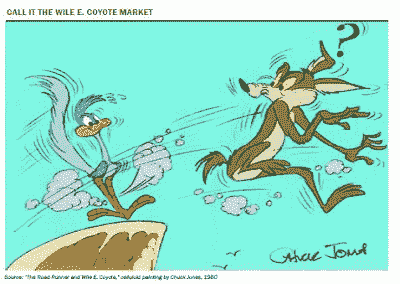

<!--yml
category: 未分类
date: 2024-05-18 04:24:23
-->

# Humble Student of the Markets: Do you believe in the Bernanke Put?

> 来源：[https://humblestudentofthemarkets.blogspot.com/2011/01/do-you-believe-in-bernanke-put.html#0001-01-01](https://humblestudentofthemarkets.blogspot.com/2011/01/do-you-believe-in-bernanke-put.html#0001-01-01)

Earlier this week Gluskin Sheff Chief Economist David Rosenberg wrote an article in the Globe and Mail entitled [Why this rally will end in tears](http://www.theglobeandmail.com/report-on-business/economy/economy-lab/david-rosenberg/why-this-market-rally-will-end-in-tears/article1874891/): Last week, Rosenberg called the current state of the financial market a [Wile E. Coyote market](http://www.ritholtz.com/blog/2011/01/wile-e-coyote-market/), or a market that seemingly ignores the major macro-economic risks that could blow up the global economy.

> We have an incredible bear market rally on our hands. History shows that these spasms can go further than anyone thinks. But after the U.S. market staged a monstrous 80-per-cent-plus rally from its March, 2009, lows (the most pronounced bounce in such a short time since 1955), it has become seriously overextended. Meanwhile, practically every pundit is extrapolating the recent trend into the future because that is the easy thing to do.
> 
> Most investors see only the recent returns; they do not see the nearly invisible risks. But the risks are there. I recall all too well the 2003-07 bear market rally – yes, that is what it was. It was no long-term bull run such as 1949-1966 or 1982-2000\. It was a classic bear market rally, and it ended in tears because what drove the market upward was phony wealth generated by a non-productive asset called housing alongside widespread financial engineering, which triggered a wave of artificial paper profits. 

He went on to detail his concerns about the future (which I paraphrase):

*   Rising oil prices may derail the fragile US economic recovery
*   US housing fundamentals are poor and deteriorating
*   US unemployment is skyrocketing and remains a social and economic problem
*   US State and local government cutbacks will be a drag on the American economy
*   US debt ceiling and possible default
*   Excessive debt in the global economy, with the European periphery a special concern
*   Food inflation in the emerging market economies, especially in China, which could lead to the Chinese authorities taking steps to cool down its overheated economy – leading to a global recession.

**When will it be time for QE3?**

While I would tend to agree with many of Rosenberg’s concerns about the macro-economic risks to this upturn, most of the risks in his outline are economic in nature and could be addressed by central bank action. In such a case, the question for investors has to be: Were any of these negative outcomes were to occur, would the Bernanke Fed respond with another round of quantitative easing? In other words, is there a Bernanke Put in the market?

I believe that the future trajectory of the global economy and asset prices are highly policy dependent. While I have my opinion, I am not confident enough in them to be a basis for investment decisions. That’s why I depend on the discipline of the

[Inflation-Deflation Timer Model](http://www.qwestfunds.com/publications/newsletters_pdf/newsletter_november_2009.pdf)

, as the underlying philosophy is to allow market prices to tell us the likely direction of policy and price trends, which in turn, allows us to be more tactical and able to capitalize on the intermediate swings in the markets.