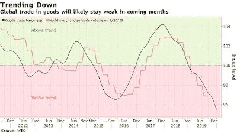

<!--yml
category: 未分类
date: 2024-05-18 02:20:51
-->

# Humble Student of the Markets: Don't count on a V-shaped recovery

> 来源：[https://humblestudentofthemarkets.blogspot.com/2020/02/dont-count-on-v-shaped-recovery.html#0001-01-01](https://humblestudentofthemarkets.blogspot.com/2020/02/dont-count-on-v-shaped-recovery.html#0001-01-01)

The covid-19 coronavirus outbreak is a human tragedy, just like Ebola, MERS, and SARS. For investors, it has an economic impact. Even before the outbreak, world merchandise trade volume had been falling. New data is likely to show that the outbreak disrupted global supply chains sufficiently to further depress global trade.

The market consensus initially expected the effects of the virus to top out in mid or late February, and they consequently penciled in a V-shaped recovery. As China slowly returns to work amidst draconian measures to control the outbreak, doubts are rising on whether China's economy could bottom out in Q1\. The authorities would have to be satisfied that the worst of the infection is over before giving the all-clear for everyone to return to work. An economy as large as China's will not be able to restart itself overnight, and the process will take time. In the meantime, much damage has been done, both to global supply chains and Chinese company balance sheets, and a wave of insolvencies is likely to follow. The only question is the magnitude.

As well, fear has to fade for business confidence to return to normal. The latest statistics from Johns Hopkins CSSE shows that the growth of covid-19 cases is not under control outside China. Equally disturbing is the challenges faced by two First World economies, Japan and Singapore, to deal with the outbreak. What happens when the infection appears in countries with health care systems that are less prepared?

It is therefore difficult to believe that the economic impact will bottom out in Q1, or the economic recovery will be V-shaped.

The full post can be found

[here](https://humblestudentofthemarkets.com/2020/02/22/dont-count-on-a-v-shaped-recovery/)

.