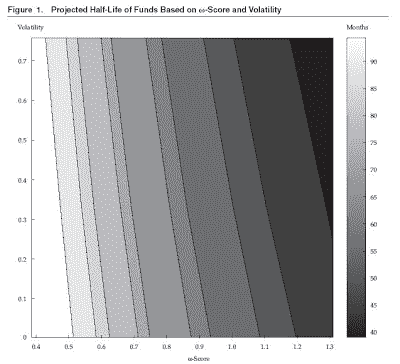

<!--yml
category: 未分类
date: 2024-05-18 00:58:35
-->

# Humble Student of the Markets: Don’t let the sorcerer’s apprentices hijack this model

> 来源：[https://humblestudentofthemarkets.blogspot.com/2009/02/dont-let-sorcerers-apprentices-hijack.html#0001-01-01](https://humblestudentofthemarkets.blogspot.com/2009/02/dont-let-sorcerers-apprentices-hijack.html#0001-01-01)

As I perused my latest edition of the

[Financial Analysts Journal](http://www.cfapubs.org/toc/faj/2009/65/1)

, two interesting articles came to light. The first entitled

*Estimating Operational Risk for Hedge Funds*

, detailed a quantitative scoring methodology for hedge fund operational due diligence:

The authors found high return volatility and high levels of conflict of interest at hedge funds may lead to problems, such as fraud and fund failure. Even though the authors noted that “a quantitative model can never fully replace human judgment”, no doubt some

[sorcerer’s apprentice](http://humblestudentofthemarkets.blogspot.com/2008/09/sorcerers-apprentices-at-work.html)

will formalize some version of this into a quantitative score, much like the Altman Z, and it will go into wide usage for

[OPDD](http://humblestudentofthemarkets.blogspot.com/2008/12/hedge-fund-operational-due-diligence.html)

.

I don’t know about you, but I would not like to entrust my money to a manager of a corporate bond fund who bases his decisions mainly on the

[Altman Z](http://humblestudentofthemarkets.blogspot.com/2008/05/limitations-of-altman-z.html)

score.

This hedge fund operational risk model is an extremely useful model as a first cut at due diligence, but it is not a substitute for clear thinking. Most importantly, if the inputs to a model are known, the score can be gamed and manipulated by unscrupulous users.

Interestingly, the same edition of the FAJ had an article called

*Models*

, by Emanuel Derman, where he echoes my feelings on quant models:

> Financial models are therefore best regarded as a collection of mathematically consistent, parallel “thought universes,” each of which will always be far too simple to resemble the real financial world, but whose exploration as a whole can nevertheless provide valuable insight.

**Quants need to learn to be more empirical**

The mortgage meltdown was caused by the blind application of dubious models by quants who didn't know any better. I hope that the financial world has learned its lesson.

Don’t let the sorcerer’s apprentices hijack this hedge fund due diligence model. Otherwise this will get out of control and lead to another meltdown a few years from now.