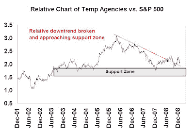

<!--yml
category: 未分类
date: 2024-05-18 00:59:04
-->

# Humble Student of the Markets: Don’t panic: Real-time data points to stabilization

> 来源：[https://humblestudentofthemarkets.blogspot.com/2009/02/dont-panic-real-time-data-points-to.html#0001-01-01](https://humblestudentofthemarkets.blogspot.com/2009/02/dont-panic-real-time-data-points-to.html#0001-01-01)

When I have done fundamental research in the past, I focused on the company’s strategy and its drivers of profitability and growth. When I expand my investment universe to thousands of companies using quantitative techniques, I used multi-factor models based on the usual suspects: value, growth, momentum, sentiment, signals (e.g. insider activity, buybacks, etc.)

When I do top-down analysis, my philosophy differs from many other researchers in the field. During these times when

[economists bicker](http://paul.kedrosky.com/archives/2009/02/02/first_we_kill_a.html)

about the stimulus package, it’s important to keep in mind that 2009 will be the year when the economic crisis fully migrates from Wall Street to Main Street. The headlines will get a lot worse before it gets better.

Particularly during periods like this, economic statistics are not very useful because they are mainly backward looking. For top-down analysis, I prefer to rely on real-time market signals.

**Don’t panic**

The real time data is constructive for the economic outlook. The equities of two leading industries that I watch closely, homebuilding and temp agencies, are showing signs of stabilization.

[Homebuilders](http://humblestudentofthemarkets.blogspot.com/2009/01/some-signs-of-spring-for-homebuilders.html)

appear to be trying to put in a bottom compared to the market. I also put together a composite of the stock of Staffing and Temp Agencies and compared their performance relative to the S&P 500\. As the chart below shows, this group has broken out of a relative downtrend. More importantly, this group doesn’t seem to be totally falling apart despite the dire headlines hitting the mainstream media. The chart indicates that the group has only retreated to a relative support zone dating back from 2003-5.

**Bad news already discounted?**

Another important sign to watch is how the market reacts to bad news. A case in point, the

[outlook for Tech earnings](http://online.barrons.com/article/SB123275426986311581.html)

looks terrible, but the chart below shows the NASDAQ 100 outperforming the S&P 500\. Is most of the bad news in the market already?

**It’s so bad it’s good**

The psychology is terrible. It is so terrible that the blooger

[VIX and More](http://vixandmore.blogspot.com/2009/02/bullish-signal-from-global-volatility.html)

is reporting a buy signal from his global volatility index.

We seem to be entering a “bad news is good news” phase for the market. In fact, there are indications that there is an

[inverse long-term relationship between employment and equity returns](http://www.marketwatch.com/news/story/Bad-news-job-front-doesnt/story.aspx?guid=%7B5D3F2682%2D3190%2D4536%2D9EF0%2D3DBA0578BF14%7D)

.

I believe that as long as we don’t see an ugly surprise like

[protectionism](http://news.bbc.co.uk/2/hi/business/7866308.stm)

rear its ugly head, most of the bad news is in the equity market and the downside is limited at current levels.