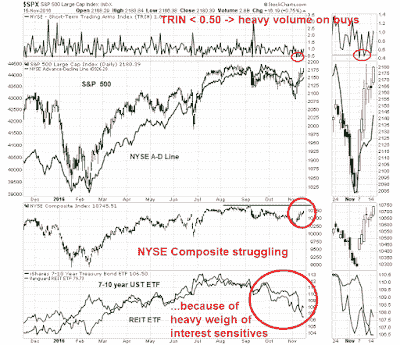

<!--yml
category: 未分类
date: 2024-05-18 02:59:45
-->

# Humble Student of the Markets: Don't worry about bad breadth, NYSE edition

> 来源：[https://humblestudentofthemarkets.blogspot.com/2016/11/dont-worry-about-bad-breadth-nyse.html#0001-01-01](https://humblestudentofthemarkets.blogspot.com/2016/11/dont-worry-about-bad-breadth-nyse.html#0001-01-01)

I have been seeing analysis from various quarters raising concerns about the sustainability of the post-election stock market advance because of the poor breadth of the market. The chart below shows the NYSE A-D Line overlaid on top of the SP 500\. As you can see from the chart, the NYSE A-D Line has been lagging even as the market advanced. If the generals (large caps) are leading the charge, but the troops (breadth) are not following, then such divergences are thought to be warning signs that the move may not be sustainable.

I would not be so worried about that. The NYSE Composite is made up of many closed-end bond funds and REITs which have dragged down the performance of that index. We can see a hint of that effect in TRIN (top panel). There were two days in the post-election rally when TRIN fell below 0.50, which is an indication that advancing volume was running well ahead of advancing issues. That`s because many of the declining issues were relatively thinly traded interest sensitive bond funds and REITs.

While I am not worried about a negative breadth divergence, the sudden turnaround in bullish sentiment is a concern to me.

The full post can be found at our new site

[here](https://humblestudentofthemarkets.com/2016/11/15/dont-worry-bad-breadth-nyse-edition/)

.