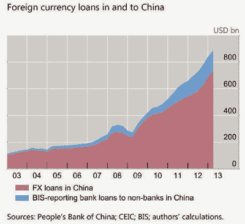

<!--yml
category: 未分类
date: 2024-05-18 03:40:53
-->

# Humble Student of the Markets: EM tail-risks are rising

> 来源：[https://humblestudentofthemarkets.blogspot.com/2014/04/em-tail-risks-are-rising.html#0001-01-01](https://humblestudentofthemarkets.blogspot.com/2014/04/em-tail-risks-are-rising.html#0001-01-01)

As the events in Eastern Ukraine unfold,

[Ambrose Evans-Pritchard](http://www.telegraph.co.uk/finance/comment/ambroseevans_pritchard/10771069/US-financial-showdown-with-Russia-is-more-dangerous-than-it-looks-for-both-sides.html)

wrote about the risks of a an American-Russian confrontation:

> The United States has constructed a financial neutron bomb. For the past 12 years an elite cell at the US Treasury has been sharpening the tools of economic warfare, designing ways to bring almost any country to its knees without firing a shot.
> 
> The strategy relies on hegemonic control over the global banking system, buttressed by a network of allies and the reluctant acquiescence of neutral states. Let us call this the Manhattan Project of the early 21st century.
> 
> "It is a new kind of war, like a creeping financial insurgency, intended to constrict our enemies' financial lifeblood, unprecedented in its reach and effectiveness," says Juan Zarate, the Treasury and White House official who helped spearhead policy after 9/11\.

The weapon is not military, but financial in nature:

> The stealth weapon is a "scarlet letter", devised under Section 311 of the US Patriot Act. Once a bank is tainted in this way - accused of money-laundering or underwriting terrorist activities, a suitably loose offence - it becomes radioactive, caught in the "boa constrictor's lethal embrace", as Mr Zarate puts it.
> 
> This can be a death sentence even if the lender has no operations in the US. European banks do not dare to defy US regulators. They sever all dealings with the victim.

In a different 

[article](http://www.telegraph.co.uk/finance/businesslatestnews/10766324/Russias-bond-market-is-Achilles-Heel-as-showdown-with-West-escalates.html)

, Evans-Pritchard outlined Russia's financial vulnerability:

> Russia is at increasing risk of a full-blown financial crisis as the West tightens sanctions and Russian meddling in Ukraine pushes the region towards conflagration.
> 
> The country’s private companies have been shut out of global capital markets almost entirely since the crisis erupted, causing a serious credit crunch and raising concerns that firms may not be able to refinace debt without Russian state support.
> 
> “No Eurobonds have been rolled over for six weeks. This cannot continue for long and is becoming a massive issue,” said an official from a major Russian bank. “Companies have to roll over $10bn a month and nothing is moving. The markets have been remarkably relaxed about this, given how dangerous it is. Russia’s greatest vulnerability is the bond market,” he said.

In particular, he singled out the Russian external debt of $714 billion as a source of vulnerability:

> A report by Sberbank said Russia has $714 bn of foreign debt: $427bn for compaines, $207bn for banks, and $62bn from state bodies. The oil group Rosneft relies on foreign debt for 90pc of its funding. Foreigners also own 70pc of the free-float of Russian stock market, which has not yet dropped heavily but has been held back by 15pc relative to emerging market peers since late February.

While financial sanctions would no doubt hurt the Russian economy, Evans-Pritchard indicated that Russia is not helpless and she could respond with other means, such as cyber-warfare:

> Chancellor George Osborne must have been let into the secret of US plans by now. Perhaps that is why he issued last week's alert in Washington, warning City bankers to prepare for a sanctions fall-out. The City is precious, he said, "but that doesn't mean its interests will come above the national security interests of our country".
> 
> The greatest risk is surely an "asymmetric" riposte by the Kremlin. Russia's cyber-warfare experts are among the best, and they had their own trial run on Estonia in 2007\. A cyber shutdown of an Illinois water system was tracked to Russian sources in 2011\. We don't know whether US Homeland Security can counter a full-blown "denial-of-service" attack on electricity grids, water systems, air traffic control, or indeed the New York Stock Exchange, and nor does Washington.
> 
> "If we were in a cyberwar today, the US would lose. We're simply the most dependent and most vulnerable," said US spy chief Mike McConnell in 2010\.
> 
> The US defence secretary Leon Panetta warned of a cyber-Pearl Harbour in 2012\. "They could shut down the power grid across large parts of the country. They could derail passenger trains or, even more dangerous, derail passenger trains loaded with lethal chemicals. They could contaminate the water supply in major cities, or shut down the power grid across large parts of the country,” he said. Slapstick exaggeration to extract more funds from Congress? We may find out.

While some analysts may have factored the economic and financial effects of western sanctions on Russia, I bet that the consequences of the shutdown of the US power grid is not in anybody's spreadsheet.

**Another giant with gargantuan external debt**

Incidentally, when I read the $714 billion external debt figure, I had to laugh. Can you guess who other EM country has external debt in that order of magnitude?

If you guessed China, you win the prize. This chart comes from an article by

[Ambrose Evans-Pritchard](http://www.telegraph.co.uk/finance/china-business/10407625/BIS-sees-risk-of-1998-style-Asian-crisis-as-Chinese-dollar-debt-soars.html)

in October 2013:

> Foreign loans to companies and banks in China have tripled over the last five years to almost $900bn and may now be large enough to set off financial tremors in the West, and above all Britain, the world’s banking watchdog has warned.
> 
> “Dollar and foreign currency loans have been growing very rapidly,” said the Bank for International Settlements in a new report.
> 
> “They have more than tripled in four years, rising from $270 billion to a conservatively estimated $880 billion in March 2013\. Foreign currency credit may give rise to substantial financial stability risks associated with dollar funding,” it said. China’s reserve body SAFE said 81pc of foreign debt under its supervision is in dollars, 6pc in euros, and 6pc in yen.

Note that the last date of the chart is in early 2013\. Given the pace of the increase, Chinese external debt could easily be very close to $1 trillion or more today. To put the $1 trillion external debt into context, the most recent Chinese GDP release came in at 7.4%, which was ahead of expectations of 7.3%. However, the issue is not whether is China is growing at 7.0% or 7.5%, but whether it will experience a financial crisis. China bulls have pointed out that most of Chinese debt is in RMB and therefore it is unlikely to experience an external debt crisis given the size of its foreign exchange reserves. Nevertheless, an external debt position of roughly $1 trillion is nothing to sneeze at, even if your reserves is a multiple of that figure.

Under a scenario where China undergoes a financial crisis, no doubt western banks would get hurt - and that would spook markets. That tail-risk is probably not in too many analysts' spreadsheet models either.

**Remember the "tail" in "tail-risk"**

I am not trying to engage in fear mongering. I only bring up these possibilities of events in Ukraine or China spiraling out of control not because they represent my base case scenarios, but as tail-risks. Just remember the "tail" in the term "tail-risk".

To be sure, the latest economic releases out of China suggests that the economy may be turning up and therefore financial risks are receding, as per Tom Orlik at Bloomberg:

A

[WSJ](http://blogs.wsj.com/chinarealtime/2014/04/16/electricity-steel-hint-at-economic-uptick-in-china/)

report came to the same conclusion:

> Official data shows China’s economy in the first quarter grew at its slowest pace in 18 months, but two proxies point to some resilience.
> 
> Electricity output—an indicator favored by Premier Li Keqiang over gross domestic product—and crude steel production grew faster in March than in the preceding two months. In addition, steel output in March hit a record high, the National Bureau of Statistics said.
> 
> Back in 2007, when he was party boss of Liaoning province, Mr. Li quipped that when it comes to growth data, officials might lie—but volts do not.
> 
> Electricity output in March was up 6.2% from a year earlier to 453 billion kilowatt-hours, faster than the combined 5.5% pace of January and February (the two months were counted together to limit distortions from the Lunar New Year holidays). Steel production was up 2.2% to a record 70.3 million tons. That compares with a 0.6% expansion in February and a contraction of 3.2% in January.
> 
> The data added to a sense China’s economy may have stabilized in March. Other data released Wednesday—including retail sales and industrial production—edged up from the previous two months.

As well, speculation about asymetric warfare like cyber attacks is just that - speculation. If Moscow orchestrated the initial provocations in Eastern Ukraine, the military response by Kiev was no doubt expected and the Kremlin has a plan to deal with what comes next. We will just have to watch how this elaborate dance plays itself out.

Nevertheless, the technical picture of the stock market is starting to look like the Spring of 2011\. Market internals are deteriorating and risk appetite is rolling over. The crisis then came from the combination of a political impasse in Washington and the eurozone crisis. It was a volatile mixture which eventually sparked a major market sell-off. In 2014, investors have to be aware of the nature and the rising level of tail-risks that could affect financial markets in the months to come.

*Cam Hui is a portfolio manager at [Qwest Investment Fund Management Ltd.](http://www.qwestfunds.com/) (“Qwest”). The opinions and any recommendations expressed in the blog are those of the author and do not reflect the opinions and recommendations of Qwest. Qwest reviews Mr. Hui’s blog to ensure it is connected with Mr. Hui’s obligation to deal fairly, honestly and in good faith with the blog’s readers.”

None of the information or opinions expressed in this blog constitutes a solicitation for the purchase or sale of any security or other instrument. Nothing in this blog constitutes investment advice and any recommendations that may be contained herein have not been based upon a consideration of the investment objectives, financial situation or particular needs of any specific recipient. Any purchase or sale activity in any securities or other instrument should be based upon your own analysis and conclusions. Past performance is not indicative of future results. Either Qwest or I may hold or control long or short positions in the securities or instruments mentioned.*