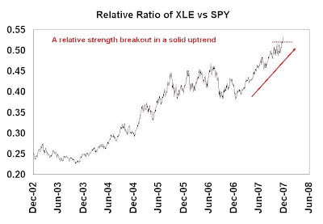
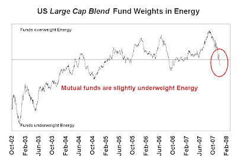

<!--yml
category: 未分类
date: 2024-05-18 01:15:15
-->

# Humble Student of the Markets: Energy stocks ready for another upleg?

> 来源：[https://humblestudentofthemarkets.blogspot.com/2007/12/energy-stocks-ready-for-another-upleg.html#0001-01-01](https://humblestudentofthemarkets.blogspot.com/2007/12/energy-stocks-ready-for-another-upleg.html#0001-01-01)

**LT Uptrend + Breakout + Neutral Sentiment = Bullish** 

Energy stocks may be ready for another upleg for three reasons.

**Long term uptrend:**

the first chart shows the relative ratio of XLE (Energy Select SPDR ETF) to SPY (S&P 500 SPDR ETF). As you can see the Energy sector has been in a long term relative uptrend against the market, as defined by the S&P 500\. As oil prices approached $100 and pulled back, so did the Energy relative to the market.

**Relative strength breakout:**

the sector broke out to an all-time relative high against the S&P 500 in mid-December.

**Neutral mutual fund sentiment:**

Using the technique shown in the sidebar (titled

*Reverse Engineering a Manager's Macro Exposure*

) I imputed the average Energy sector exposure of 22 US large cap blend equity mutual funds. These 22 funds can be thought of as a composite of the S&P 500-like mandate funds from the largest mutual fund complexes. As you can see from the chart, mutual funds moved from a significant overweight to a neutral/underweight position in the Energy sector.

In future posts I will highlight other divergences and opportunities within the Energy space.