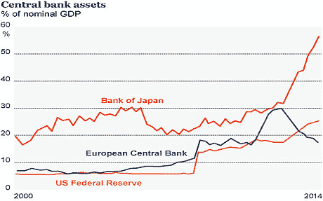

<!--yml
category: 未分类
date: 2024-05-18 03:30:19
-->

# Humble Student of the Markets: Enjoy the party, but watch for the police raid

> 来源：[https://humblestudentofthemarkets.blogspot.com/2014/11/enjoy-party-but-watch-for-police-raid.html#0001-01-01](https://humblestudentofthemarkets.blogspot.com/2014/11/enjoy-party-but-watch-for-police-raid.html#0001-01-01)

**Trend Model signal summary**

Trend Model signal: Neutral (upgrade)

Direction of last change (trading model): Positive

The actual historical (not back-tested) buy and sell signals of the trading component of the Trend Model are shown in the chart below:

**Update schedule**

: I generally update Trend Model readings on 

[my blog](http://humblestudentofthemarkets.blogspot.com/)

 on weekends and tweet any changes during the week at @humblestudent. In addition, I have been trading an account based on the signals of the Trend Model. The last report card of that account can be found 

[here](http://humblestudentofthemarkets.blogspot.com/2014/10/trend-model-september-report-1-year-401.html)

.

**A light at the end of the EPS downgrade tunnel**

In the long-run, the two main driver of stock prices are the earnings outlook and the discount rate for those earnings. The latest 

[Factset](http://www.factset.com/websitefiles/PDFs/earningsinsight/earningsinsight_10.31.14)

analysis of EPS estimates shows that forward 12 month EPS began to fall about three weeks ago and they continuing to decline. As the chart below shows, past episodes of falling forward EPS estimates have coincided with weak stock markets in the past.

The EPS outlook is deteriorating. Not only is the Street cutting Q4 estimates, they are cutting 2015 estimates as well. This chart shows expected 2015 EPS growth falling the most in Energy, which is to be expected given the weakness in oil prices, but the decline is occurring across the board in all sectors.

There may be a light at the end of the EPS downgrade tunnel. In my market commentary last week (see 

[Correction, what correction?](http://humblestudentofthemarkets.blogspot.com/2014/10/correction-what-correction.html)

), I suggested that US equity outlook depended more on what was happening globally. It wasn't enough just to watch Fed actions, but what was happening outside US borders as well. That's because the message from corporate conference calls indicated that the greatest growth concerns came from Europe.

**Bullish European developments**

Europe is set to turn around. Last week, I also highlighted a column by

[Anatole Kaletsky](http://blogs.reuters.com/anatole-kaletsky/2014/10/24/europes-economic-and-political-future-will-be-determined-in-the-next-few-days/)

indicating that Europe was about to see three key events occur. First, the ECB`s Asset Quality Review of eurozone banks were going to be published. If the results were not overly dire, it would show that the banking system was ready for QE. AQR would therefore set the stage for the announcement of some form of QE at the November ECB meeting. As it turned out, no major French or German bank failed the AQR and the problems banks that hadn`t addressed their balance sheet problems were relatively small and were concentrated in peripheral eurozone countries. If Kaletsky is correct, then one of pre-conditions for the ECB to announce QE has been satisfied.

Next, Kaletsky was watching the Ukrainian election with interest, as pro-Western parties led by Poroshenko won, which would lead to a more pragmatic approach to dealing with Putin:

> Starting with the Ukrainian election, a victory for President Poroshenko’s moderate party should allow EU leaders to launch a genuine peace process that recognises the loss of Crimea as irreversible and acknowledges Russia’s vital interests in maintaining the military neutrality of its immediate neighbours. Once these basic conditions are satisfied, a rapprochement with Russia should become possible, allowing sanctions to be gradually dismantled or at least confirming that sanctions will expire by mid-2015, as currently legislated. Removing the threat of war or further sanctions in eastern Europe will have a major beneficial effect on businesses in Germany and Italy, which been hurt much more by the confrontation with Russia than European leaders expected.

Indeed,  Proshenko’s party, along with other pro-Western parties, won the election. Soon thereafter, we saw the conclusion of a Russia-Ukraine gas deal on Thursday, which should bring down geopolitical tensions. These developments should be interpreted as market bullish (via

[Reuters](http://www.reuters.com/article/2014/10/30/us-ukraine-crisis-gas-idUSKBN0II0XQ20141030)

):

> Ukraine, Russia and the European Union signed a deal on Thursday that will see Moscow resume vital supplies of gas to its ex-Soviet neighbor over the winter in return for payments funded in part by Kiev's Western creditors.
> 
> After several failed rounds of talks in recent weeks as conflict rumbles on despite a ceasefire with pro-Russian rebels in eastern Ukraine, the accord also eases concerns that a new "gas war" could disrupt winter supplies if energy to EU states, notably through pipelines shut down across Ukraine since June.

Finally, Kaletsky wrote that the European Commission was to rule on the French budget and it may be a signal that the Germans were softening their stance on the sticky issues of austerity and fiscal stimulus:

> Finally, a U-turn on fiscal austerity is highly probable when the Commission delivers its verdict on the French budget on Oct. 29, or failing that, in mid-November after a symbolic “re-negotiation” leading to some cosmetic strengthening of French structural reforms.

On Wednesday, the

[EC gave tentative green lights to both the French and Italian budgets](http://www.euronews.com/2014/10/29/ec-gives-tentative-green-light-to-french-and-italian-budgets/)

. The combination of the actions of the EC and this

[Reuters](http://www.reuters.com/article/2014/10/24/eu-summit-merkel-draghi-idUSB4N0NR01W20141024?irpc=932)

story indicating a thaw in relations between Draghi and Merkel are highly suggestive that a backroom deal has been struck on German acquiescence to fiscal stimulus and possibly some form of QE:

> German Chancellor Angela Merkel thanked ECB President Mario Draghi for spelling out to leaders at an EU summit that governments must play a role in boosting the faltering euro zone economy, and said it was their firm intention to do so.
> 
> "I am very thankful to Mario Draghi for holding up a mirror for us once again," Merkel told a news conference in Brussels on Friday, a day after Reuters reported tensions in the relationship between Berlin and the Italian ECB president.
> 
> "Monetary policy can do some things, that is the job of the independent European Central Bank. But if fiscal policy doesn't react simultaneously, if we don't improve our economic policies, our competitiveness and our investment climate, then we won't come out of this unsatisfactory situation," Merkel said.
> 
> She added that leaders had expressed their "clear intention" to do all this in response to the weak economy.

It sounds like the European elite are all getting their ducks in a row, just wait for the announcement.

**The market shrugs off the Fed**

Across the Atlantic, the US economy continues to chug along nicely. Thursday's GDP report came in at 3.5%, which was well ahead of market expectations.

[New Deal Democrat](http://community.xe.com/blog/xe-market-analysis/weekly-indicators-nothing-spooky-here-edition)

summed up the GDP report and the economic outlook in an upbeat manner:

> In the rear view mirror, 3rd Quarter GDP was up 3.5%. The employment cost index was also up smartly, a boon for workers. Most of the monthly reports were also quite positive. Two separate measures of consumer confidence were at their highest levels since the recession. The Chicago PMI index was at its highest in a year. Pending home sales improved slightly. September Personal income and the personal savings rate were both up. The Case Shiller house price index declined slightly for the 4th month in a row, a positive or negative depending on whether one is a buyer or a seller. September durable goods were down, as was personal spending.

Here is his conclusion from the latest snapshot of high frequency economic releases:

> With the chronic exception of mortgage applications, there is simply little else to complain about. There are a few pockets of relative weakness, and that's it. Expect growth to continue.

The chart below shows the four-week average of initial jobless claims (in blue, inverted) overlaid on top of the SPX (in red). What more do you need to know about what drives the stock market?

In line with a picture of continuing economic growth, the FOMC's statement last week was somewhat more hawkish than what I had expected. I agreed with Tim Duy when he wrote in his

[FOMC preview](http://economistsview.typepad.com/timduy/2014/10/fomc-meeting-.html)

that the statement would include some mention of non-US weakness: "they will mention they remain watchful of foreign growth". In fact, the tone of the statement was the least dovish statement that could be expected from the current FOMC. The stock market fell in response to the Fed announcement, but the decline was not precipitous. It then rallied on the next day on the better than expected GDP release.

Then, just as the QE party thrown by the Federal Reserve was ending, the BoJ decided to throw one of its own.

[Ambrose Evans-Pritchard](http://www.telegraph.co.uk/finance/economics/11202675/Japan-risks-Asian-currency-war-with-fresh-QE-blitz.html)

described it very well this way (emphasis added):

> The Bank of Japan (BoJ) voted by 5:4 in a hotly-contested decision t***o boost its asset purchases by a quarter to roughly $700bn a year, covering the fiscal deficit and the lion’s share of Japan’s annual budget.*** “They are monetizing the national debt even if they don’t want to admit it,” said Marc Ostwald, from Monument Securities.
> 
> In a telling move, the bank will concentrate fresh firepower on Japanese government bonds (JGBs), pushing the average maturity out to seven to 10 years. **It also pledged to triple the amount that will be injected directly into the Tokyo stock market through exchange-traded funds, triggering a 4.3pc surge in the Topix index.**

Wow!

**The party is just getting going....**

For now, the technical picture of the stock market remains intermediate term bullish. Price momentum is expanding and I am seeing strength across the board.  The Dow Jones Industrials and Transports have both made new highs, which affirm Dow Theory buy signals.

Rather than go through a lot of my own technical analysis, I'll leave it to others who speak much better than I do. Brett Steenbarger at

[TraderFeed](http://traderfeed.blogspot.com/2014/11/putting-this-market-rally-into.html)

summed up the technical picture this way:

> [My most recent look at market breadth](http://www.traderfeed.blogspot.com/2014/10/a-fresh-look-at-stock-market-breadth.html) suggested that market strength was actually expanding, not contracting as it had done from much of June through September. I suggested some give back was to be expected, as many of my measures were approaching levels associated with past momentum peaks, but the news from Japan on Friday only lifted stocks further.
> 
> Meanwhile, [correlations and volatility](http://www.traderfeed.blogspot.com/2014/10/what-we-can-learn-from-relative.html) remain high--not what we normally see when rallies are sputtering and about to turn over. We are accustomed to seeing stocks fall on increases in volatility and rise on decreasing volatility. In terms of realized volatility--not the implied volatility measure of VIX--[this has not been the case](http://www.traderfeed.blogspot.com/2014/10/what-is-different-about-this-market.html). We have rallied on actual price volatility that is much greater than would normally be expected at the current level of VIX.

He concluded:

> In short, the data support the notion that this is a fresh bull market leg, not a bounce in a topping market. If that is the case, we can expect further price gains, even after momentum has crested. I will be tracking the above measures and others to update the rally's trajectory.

In addition,

[Dana Lyons](https://twitter.com/JLyonsFundMgmt/status/528155060430069761/photo/1)

took a look at past V-shaped bottoms and concluded that, while the market may consolidate over the short-term, history suggests that there isn't a lot of downside risk:

In short, the Fed's party has moved over to the BoJ's place - and that party is just getting going.

**...but the neighbors are about the call the cops**

Last week, I was called a permabull (LOL). Still, I remain cognizant of the risks posed by the current macro environment. While the BoJ party is just getting going, the partiers are spilling out onto the street and getting out of control. The neighbors are getting upset and they're about to call the cops. My inner trader remains wary of the time when the police show up and raid the party.

Here are some of my concerns.

First,

[Ambrose Evans-Pritchard](https://twitter.com/AmbroseEP/status/528089827867369472)

pointed out that the BoJ is inviting a currency war that has global repercussions:

In addition to putting pressures on eurozone exports,

[Evans-Pritchard](http://www.telegraph.co.uk/finance/economics/11202675/Japan-risks-Asian-currency-war-with-fresh-QE-blitz.html)

pointed out that the latest BoJ initiative is bound to cause dislocation in other Asian economies:

> Hans Redeker, from Morgan Stanley, said Japan is exporting its deflationary pressures to the rest of Asia. “It is not clear whether other countries can cope with this. There have been a lot of profit warnings in Korea. The entire region is already in difficulties with overcapacity and a serious debt overhang. Dollar-denominated debt has risen exponentially to $2.5 trillion from $300bn in 2005, and credit efficiency is declining,” he said.

The worst-case scenario is a trade and currency war that gets out of control. Perennial bear Albert Edwards has raised the spectre of a repeat of the Asian Crisis (emphasis added):

> Albert Edwards, from Societe Generale, said Japan is at the epicentre of a currency maelstrom, a replay of the Asian financial crisis from 1997-1998, though this time the region is a much bigger part of the global economy. “***China cannot tolerate this kind of shock when it already faces a credit crunch and has suffered a massive loss in competitiveness. Foreign direct investment into China has already turned negative***,” he said.
> 
> It was a yen slide in 1998 that led to the most dangerous episode of the Asian drama. China threatened to retaliate, a move that would have threatened the disintegration of the regional trading system. It took direct action by Washington and concerted global intervention to stabilise the yen and contain the crisis.
> 
> This yen-yuan dynamic is looming again. China has for now stopped buying foreign bonds to weaken its currency but this has let deflationary forces gain a footing in the Chinese economy. “If China’s inflation rate falls below 1pc, it will be forced to devalue as well. Currency war was always how this was going to end, and it risks sending a wave of deflation across the world from Asia,” he said.

> As each country resorts to a beggar-thy-neighbour policy in moves akin to the 1930s, deflation is dumped in the lap of any region that is slow to respond - currently the eurozone.

On the news of the BoJ stimulus, the Nikkei surged 4.8% on the day and regional bourses rose in sympathy on Friday. One of the key indicators of further dislocation in neighboring PacRim economies will be seen in the stock indices of those countries. The chart below shows the Nikkei 225 on the top panel and the stock indices of Taiwan and South Korea on the next two. Can the Taiwanese and Korean markets maintain their minor uptrend (dotted line) or will they start to decline, which will be an indication of trouble?

Meanwhile, stress levels are rising in China. China's latest

[PMI release missed expectations](http://www.businessinsider.com/china-misses-october-pmi-2014-10)

again. Diana Choyleva of Lombard Street Research

[tweeted](https://twitter.com/choyleva/status/528141315834261504?refsrc=email)

that their own estimates show that Chinese growth is coming far worse than what the official statistics indicate. Ouch!

More worrisome is market-based indicators are pointing to the lack of re-balancing. The chart below of PGI, which represents New China consumer sensitive companies in China, relative to FXI, which is weighted towards Old China financials and infrastructure-sensitive plays, show that Old China has been outperforming New China.

How much stress can China take without taking action that reverberates around the world?

**The investor's field guide to the US midterm elections**

On this side of the Pacific, the US is about to hold its midterm Congressional elections on Tuesday (see my previous post

[The bullish and bearish implications of the midterm elections](http://humblestudentofthemarkets.blogspot.com/2014/10/the-bullish-and-bearish-implications-of.html)

). The Republicans are certain to win control of the House and the latest

[sports book odds](http://www.paddypower.com/bet/politics/other-politics/us-politics?ev_oc_grp_ids=1148253)

indicate an 83% chance that the GOP will hold a majority in the Senate as well.

That's bullish, right?

Well, sort of. We will likely see a risk-on rally should the Republicans will both House and Senate. However, it remains to be seen how the markets will react to the interactions between a Republican Congress and the White House. Here are some likely scenarios (via

[CNN Money](http://money.cnn.com/2014/10/26/news/economy/republicans-senate-taxes-spending-debt-ceiling/index.html)

):

> The most likely scenario, they say, is that Republicans will end up acting more centrist-right than Tea Party-right.
> 
> First, they know the next presidential election is right around the corner.
> 
> Remember last year's government shutdown -- forced by far right lawmakers and disparaged by Republican leaders?
> 
> "The GOP has to show they'll govern and get things done ahead of 2016 to better compete with Hillary Clinton," said Greg Valliere, chief political strategist of the Potomac Research Group.

The wildcard is how the clash over the budget will play out:

> Come mid-December, the current crop of lawmakers will need to reauthorize spending to avoid a government shutdown. Everyone expects them to do so.
> 
> The question is for how long. If they do it through the end of fiscal year 2015, which ends September 30, that "would signal a continued freeze on the budget wars," Krueger said.
> 
> But if it's only for a few months, and the Republicans come back as the Senate majority in January, that may "signify the return of governing-by-crisis," he said.
> 
> In either case, Congress will also have to pass a budget for fiscal year 2016, which starts next October.

The worst case scenario is another budget ceiling battle reminiscent of 2011 - and we all remember what happened to the markets that year.

**Market implications**

My base case scenario calls for a stock market rally into the election on Tuesday. Then I will have to re-evaluate the political and market developments. J C Parets at

[All Star Charts](http://allstarcharts.com/sp500-seasonal-studies-combined/)

combined a number of seasonal patterns and produced this roadmap for the SPX into year-end:

That pattern looks about right to me, with the caveat that it is only a roadmap and every squiggle should not be regarded as an absolute forecast. Given the recent powerful technical momentum shown by the US equity market, I would concur with the scenario of a rally, followed by consolidation and then another upleg into year-end.

Enjoy the party! The neighbors are about to call the cops, but the raid won`t happen for a while yet. That`s a 2015 story.

My inner trader remains bullish. My inner investor is starting to get concerned about 2015, but he isn`t to take any immediate action.

**Disclosure:**

Long SPXL, TQQQ and CURE