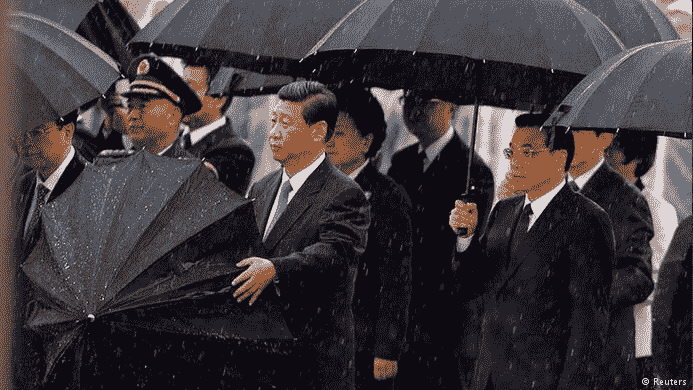

<!--yml
category: 未分类
date: 2024-05-18 03:32:18
-->

# Humble Student of the Markets: Everybody was umbrella fighting...

> 来源：[https://humblestudentofthemarkets.blogspot.com/2014/09/everybody-was-umbrella-fighting.html#0001-01-01](https://humblestudentofthemarkets.blogspot.com/2014/09/everybody-was-umbrella-fighting.html#0001-01-01)

In my last two posts, I highlighted the rising tail-risk from the protests in Hong Kong (see

[The Big Kahuna Korrection, or buy Yom Kippur?](http://humblestudentofthemarkets.blogspot.com/2014/09/the-big-kahuna-korrection-or-buy-yom.html)

and

[HK tail-risk is rising](http://humblestudentofthemarkets.blogspot.com/2014/09/hk-tail-risk-is-rising.html)

). While the markets focuses on the actions of the ECB and the US Employment report this week, the risk of the derailment of one of the three key engines of global growth, namely China, is heightened.

|  |
| **Xi shows the world that he can handle an umbrella too** |

**Lots of analysis and opinions**

Since I penned those two posts, much analysis has been written about the so-called umbrella protests in Hong Kong, where pro-democracy residents are in the streets over a decision by Beijing to limit the candidates for the election of Hong Kong`s next chief executive. Here is the summary from

[Bloomberg](http://www.bloomberg.com/news/2014-09-29/how-to-end-hong-kong-protests-a-tricky-question-for-xi-in-china.html)

:

> The most violent protests in Hong Kong in almost 50 years pose a dilemma for President Xi Jinping: clear the streets and risk embedding anti-China sentiment in a city that has prized its relative freedom, or make concessions and appear weak at home.
> 
> Thousands of protesters have remained on the streets, refusing to back down after Hong Kong police on Sept. 28 fired tear gas and pepper spray in the worst clashes since unrest swept the city in 1967, led by pro-Communist groups inspired by Mao Zedong’s Cultural Revolution. The protests prompted banks to close branches in the central area and pushed the main Hong Kong stock market index down a further 1.4 percent today.
> 
> As China prepares to celebrate the 65th anniversary of the establishment of the People’s Republic of China, Xi may want to demonstrate his grip on power on the mainland as he presses an anti-corruption drive that has snared senior officials and seeks to curb separatist sentiment in the Xinjiang region. Even so, acting forcefully to quell the protests may threaten Hong Kong’s standing as a city where businesses prize the rule of law and citizens cherish their freedom of expression.

Here is the key dilemma facing Chinese President Xi Jinping:

> “When push comes to shove, Xi Jinping has to calculate what this means for his own authority,” said David Zweig, professor of political science at the Hong Kong University of Science and Technology. “It is a delicate balance between not having a terrible outcome in the streets and looking weak. I am not sure if the students quite understand that.”

As well, Xi has to consider the risks that protests could spread to nearby Macau, or even China itself. If he does intervene forcefully, then he can kiss the dream of Taiwan reunification under the Hong Kong formula of ”One Country, Two Systems” for a generation.

Sara Hsu, writing in

[The Diplomat](http://thediplomat.com/2014/09/the-economic-implications-of-hong-kongs-protests/)

, outlined three possible outcomes. First, the protesters could back down, either willingly or grudgingly. The government could come to some form of compromise with the demonstrators (as they did before in Wuhan in 2011). The first two outcomes would calm markets and likely see relief tallies in risky assets. The third is the most unpleasant and involves a clampdown with dire consequences:

> Third, Beijing may use violence, perhaps real bullets, to crack down, in a Tiananmen-like confrontation. This is the least desirable outcome for both Hong Kong and Beijing, as it would stifle relations between the two regions for some time to come. It would dampen trade and investment with Hong Kong, harm the stock market, which contains a large percentage of Mainland-based companies, and put the Shanghai-Hong Kong Stock Connect program on ice. Currently, trade from the Mainland into Hong Kong measured at $384.8 billion in 2013, direct investment from Hong Kong into the Mainland weighed in at $73.4 billion in 2013, and the market capitalization of Mainland firms listed in Hong Kong amounts to $1.8 trillion. Disruption of these financial flows would cause a serious economic shock to both regions.
> 
> Further, the wider economic implications of a crackdown should also be considered. A shock to the China/Hong Kong trade nexus, combined with an arrest in direct investment into the Mainland, would sharply impact the rest of the world, cutting off access to imported goods from China, and rerouting export channels to Shanghai, creating congestion and reducing exported goods to China. A crackdown would also call for an international response, possibly in the form of a trade embargo, as has been implemented against Russia. This would certainly disrupt trade, and would weaken economic ties between China and the West.

**Why a crackdown is likely**

Here is my two cents worth on the decision making process. I believe that there are many reasons for the authorities to lean towards using force to resolve the situation.

First, the fact that the world is watching is unlikely to much to affect the actions of the authorities. Beijing was full of western reporters in 1989, but their presence did not deter the Politburo`s decision to send in the troops into Tiananmen Square in the face of an existential threat to their authority, which the Hong Kong protests are today.

As well, China has evolved since 1989 and they appear to be better prepared for incidents like these.

[Zero Hedge](http://www.zerohedge.com/news/2014-05-13/stunning-images-chinese-riot-police-training-working-class-insurrection)

posted a provocative piece about PLA (People`s Liberation Army) Police Riot units. Note that they refer to a Shezhen based riot police unit, who are typically trained to handle protesters with non-lethal force, rather than the regular PLA employed in 1989, who were not. The presence of these PLA riot police units that could use non-lethal force to put down the demonstrators would serve to mitigate the kinds of outcomes seen in 1989 where PLA units were ordered in and start shooting.

In addition, a recent poll by the University of Hong Kong (via the

[WSJ](http://t.co/jqJbwhhEi3)

) shows that the protesters do not enjoy majority support. Only 27% of Hong Kongers agreed with the Occupy Central movement while 54% disagreed. This will serve to give Bejing the moral authority to put down what might be perceived as an unpopular insurrection.

**Xi loses face**

Lastly, there is the matter of the Chinese culture and character that I have not seen talked about in much of the analysis that I have read. These protests are occurring at the start of the Chinese national holiday commemorating the Mao Zedong Communist Liberation of China. Moreover, the protesters have given an October 1st deadline, the day of the national holiday, for the current HK executive CY Leung to resign. As well, this week marks the start of Golden Week holiday, when many Mainlanders go to Hong Kong to shop. Moreover, the protesters have boxed themselves in a corner so that HK chief executive Leung has nothing to offer them.

***In effect, these protests are a direct affront to Xi Jinping and will cause him to lose face***

.  You don`t provoke a major Chinese leader and make him lose face without suffering consequences. Such actions are likely to cause emotional reactions that go beyond the normal political and economic calculus that accompany such decisions.

I hope that I am wrong, but I fear that events are likely to turn out in a less than benign fashion. Neither side seems to backing down and we will either see a settlement or a violent confrontation in the next few days. The outcome will be critical for the fate of Hong Kong, Macau, China, Taiwan and the growth outlook for the Asia-Pacific region.

Stay tuned.