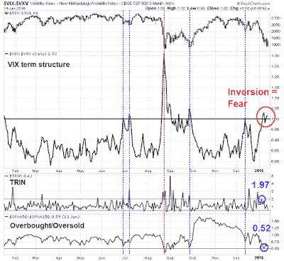

<!--yml
category: 未分类
date: 2024-05-18 03:11:02
-->

# Humble Student of the Markets: Explaining the lack of capitulation (and what it means)

> 来源：[https://humblestudentofthemarkets.blogspot.com/2016/01/explaining-lack-of-capitulation-and.html#0001-01-01](https://humblestudentofthemarkets.blogspot.com/2016/01/explaining-lack-of-capitulation-and.html#0001-01-01)

[Dana Lyons](http://jlfmi.tumblr.com/post/137270525700/complacent-correction-cause-for-concern)

 recently wrote a terrific piece about the level of complacency in the current bout of stock market weakness. The SPX had fallen over 9% in two weeks, but the VIX Index was barely challenging its December highs and it was nowhere near the highs set during the August/September selloff.

He found that past instances of where the market fell a lot but the VIX did not respond in a corresponding fashion foreshadowed further stock market weakness.

**Where is the wash-out?**

I had also been concerned about the apparent lack of panic during the latest market slide. My Trifecta Bottom Model, which was first described

[here](http://humblestudentofthemarkets.blogspot.com/2014/09/sell-rosh-hashanah.html)

, uses three somewhat uncorrelated components to spot short-term market bottoms:

1.  **VIX term structure inversion:** Which measures rising fear in the option market much better than the absolute level of the VIX Index;
2.  **TRIN:** When TRIN is above 2, it is often an indication of capitulative price-insensitive selling, otherwise known as margin clerk market; and
3.  **OBOS:** This is an intermediate term oversold indicator which indicates an oversold condition when the indicator falls below 0.5.

The Trifecta Bottom Model has been uncanny in spotting bottoms in the last three years. The chart below shows the record of this model in the last year, where the blue vertical lines indicate that two of the three components have been triggered (Exacta signal) and the red line indicates that all three were triggered. All marked short-term bottoms. The latest bout of stock market weakness saw TRIN hit a high of 1.97 (not quite 2.0) and the OBOS reach a low of 0.52 (not quite 0.5). Are these readings close enough to trigger a buy signal?

The full post is at our new site

[here](https://humblestudentofthemarkets.com/2016/01/14/explaining-the-lack-of-capitulation-and-what-it-means/)

.

**Site Notice**

Please be reminded that the new 

[site](https://humblestudentofthemarkets.com/)

 is closing to new subscribers as of midnight (Pacific Time) this Friday, January 15, 2016\. This is because I would like to better control the rapid growth of our community.

Here is a sample of some of my recent posts:

Two weeks ago, I wrote 

[The reason why the bulls should be cautious about a January hangover](https://humblestudentofthemarkets.com/2015/12/29/the-reason-why-the-bulls-should-be-cautious-about-a-january-hangover/)

. To be sure, I never expected the kind of downdraft that the market is experiencing, but I was directionally correct. What's more, my big picture calls were pretty good last year (and they contrarian enough that I got a ton of hate mail):

 I know that many readers have been following me for a long time. I would like to give them the opportunity to get the best start on 2016\. Come over to the new 

[site](https://humblestudentofthemarkets.com/)

 and take a look.

The subscription page is 

[here](https://humblestudentofthemarkets.com/shop/)

 (US$199.99 for one year, US$19.99 for one month, US$4.99 for a 24-hour day pass). Even if you are not ready to subscribe, you can always sign up for 

[email notification of free posts](https://humblestudentofthemarkets.com/subscribe-to-free-posts/)

 as they are free and available to the public two weeks after publication.

We would love to have you join our community.