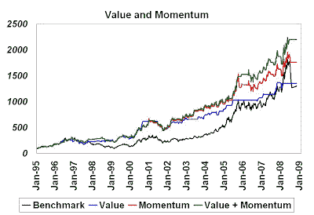

<!--yml
category: 未分类
date: 2024-05-18 01:05:23
-->

# Humble Student of the Markets: Factor diversification = Living to fight another day

> 来源：[https://humblestudentofthemarkets.blogspot.com/2008/09/factor-diversification-living-to-fight.html#0001-01-01](https://humblestudentofthemarkets.blogspot.com/2008/09/factor-diversification-living-to-fight.html#0001-01-01)

In the past I have met a number of quants who have forgotten the value of diversification. This attitude is especially prevalent among those who work at funds that happen to be showing superior returns at the time. The blowup at [Ospraie](http://www.bloomberg.com/apps/news?pid=20601087&sid=ac8G.pB.5TCI&refer=home) illustrates the importance of factor diversification in model building (not to mention risk control and position sizing).

**Timing commodity equities – an example**
As Ospraie invested in the commodity equity space, I show an example below of the components of a long-only timing model as applied to a commodity equity index. The black line shows the cumulative returns of the index from 1995.

**Value works - but not all the time** The blue line shows the returns of a timing model based mainly on value principles. The underlying model is not a classic value model but one modified by market signals. The problem with classic value is that it tends to be too early – early to buy and early to sell. One way of mitigating that problem is to combine it with some forward looking signal, e.g. estimate revision or relative strength, so that the model doesn’t buy just because it’s cheap, it buys when it’s cheap and fundamentals have stopped moving down.

This modified value model delivered returns that were roughly in line with the index over the 1995-2008 period but with lower volatility. It avoid much of the negative returns in the 1997-99 period but lagged when the benchmark started to rise in 2004.

**Momentum works but it’s volatile**

Momentum and trend following models can solve the problem of missing a significant uptrend in the benchmark. The red line shows the cumulative return of a momentum model as applied to the commodity equity index.

The momentum model also avoided much of the drawdowns that the value avoided in 1997-99\. It was also above to participate in the rise in the index from 2003 onwards. Overall, it outperformed the value model probably because the test period in question was mainly a bull market. However, returns were more volatile than the value model. Moreover, the momentum model suffered a drawdown in this current downturn whereas the value model was flat for this period.

**How to diversify and how not to diversify**

The correlation of the excess returns of the two models is 0.69\. Even with a relatively high correlation coefficient we can observe a diversification effect. The green line shows the cumulative returns of a modified value and momentum model, which outperforms the index and either the value or momentum model alone. Volatility is lower than the momentum model indicating superior risk-adjusted returns.

**When do you zig and when do you zag?**

This diversification exercise assumes fixed equal weights between the value and momentum models. What if an investor was short term oriented and allocated the weights according to recent performance? This could easily happen in a hedge fund with a value manager and momentum manager: “We manage risk and allocate capital according to the returns of our strategies”. The chart below shows the returns of a weighting scheme that adapts according to the recent returns of the two investment approaches. While adaptive weighting does outperform the benchmark, it does not outperform the fixed weighting scheme.

There are some lessons for quants in all this:

*   Diversify so that you can live to fight another day
*   If you can't forecast which model does best, don’t forecast and stay at a neutral (fixed) weight