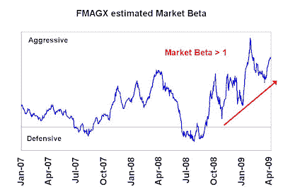
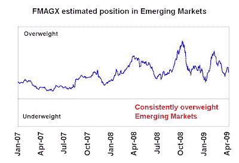
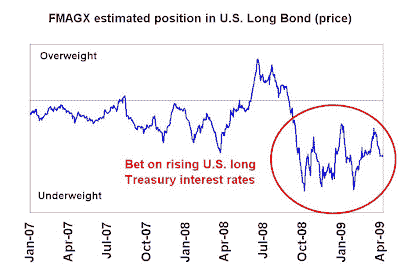

<!--yml
category: 未分类
date: 2024-05-18 00:55:29
-->

# Humble Student of the Markets: Fidelity Magellan recovers in 2009

> 来源：[https://humblestudentofthemarkets.blogspot.com/2009/04/fidelity-magellan-recovers-in-2009.html#0001-01-01](https://humblestudentofthemarkets.blogspot.com/2009/04/fidelity-magellan-recovers-in-2009.html#0001-01-01)

Remember Peter Lynch? He skippered Fidelity Magellan (FMAGX) during the 1977-1990 period and took the obscure fund to fame. The fund beat the S&P 500 in 11 of those 13 years. Since his departure, FMAGX has gone to a number of managers.

The latest steward of the fund is Harry Lange, who has been in charge since late 2005\. FMAGX has had its troubles as it sported a

[spotty record](http://quicktake.morningstar.com/FundNet/TotalReturns.aspx?Country=USA&Symbol=FMAGX)

in the last few years. Morningstar rates this large cap growth fund with only two stars.

In 2009, however, we saw a spectacular turnaround. The fund is up 6.6% YTD to April 9, or 11% ahead of the S&P 500\. Lange appeared to have achieved these returns with a combination of bets on emerging markets, interest rates and good stock picking.

**Market timing a performance headwind**

When I reverse engineered FMAGX’s macro exposures, the turnaround in performance was surprising as portfolio manager Lange was aggressive in his market beta, or market timing bet. As the chart below shows, FMAGX moved to an aggressive stance on the market in the late summer of 2008 and cranked up that exposure as the market tanked.

**The right kind of market exposure?**

Morningstar reports that FMAGX had 21% of the fund exposed to foreign stocks. Fortunately, it seemed to be the right kind of exposure. FMAGX has had a consistent overweight exposure to emerging market stocks. A quick look at the iShares MSCI Emerging Markets ETF (EEM) shows that it beat the S&P 500 by 18% YTD. (Note that the fund may not have actually held a big position in emerging markets, but held stocks that were highly correlated to emerging markets – a subtle difference.)

FMAGX also had a negative exposure to the U.S. long bond, which underperformed the S&P 500 by 14% YTD:

**Stock picking a standout**

Stock selection was also a standout. A glance at the

[top holdings](http://quicktake.morningstar.com/FundNet/Holdings.aspx?Country=USA&Symbol=FMAGX)

of FMAGX shows the top holding to be Corning Inc (GLW), which occupied 7.6% of the portfolio and was up an astounding 59% YTD. In fact, only five of the top 25 holdings showed negative returns YTD.

Given the large number of holdings in this portfolio (218), the fund appears to make big stock bets, as evidenced by the large (7.6%) position in the top holding. Such a profile is suggestive that stock selection will dominate returns over the macro positioning of the fund.

We’ll have to watch and see if the turnaround continues.