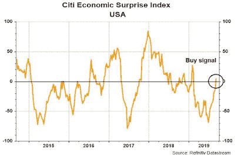

<!--yml
category: 未分类
date: 2024-05-18 02:26:12
-->

# Humble Student of the Markets: Fun with quant: Pure and naive factors

> 来源：[https://humblestudentofthemarkets.blogspot.com/2019/09/fun-with-quant-pure-and-naive-factors.html#0001-01-01](https://humblestudentofthemarkets.blogspot.com/2019/09/fun-with-quant-pure-and-naive-factors.html#0001-01-01)

A reader alerted me to a

[CNBC](https://www.cnbc.com/2019/09/07/special-chart-suggests-the-market-is-starting-a-hot-streak.html)

report of a bullish analysis by Bespoke's Paul Hickey:

> Bespoke Investment’s Paul Hickey believes a market hot streak is unfolding.
> 
> The independent market researcher is building his bullish case by zeroing in on the Citi Economic Surprise Index, which is built to measure optimism in the economy.
> 
> In the week ending Friday, the index flipped into positive after spending more than 100 days in negative territory. Hickey contends the move suggests investors are feeling more confident about the economy’s direction, so there’s a good chance stocks will rip higher.
> 
> “There are five prior periods that we’re talking about. One, three and six months later, the S&P was higher four out of five times,” Hickey told CNBC’s “Trading Nation” on Friday. “When we looked at when these prior streaks have ended and expectations have been ratcheted down enough, the market actually did quite well going forward.”

Quantitative analysts often struggle with a hidden problem called multicollinearity, which is the tendency of two variables that are closely correlated but have different effects. One example of multicollinearity is a person's height and weight. One way of addressing this problem is to isolate the "pure" effect of a signal from its "naive" multicollinear effect.

Here is an analysis of the pure and naive effects of the Economic Surprise Index (ESI) surge factor.

The full post can be found

[here](https://humblestudentofthemarkets.com/2019/09/09/fun-with-quant-pure-and-naive-factors/)

.