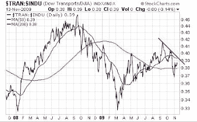

<!--yml
category: 未分类
date: 2024-05-18 00:42:48
-->

# Humble Student of the Markets: Fundamental meets technical analysis

> 来源：[https://humblestudentofthemarkets.blogspot.com/2009/11/fundamental-meets-technical-analysis.html#0001-01-01](https://humblestudentofthemarkets.blogspot.com/2009/11/fundamental-meets-technical-analysis.html#0001-01-01)

The mark of a good fundamental analyst is the ability to dig and look for data points that the rest of the market hasn’t really focused on. So it is with great interest that Jeff Matthews, who often has good fundamental insights, indicated that the economy may be improving or poised to improve because of

[extremely low inventory levels that he is seeing on a bottom-up basis](http://jeffmatthewsisnotmakingthisup.blogspot.com/2009/11/why-buffett-finished-off-burlington-its.html)

. In addition,

[FedEx had reported improving volumes](http://jeffmatthewsisnotmakingthisup.blogspot.com/2009/09/pay-attention-to-fedex-not-fed.html)

back in September, another sign of economic improvement.

Matthews concluded that this argues for buying transportation stocks and went on to speculate that this was one of the reasons why Buffett wanted to buy Burlington Northern:

> But given the fact that he stands at the center of an economic supply chain that stretches from a candy maker in South San Francisco to a high-tech machine tooling supplier in Israel, we think it’s no wonder Warren Buffett decided the time was right to buy the rest of Burlington Northern.
> 
> There’s going to be a lot of—to be technical again—stuff that will need to be getting moved around in the next twelve months.
> 
> It’s the inventories, and Buffett isn’t stupid.

**Where is the market consensus?**

One of the failings of fundamental analysis, however, is that fundamental analysts may be correct in their analysis but they can get their timing wrong. So is Jeff Matthews early?

To get an idea of the market consensus, the chart below shows the ratio of the Dow Jones Transportation Average relative to the Dow Jones Industrials Average. As you can see from the chart, the Transports show no sign of life on a relative basis and could be argued that it is in a minor downtrend.

Is Jeff Matthews mistaken? early or what?

For Buffett to be so tactical with an investment the size of a Burlington Northern would be out of character for him. As for Matthews' call for a growth surprise, I prefer to wait for some confirmation that market perception has turned before hopping on board his *train*.

To each his own.