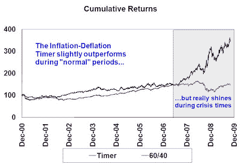
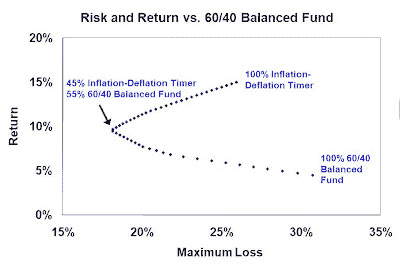

<!--yml
category: 未分类
date: 2024-05-18 00:43:45
-->

# Humble Student of the Markets: Get ready for Extremistan

> 来源：[https://humblestudentofthemarkets.blogspot.com/2009/11/get-ready-for-extremistan.html#0001-01-01](https://humblestudentofthemarkets.blogspot.com/2009/11/get-ready-for-extremistan.html#0001-01-01)

Nicholas Nassim Taleb, the author of

*The Black Swan*

, has been talking about the states of

*Mediocristan*

and

*Extremistan*

. The two concepts has been

[described as follows](http://ideafestival.typepad.com/my_weblog/2008/09/starting-with-w.html)

:

> "Mediocristan" and "Extremistan" are two world domains. In the former, extremes exist but are inconsequential, in the latter, extremes are not expected, but play a massive role. In the former, the ordinary plays a massive role. In the latter, one's wealth can change massively in a second.

What makes the pre-conditions for Extremistan? John Robb, who blogs at

[Global Guerilla](http://globalguerrillas.typepad.com/globalguerrillas/2009/10/extremistan.html)

, describes the conditions for extreme events.

> *   More winner take all competitions. As in: a small number of individuals or companies win everything. More inequality and less social justice are inevitable.
> *   Actions by individuals and small groups generate increasingly extreme results (this is akin to the superempowerment thesis for global guerrillas readers). As in: "eventually, one man might be able to declare war on the world and win."
> *   Systemic events, both negative and positive, will occur at a high frequency, faster and with more extreme outcomes than ever before (this is also a common feature of unstable, high performance systems that lack a correspondingly high performance control system -- as in, you don't need to predict far in advance if you can correct fast enough).

These conditions sound much like the circumstances described by Simon Johnson, former chief economist at the IMF, in his

[Atlantic article](http://www.theatlantic.com/doc/print/200905/imf-advice)

. Johnson describes a society where there are class differences and when crisis hits, the elite gets bailed out and the middle and lower classes take the brunt of the adjustment. In the end, the

[rich get richer](http://baselinescenario.com/2009/10/17/who-is-carlos-slim/)

.

**What about China?**

Can China save the world? In the current financial crisis, China is held out as the last refuge of hope. Its economy is growing while other major industrialized countries are mired in no or slow growth. It has massive reserves, which could serve to forestall the worst effects of deflationary adjustments.

Mike Pettis, who blogs at

[China Financial Markets](http://mpettis.com/2009/10/chinese-railways-and-speculating-pig-farmers/)

, believes that Chinese growth is not sustainable in the medium term. If and when Chinese growth is perceived to be rolling over, then the markets could fall hard [emphasis mine]:

> I spend a lot of time talking to large hedge funds and institutional investors – with at least three or four one-on-one meetings a week – on China and market conditions. It worries me that recently I have heard investors say many times, generally very sophisticated investors, that we are clearly in a bubble and the best strategy is to ride it out as long as we can. This has almost become one of the mantras of sophisticated investors – the less sophisticated, I guess, assuming that the crisis is safely behind us.
> 
> It worries me because of course we can’t all collectively ride the bubble and bail out before everyone else does. ***I wonder if this means that an awful lot of the big funds can be expected to rush to the doors at the same time when things turn bleak. If so, of course, that means we are likely to see both the upside and the downside market risks increase.*** Several of my fund management friends have insisted the problem has to do with the nature of hedge fund compensation. Most of the hedge funds were hurt pretty badly in the financial crisis, but a very large number of them were very pleasantly surprised by how quickly they’ve been able to make back a substantial share of their losses.

In China, we also find elements of Extremistan.

**What can investors do?**

This all adds up to an Age of Instability.

[Jim Welsh](http://www.ritholtz.com/blog/2009/10/welsh-october-letter/)

, writes in his newsletter:

> History suggests that these extended periods of instability (1929-1949, 1966-1982), do not reward investors who buy and hold, or the institutions that disdain cash. As a kid growing up in the Midwest, during July and August, I always wore a t-shirt and shorts and wore a crew cut. In January and February, my hair was longer and I never went outside in shorts and a t-shirt. (Well maybe once on a dare.) If my parents had known, they would have rhetorically asked me if I was stupid. So here’s a worthwhile question. ***Why do investment professionals advise their clients to simply buy and hold, whether we are in a period of stability or instability?***

This brings me back to a theme that I have talked about before. There are

[no models for all seasons](http://humblestudentofthemarkets.blogspot.com/2008/11/there-are-no-models-for-all-seasons.html)

.

***Buy and hold may not be appropriate in the Age of Extremistan***

.

In an era of instability, you need to use models that capture and profit from the instability. An example is the

[inflation-deflation timer](http://humblestudentofthemarkets.blogspot.com/2009/08/timing-inflationdeflation-trade.html)

, which would be well-suited for an environment where market expectations oscillate between the Arctic deep freeze of deflation and the equatorial heat of runaway inflation.

**The Inflation-Deflation Timer for Canadians**

Incidentally, I have also updated the

[Inflation-deflation timer for Canadian Dollar investors](http://www.qwestfunds.com/publications/qwest_newsletter.html)

. The analysis resulted in a model whose back-tested returns beat all other asset classes by 10% or more during the test period. As the chart below shows, the Inflation-Deflation Timer slightly outperformed a 60% stock/40% bond portfolio in “normal” times and stood out during crisis periods. Downside risk was slightly better than the 60/40 balanced fund.

What’s more the Inflation-deflation timer appeared to be a highly diversifying asset to a 60/40 balanced portfolio. A minimum risk portfolio would indicate a 45% allocation to an Inflation-deflation timer strategy.

You can find the full details of the Canadian model

[here](http://www.qwestfunds.com/publications/qwest_newsletter.html)

.