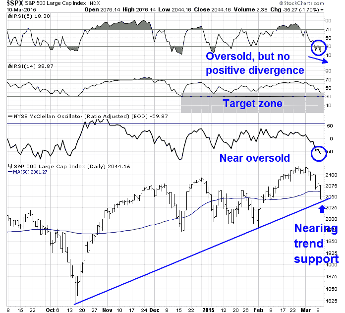

<!--yml
category: 未分类
date: 2024-05-18 03:24:15
-->

# Humble Student of the Markets: Getting close to a ST market bottom

> 来源：[https://humblestudentofthemarkets.blogspot.com/2015/03/getting-close-to-st-market-bottom.html#0001-01-01](https://humblestudentofthemarkets.blogspot.com/2015/03/getting-close-to-st-market-bottom.html#0001-01-01)

In my last weekend post, I wrote that US equities was getting close to a bottom and I stand by those remarks. Using the market patterns of 2011 and 2012 as a template, I thought that stocks was getting oversold and downside risk was limited to 1-2% (see

[Bullish, but "data dependent"](http://humblestudentofthemarkets.blogspot.com/2015/03/bullish-but-data-dependent.html)

):

> In some cases, the market rebounded right away. In another, it required a final flush before seeing a durable bottom.
> 
> My main takeaway from 2011 and 2012 is that near-term downside risk is limited to 1-2% from current levels. Today's SPX chart shows that the market is oversold on RSI-5\. There is technical support at the 50 day moving average (2062) and further support at the uptrend line drawn from the October low (about 2040), which is roughly 1.5% below Friday's closing levels.

On Monday, we got an unimpressive bounce and I

[tweeted](https://twitter.com/HumbleStudent/status/575005392721285120)

that the final flush scenario was in play:

On Tuesday, stock prices sold off dramatically and readings are at or very close to oversold levels where a durable bottom have been seen in the past. The chart below of the SPX with 5-day RSI, 14-day RSI and McClellan Oscillator (NYMO) tells the story. RSI-5 is oversold, but not showing a positive divergence of higher low, though past bottoms have not necessarily shown such readings. RSI-14 closed at 38.87, which is nearing the range where the market has bottomed in the past few months. NYMO came in at -59.87, which is just a fraction away from an oversold reading of -60\. Finally, the SPX closed at 2044.16, below the key 50 day moving average, but just above trend line support at about the 2040 level.

In addition, fear indices are starting to spike. The chart below of the VIX term structure, as measured by the VIX-VXV ratio, and TRIN shows capitulation-like market behavior. The VIX-VXV ratio is rising, though it is not inverted (above 1). TRIN spiked to 2.64, which indicates panic selling. I have drawn blue vertical lines to mark past instances in the last three years when TRIN has risen above 2 and red vertical lines to mark past instances when the dual conditions when VIX term structure inverted and TRIN was over 2\. The red lines have been much better at calling bottoms, but the blue lines have, more often than not, indicated instances when the market either bounced or downside risk was limited.

In short, market technicals suggest that stocks have either made a bottom or very close to a bottom. I have no idea what stock prices will do in the next couple of days, but the odds favor higher stock prices in the next week.