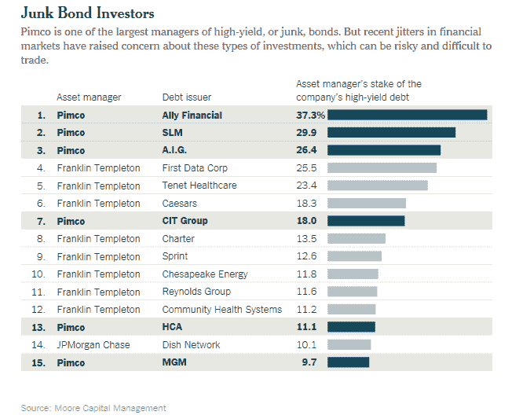

<!--yml
category: 未分类
date: 2024-05-18 03:31:14
-->

# Humble Student of the Markets: Getting close to a bottom, but not yet

> 来源：[https://humblestudentofthemarkets.blogspot.com/2014/10/getting-close-to-bottom-but-not-yet.html#0001-01-01](https://humblestudentofthemarkets.blogspot.com/2014/10/getting-close-to-bottom-but-not-yet.html#0001-01-01)

**Trend Model signal summary**

Trend Model signal: Risk-off

Direction of last change (trading model): Negative

The actual historical (not back-tested) buy and sell signals of the Trend Model are shown in the chart below:

**Update schedule**

: I generally update Trend Model readings on

[my blog](http://humblestudentofthemarkets.blogspot.com/)

on weekends and tweet any changes during the week at @humblestudent. In addition, I have been trading an account based on the signals of the Trend Model. The last report card of that account can be found 

[here](http://humblestudentofthemarkets.blogspot.com/2014/10/trend-model-september-report-1-year-401.html)

.

**The enigmatic bear**

Is the correction over? Did we bottom last week?

I've been getting those questions all of the last week. To answer that question, I believe that we have to answer the question of why the stock market went down. The current bearish episode is highly enigmatic as there appeared to be no consensus fundamental reason for the swoon. In other words: Unless you know what your illness is, how can you know if you are cured?

As the stock market sold off last week, the narrative seemed to be rising worries over economic weakness in Europe and, to a lessor extent, China. Indeed, the US earnings outlook has finally started to deteriorate in response to the economic weakness abroad. The chart below, from John Butters of

[Factset](http://www.factset.com/websitefiles/PDFs/earningsinsight/earningsinsight_10.17.14)

(annotations in red are mine), shows that forward EPS estimates (blue line) are starting to roll over. Such episodes have been associated in the past with either corrections or bear markets.

To explore the implications of the global slowdown hypothesis,

[Gavyn Davies](http://blogs.ft.com/gavyndavies/2014/10/12/its-the-new-mediocre-not-a-global-recession/)

outlined a number of slow growth scenarios called the "new mediocre" (charts

[here](https://www.fulcrumasset.com/assets/Document/GDPresentationOct2014.pdf)

). First, he outlined his baseline scenario of continued global growth. Note that the projections for US GDP growth is in the 2-4% zone:

He then modeled a China hard landing scenario, with a growth slowdown that could freak out the markets.

As much of the market concerns last week surrounded slowing eurozone growth, Davies highlighted how growth seems to be spreading to core eurozone countries like France and Germany:

He went on to model the effects of a eurozone recession, which showed a marginal growth slowdown in the US:

Just so that investors don`t go overboard on the bearish scenarios, Davies indicated that growth "nowcasts" are not showing any sign of slowdown:

If we were to accept the narrative that the markets fell because of concerns over slowing growth, the the latest BoAML Fund Manager Survey (FMS) should provide some comfort for US equity bulls. The FMS shows that global growth expectations are rolling over:

However, the downside is likely to be limited. The FMS shows that managers have not taken on excessive risk. Should a synchronized global growth scare occur, it woulcould cause cascading de-risking activity that would result in a crash, or even a bear market. True enough, global equity allocations are above average and they are falling, but levels are not excessive:

On the other hand, cash levels are high by historical standards:

As growth concerns are concentrated in Europe and China, the US is likely to be a safe haven for equity exposure. The FMS shows that US equity exposure is not especially high by historical standards. Should a crisis occur, managers that have the mandate flexibility to alter country equity exposure would likely gravitate to the US:

As well, the latest data on insider activity from

[Barron's](http://online.barrons.com/public/page/9_0210-instrans.html)

shows that this group of "smart investors" have been buying on this dip:

**Bottom line:**

If you were to accept the reasoning that the latest round of equity market weakness is attributable to slowing global growth, then US equities are relatively well insulated from a growth scare.

**Blame the Fed?**

The conventional wisdom explanation of this market correction seems a little too neat. I had warned about slowing global growth in July (see

[Global growth scare = Trend model downgrade](http://humblestudentofthemarkets.blogspot.com/2014/07/global-growth-scare-trend-model.html)

) and others, like 

[David Levy](http://www.independent.co.uk/news/business/analysis-and-features/doom-and-gloom-2015-global-recession-warning-from-financial-seers-of-the-century-9624700.html)

, warned about a possible US recession as well (also see

[What keeps me awake at night](http://humblestudentofthemarkets.blogspot.com/2014/08/what-keeps-me-awake-at-night.html)

):

> Just as the US economy strengthens, other countries threaten to drag it down. Employers in the US are creating jobs at the fastest pace since the late 1990s and the economy finally looks ready to expand at a healthy rate.
> 
> But sluggish growth in France, Italy, Russia, Brazil and China suggests that the old truism “When the US sneezes, the rest of the world catches a cold” may need to be flipped.
> 
> Maybe the rest of the world will sneeze this time, and the US will get sick.

Levy correctly warned us about the Global Financial Crisis. His record, as well as his family's pedigree of forecasting, is impressive:

> His grandfather, Jerome, didn’t just call the great crash of 1929 – he sold his stock and liquidated his wholesale goods business in anticipation of it. Immediately after the Second World War, when many experts thought the US was sure to fall into another depression, his father, Jay, accurately predicted a rapid expansion. In late 1999, his uncle, Leon Levy, a hedge fund manager and collector of antiquities, invited me into his office and predicted a new generation of the wealthy would be laid low soon in a coming dotcom crash.
> 
> Those stocks began their long dive a few months later.

Despite the growth concerns raised during the summer, the stock markets kept going up. The equity market went on to shrug off the Russia-Ukraine conflict, impending deflation in the eurozone, news of slowing Chinese growth and protests in Hong Kong. The explanation that the markets suddenly freaked out over slowing global growth doesn't seem plausible.

A simpler explanation was advanced by

[Macro Man](http://macro-man.blogspot.com/2014/10/what-now.html)

, who attributed the sea change in risk appetite to Fed policy:

> By an amazing coincidence, the Federal Reserve is about to stop purchasing assets for the first time in a couple of years. In the QE era, there has been a very strong inverse relationship between the degree of policy accommodation and the level of equity vol. As such, from Macro Man's perspective, the current "collapse" merely represents a normalization in the Sharpe ratio for holding equities, credit, other risky assets etc.

He concluded that we are just observing the normalization of market volatility, but it is nothing to panic over (emphasis added):

> From Macro Man's perch, this is not 2000, 2007, or any similar market-topping analogue. While there has been some financial excess, there is nothing like the kind of real economy excess to produce a proper meltdown/recession. As noted above, ***what we are observing is the start of a normalized volatility regime, at least in certain segments of financial markets. If anything, the proper historical analogue for next year will be 1994 or 2004- two years when stocks kind of scuffled as monetary policy was tightened for the first time in several years.*** (For fun, look what happened to USD/JPY on Valentine's Day 1994.)

In support of Macro Man's perspective, Izabella Kaminska at

[FT Alphaville](http://ftalphaville.ft.com/2014/10/17/2011852/it-takes-200bn-per-quarter-to-feed-the-machine/)

highlighted analysis from Matt King at Citi. Citi's interpretation is that it's global central bank liquidity that matters, not just what the Fed does:

> For over a year now, central banks have quietly being reducing their support. As Figure 7 shows, much of this is down to the Fed, but the contraction in the ECB’s balance sheet has also been significant. Seen from this perspective, a negative reaction in markets was long overdue: very roughly, the charts suggest that zero stimulus would be consistent with 50bp widening in investment grade, or a little over a ten percent quarterly drop in equities. ***Put differently, it takes around $200bn per quarter just to keep markets from selling off.***

In some ways, this "blame central bankers" explanation may be a more satisfactory explanation for the most recent bout of market weakness. It could be said that the sell-off in risk assets was sparked by de-risking in the bond market and the downside volatility was magnified by a lack of liquidity. The weakness then spread to the stock market. David Keohane of

[FT Alphaville](http://ftalphaville.ft.com/2014/10/15/2007132/drawdown-to-what/)

pointed to analysis from Nomura:

> Do click to enlarge but what you’ll see is risk assets like US high yield, energy stocks and brent (at $80 yet?) getting hit while FX and peripheral Eurozone bonds, for the most part, have been admirably steady. For the lack of something more compelling, Nomura blame the lack of a clear liquidity backstop, QE4 notwithstanding, and global growth concerns, old-hattedness notwithstanding:

Nomura went on to say that the current risk-off environment is nothing to get worried about, largely because liquidity in the banking system remains ample and there is little risk of financial contagion (emphasis added):

> Nevertheless, there is no doubt that many investors seem to be in full-on risk reduction mode currently. We are currently receiving a steady stream of questions about how bad it can get, with comparison to the 2011 sell-off and suggestions that QE4 may be needed. This illustrates how quickly sentiment has swung.
> 
> While we are concerned about the setup for risk assets in general this quarter, due mainly to liquidity and valuation considerations, we are less concerned about the actual impact of recent market dynamics on key global economies, for a number of reasons.
> 
> First, ***the type of risk aversion we are seeing now is not necessarily that powerful from a financial conditions perspective.*** Banks are actually outperforming in the sell-off, and liquidity indicators are well behaved. For example, dollar funding markets are stable, and short-duration credit instruments are holding firm, while the move in swap spreads has been moderate (relative to VIX moves). Hence, while high yield spreads are meaningfully wider (from a low base), it is not clear at this point that there will be strong feedback into the economy through tighter credit conditions. In fact, in the US, you can argue that lower mortgage rates will be a boost to an important component of the credit spectrum.
> 
> Second, the big move in oil prices can be interpreted in various ways. A delayed reaction to increased US supply? A function of weakening global demand? Due to Libyan production surprising to the upside? There will be winners and losers from this price shock (see Dissecting the Commodity Shock, 9 October 2014). But generally, the Eurozone and the US will see consumption potentially somewhat boosted by this dynamic, simply because the terms of trade are being boosted.
> 
> All told, there may well be a gradual downtrend in global growth, driven especially by EM growth trends. But it is unclear that the recent market tension is of a type that will put us into a downward spiral, as was the case during the Global Financial Crisis and during the Euro crisis.

The whole risk-off episode may have been sparked by fears of a US junk bond liquidity at Pimco (via

[Dealbook](http://dealbook.nytimes.com/2014/10/16/pimco-and-other-big-firms-could-face-liquidity-crisis-in-risky-bonds/)

):

> When it comes to high-risk bonds, the asset management giant Pimco has pretty much cornered the global market.
> 
> Be it bonds issued by the automotive financier Ally Financial or the student loan financier SLM in the United States, or government bonds in Spain and Italy, Pimco holds a commanding position in these high-yielding securities.
> 
> But as Pimco’s portfolio managers double down on their bet that high-risk bonds will thrive in a world of low interest rates, a growing number of global regulators are warning that the positions being taken on by the big asset management firms pose a broad danger to the financial system.
> 
> These concerns were amplified this week as stock markets gyrated, the yields of high-risk corporate and European bonds spiked upward and, crucially, trading volumes evaporated.
> 
> Regulators and bank executives have cautioned that an accumulation of hard-to-trade, risky bonds by a small group of fund companies could turn a bond market hiccup into a broader rout, in light of how illiquid many of these securities have become.

With a liquidity induced sell-off, where bond investors try to rush for the exits, the weakness then spread to equities, David Merkel wrote

[a must-read post](http://researchpuzzle.com/blog/2014/10/15/amplifiers/)

showing how equity weakness could get amplified.

Whatever explanation you accept for the recent episode of market weakness, the conclusion is clear. This is not the start of an equity bear market. In that case, we should look to technical analysis to see the likely near-term path for US equities.

**Equities oversold, but wait for the final bottom**

From a technical viewpoint, where does the stock market stand today?

As the week closed, the SPX showed a high degree of technical damage and many indicators are highly oversold. As the chart below shows, the SPX has violated the uptrend that began in late 2011 and remains below its weekly Bollinger Band, which is a relatively rare occurrence. In addition, other indicators such as the NYSE HL and my favorite

[overbought-oversold indicator](http://www.tradersnarrative.com/finding-buy-points-with-moving-average-ratios-4021.html)

are showing oversold readings seen in past major bottoms.

Was last week`s flush on Wednesday emotional to be a bottom? Close, but not quite (see

[A Bold Forecast: Today was not the bottom](http://humblestudentofthemarkets.blogspot.com/2014/10/a-bold-forecast-today-was-not-bottom.html)

). If we were to compare current TRIN and equity-only put-call ratios to past market bottoms of recent major market sell-offs in 2010 and 2011, the level of panic is vastly different.

Undoubtedly a bottom is near, but last week was probably not the final market low.

[Dana Lyons](http://jlfmi.tumblr.com/post/100157272585/high-volume-breakdowns-lead-to-nearby-bottoms-after)

showed the pre-conditions for major market bottoms and the sell-off last week is indicative of a pending market low,

But not yet. Here are the historical return statistics of market sell-offs like the one seen last week:

[Andrew Nyquist](http://www.seeitmarket.com/investors-panic-volatility-spikes-whats-next-stocks-13826/)

had a similar warning for traders who get prematurely bullish. Wait for the re-test of the lows:

> One word of caution for those calling this ***the bottom***: Markets almost always see retests. And quite often price gives way to brief undercuts or new lows/legs lower. Additionally, the Options Equity Put-Call ratio still hasn’t pushed above 1.00 and managed to drop to .78 today. That said, market volatility as measured by the VIX briefly spiked over 30\. And the SP 500 pierced a key Fibonacci support level but managed to close above it.

I would tend to agree with Nyquist - wait for the retest of the lows, which will likely occur next week. The last few major corrective episodes were in 2010 and 2011\. As this SPX chart from 2010 shows, the market made a W-shaped rather than a V-shaped bottom, and spent several weeks re-testing the lows before resuming the bull trend.

Here is the chart from 2011.

In addition, if you were to accept the central bank liquidity induced sell-off explanation, then

[Nautilus Research](https://twitter.com/NautilusCap/status/523121979361345536/photo/1)

has a warning for you. Expect more volatility, but not necessarily a resumption of the bull:

Putting it all together, my base case scenario calls for greater market volatility in the weeks ahead .Tactically, I expect a second round of weakness next week to test and perhaps undercut last week's low. Friday's rally was halted at the first Fibonacci retracement level (1892), with further resistance at the 200 day moving average (1906) and the 50% retracement level (1920).

My inner trader remains modestly short and my inner investor is looking around to see what bargains he can pick up at these depressed levels.

**Disclosure:**

Long SPXU