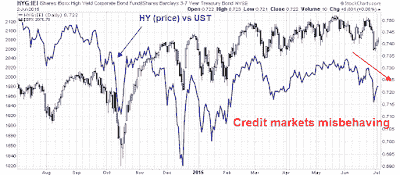

<!--yml
category: 未分类
date: 2024-05-18 03:18:58
-->

# Humble Student of the Markets: Getting set for the market of 2011

> 来源：[https://humblestudentofthemarkets.blogspot.com/2015/07/getting-set-for-market-of-2011.html#0001-01-01](https://humblestudentofthemarkets.blogspot.com/2015/07/getting-set-for-market-of-2011.html#0001-01-01)

**Trend Model signal summary**

Trend Model signal: Risk-off

Trading model: Bearish

The Trend Model is an asset allocation model which applies trend following principles based on the inputs of global stock and commodity price. In essence, it seeks to answer the question, "Is the trend in the global economy expansion (bullish) or contraction (bearish)?"

My inner trader uses the trading model component of the Trend Model seeks to answer the question, "Is the trend getting better (bullish) or worse (bearish)?" The history of actual out-of-sample (not backtested) signals of the trading model are shown by the arrows in the chart below. In addition, I have a trading account which uses the signals of the Trend Model. The last report card of that account can be found

[here](http://humblestudentofthemarkets.blogspot.com/2015/07/june-trend-model-report-card-back-on.html)

.

**Update schedule**

: I generally update Trend Model readings on

[my blog](http://humblestudentofthemarkets.blogspot.com/)

on weekends and tweet any changes during the week at @humblestudent.

**Choppy markets ahead**

These markets are confusing. The binary risk posed by the Greek drama has induced a level of volatility that the markets haven't seen for a few years. I had been highly conflicted about stock market direction, until I began to categorize the bullish and bearish indicators by time horizon. The contradictory signals all made sense when I realized that the disagreement over direction was based on time horizon. These conditions are highly suggestive of a choppy July.

Here are my model readings, from the ones with the shortest time horizon, which is 1-3 days, to the longest, which is about 12-24 months.

> **Short term trading models:** Bullish
> **Breadth:** Bearish
> **Global markets, or inter-market analysis:** Bearish
> **Macro and market fundamentals:** Bullish
> 
> **Tail-risk:** Greece and China

There you have it. While short-term trading models correctly predicted the bounce that began last week, the technical picture and market internals remain weak, which suggests that stock markets may have unfinished business to the downside. However, the long term fundamental and macro picture looks positive, which indicates that investors should view any weakness to be buying. These readings are a recipe for the next few weeks to be volatile and treacherous.

So pick your time horizon and pick your poison. Let`s begin...

**A short-term bounce**

I wrote last week that the market was set up for a short-term bounce and I was looking for some follow-through to see how durable the rally was (see

[Time for a market bounce?](http://humblestudentofthemarkets.blogspot.com/2015/06/time-for-market-bounce.html)

). Indicators like the CNN Money Fear and Greed Index had deteriorated to levels where stock prices had seen a short-term rally in the past.

Similarly, the CBOE equity-only put/call ratio rose to levels that have signaled short-term market bottoms in the past:

In my blog post, I had also highlighted my Trifecta bottom model, which has had an excellent history of spotting buyable oversold bottoms in the last few years. In this case, only two of the three components had flashed a buy signal, which are marked by the blue vertical lines in the chart below. The red lines indicate where all three components had flashed buy signals.

I would add the caveat that this model did not perform perfectly in 2010 and 2011 where oversold markets got even more oversold. So the big question then becomes, "Is this the start of a major decline?"

In general, sustainable V-shaped bottoms are accompanied by bullish enthusiasm and follow-through. I wrote about watching for

[O'Neill follow-through days](https://www.tradestation.com/education/labs/analysis-concepts/identifying-market-bottoms)

- and the window for this market action does not begin until Tuesday.

[Dana Lyons](http://jlfmi.tumblr.com/post/123015384705/for-the-vix-its-all-about-the-recovery)

also researched the topic of bullish follow-through after a V-shaped bottom. He studied the degree of retracement after a VIX spike and found that episodes more powerful retracements saw much higher market returns while weak retracements saw negative returns.

Unfortunately, I find the current anemic nature of the market action after the market bottom to be disturbing. SPY close was below its open on Tuesday, Wednesday and Thursday, which are hardly signs of positive bullish momentum. In fact,

***this was the only time in its trading history going back to 1993 that SPY had seen 10 consecutive times when the close was below the open. ***

Moreover, the relative performance of high-beta groups during the three day rally has been disappointing. The chart below shows the SPX in the top panel and the relative performance of different high-beta groups in the others. High beta stocks had been either flat or in relative downtrends leading up to the recent market swoon, which arguably could be expected. However, their performance in the brief rally afterwards can be best described as "Meh!"

This kind of market action can hardly be described as wildly bullish.

**Bad breadth**

As we move from the ultra-short term trading models to models with somewhat longer time horizons, the outlook remains problematical. The chart below of the SPX, along with a variety of breadth indicators are not showing any bullish divergence. In addition, the SPX is showing the characteristic signs of a rounded top, which suggests that stock prices are likely to resolve themselves to the downside.

**Bearish verdict from inter-market analysis**

The Trend Model depends mainly on cross-asset and global market inter-market analysis to calculate its signals. While this is a trend following model and trend following models are terrible at market turning points, I am not seeing any signs of a bullish upturn in any of the components of my model.

Let's begin with risk appetite. One of the best recent indicators of market direction that I`ve seen for a 1-3 week time horizon has been the relative performance of junk bonds. The chart below shows the performance of HY bond prices relative to their equivalent-duration Treasuries (blue line). As the chart shows, credit market risk appetite is diminishing as it is showing a negative pattern of lower highs and lower lows, which is negative for the outlook for risky assets like US equities.

The global equity picture doesn't look very bright either. Starting with Europe, the UK FTSE 100, which in theory is more insulated from Greece than eurozone equities, has violated both its 50 and 200 day moving averages and the bears have taken control as the index is in a downtrend with lower highs and lower lows. The Euro STOXX 50, which represents large eurozone stocks, remains below its 50 dma but appears to be trying to stabilize at a support level. Its future is highly dependent on how the Greek drama unfolds in the days ahead. Score European equities as bearish.

Then we have Asia. Notwithstanding the casino called the Chinese stock market (more on that later), the stock indices of every regional exchange of China`s major Asian trading partners are below their 50 dma. These are not bullish endorsements of global growth.

Cyclically sensitive commodity prices are also telling a similar story. The cyclically sensitive industrial metals complex remains weak, regardless of what currency the commodities are priced in. This is especially disturbing as the USD Index has been relatively flat in the last two months. However, the CRB Index, which is heavily weighted to energy, has been flat as oil prices have stabilized in the same period. Score commodities as mildly weak.

**Shanghai turns into a "margin clerk" market**

I don`t want to get overly Zero Hedge apocalyptic about the implications of a possible crash in the Chinese stock market as the Shanghai market has been falling relentlessly and down -28.6% from its peak in June. However, global markets may not be prepared for a catastrophic crash in Shanghai and some contagion effects may be possible.

The Chinese stock market had been driven up by increasing amounts of margins loans and financial leverage and now we are seeing the downside of what margin debt can do. The effects of margin debt in China has been well documented, here is the

[WSJ](http://www.wsj.com/articles/chinese-firms-discover-margin-lendings-downside-1435653636)

:

These charts from Goldman Sachs tell a similar story:

But wait! That's just official account margin. Then you have to account for margin loans from the informal and shadow banking sector (via

[Callum Thomas](https://twitter.com/Callum_Thomas/status/616701246506860544/photo/1)

):

One sign of desperation was when

[Beijing started hunting for manipulators](http://finance.yahoo.com/news/struggle-stem-market-rout-china-010839081.html)

who were driving down stock prices. Where were they when there were

[widespread reports of insider selling as stock prices got pumped up](http://www.chinadaily.com.cn/business/2015-06/24/content_21085187.htm)

? Despite these initiatives, plus the PBoC measure to ease interest rates last week, the Chinese stock market continues to nosedive and has turned into a "margin clerk" market.

A couple of other measures have been announced to support the cratering stock market, First, 

[Bloomberg](http://www.bloomberg.com/news/articles/2015-07-02/china-to-individual-investors-go-ahead-bet-the-house-on-stocks)

 reports that Bejing is allowing margin loans collateralized by real estate as a sign of desperation:

> In China, you can now literally bet the house on the nation’s tumultuous stock market.
> 
> Under new rules announced Wednesday by the country’s securities regulator, real estate has become an acceptable form of collateral for Chinese margin traders, who borrow money from securities firms to amplify their wagers on equities. That means if share prices fall enough, individual investors who pledge their homes could be at risk of losing them to a broker.

We also saw the surprise announcement that  21 brokerage houses banded together to put 120 billion RMB (USD 19 billion) into the stock market (via

[Bloomberg](http://www.bloomberg.com/news/articles/2015-07-04/china-stock-brokers-set-up-19-billion-fund-to-stem-market-rout)

):

> The 21 brokers led by Citic Securities Co. will invest the equivalent of 15 percent of their net assets as of the end of June, or no less than 120 billion yuan ($19.3 billion) in total, the Securities Association of China said in a statement on its website Saturday. The fund will invest in blue-chip exchange-traded funds, it said.
> 
> The move comes after measures to shore up equities failed to stop margin traders from unwinding positions at a record pace, with the market losing more than $2.8 trillion of value in three weeks. The People’s Bank of China cut interest rates last week, while margin-trading rules were eased and trading fees were cut Wednesday.

A 120 billion yuan fund dedicated to buying blue chip stocks in a market that`s falling because of margin loan liquidation may not be enough:

> The new fund to bolster equities may have only “a fleeting effect when daily turnover has reached 2 trillion yuan”, according to Hao Hong, China equity strategist at Bocom International Holdings Co. in Hong Kong.
> 
> “This 120 billion yuan won’t last for an hour in this market,” Hong said by phone from Beijing Saturday. “It might benefit blue-chip stocks, as investors may see them as value, but the bursting of the bubble in small-cap/tech stocks is likely to continue.”

Japan tried similar tactics in the early 1990's and it failed. Here is a

[NY Times](http://www.nytimes.com/1990/02/27/business/japan-intervenes-to-give-stability-after-stock-drop.html)

article from February 27, 1990 (h/t 

[Patrick Chovenac](https://twitter.com/prchovanec/status/616189660717576196)

):

> After a week of turmoil on the Tokyo Stock Exchange, topped by Monday's 4.5 percent plunge, the Government and the exchange itself intervened to restore stability...
> 
> On opening Tuesday, the market quickly bounced back an additional 600 points before heading downward again. At the mid-day close, the average had erased all of its gains and was down 171.30 points. The strong market in New York and signs that the Japanese Government's efforts were helping to stabilize the yen were credited for the small, temporary rebound, but the subsequent drop was taken as a sign that market confidence was still fragile.

For some context on the scale of the slide in Chinese stocks,

[Bloomberg](http://www.bloomberg.com/news/articles/2015-07-02/chinese-stocks-just-lost-10-times-greece-s-gdp)

reported on July 2 that the fall in Chinese equities was equivalent to 10 Greek GDPs (and that was before prices fell even further):

> A dizzying three-week plunge in Chinese equities has wiped out $2.36 trillion in market value -- equivalent to about 10 times Greece's gross domestic product last year.

If the Chinese market continues to slide, the big question then becomes, "What`s the potential damage to global markets?"

We can categorize the possible damage as short-run and long-run. The short-term risk is a financial contagion that spreads throughout the global financial system. There is about $9 trillion in loans in the offshore USD market (see

[The key tail-risk that the FOMC missed (and you should pay attention to)](http://humblestudentofthemarkets.blogspot.com/2015/02/the-key-tail-risk-that-fomc-missed-and.html)

). BIS statistics indicate about $1.1 trillion was directed to Chinese companies, mostly through Hong Kong conduits.

Let`s sketch out a worst case scenario with some back of the envelope calculations. Supposing that 25% of those loans go sour and lenders recover, on average, 70 cents on the dollar. Aggregate losses, would then amount to $83 billion, which is roughly the same order of magnitude as total Puerto Rico debt of $72 billion. (If you`re not panicked that a PR default would sink the markets, why should a Chinese market crash spook you?) To be sure, a $83 billion hit to the global financial system would be unpleasant, but not fatal, especially if the losses are spread around. Conceivably, we could see a major regional player like Macquarie Bank go belly up (that's just an example, I know nothing about Macquarie), but central bankers are much better prepared at these liquidity-driven panics than they were in 2008.

The long term effects of a crash in Chinese equities are far more serious as it will depress Chinese household sector wealth. Such an event will end the hopes of any consumer-based re-balancing that Beijing might have had. The rest of the world would see negative side effects in the form of falling Chinese demand for both consumer and capital goods. George Magnus, writing in the

[FT](http://www.ft.com/intl/cms/s/0/3dbafa5e-21a6-11e5-ab0f-6bb9974f25d0.html)

, outlined the possible fallout:

> If there were another precipitous market decline, the effects on the economy might increase for three reasons. First, although Chinese households typically hold only about 20 per cent of assets in equities, exposure is rising for the new middle class. More than 10 per cent of the between 70m and 80m retail trading accounts were opened this year, about the same as in 2014\. Second, any short-term balance sheet boost for SOEs will disappear, and non-financial company revenues and earnings will be put under pressure by weaker demand, overcapacity and deflation.
> 
> Third, and perhaps most important, another large drop will probably mark a loss of confidence in the government’s ability to underpin the market at a time when the economy is going through a tough time. Investment, except in infrastructure, is sliding in all sectors. In spite of easy monetary policies, real interest rates are high because of deflation in producer prices. Debt growth has fallen but is still growing at twice the rate of nominal gross domestic product. The anti-corruption campaign unleashed by President Xi Jinping is sapping growth and initiative and stifling economic reforms. As a recent World Bank report suggested, China’s capacity to grow and boost productivity will be compromised while the state interferes extensively and directly in resource allocation.

[Business Insider](http://www.businessinsider.com/us-industrial-impact-chinese-slowdown-2015-6)

highlighted a UBS report on the impact of a Chinese slowdown on developed market economies:

> "With China's property construction deceleration set to deepen this year in a multi-year slowdown, we may see a longer-term decline in China's appetite for foreign industrial imports," said the report.
> 
> This is especially troubling to vehicle and machinery producers, as around 30% of all exports from the US in those industries go to China. Globally, Germany and the EU send nearly 50% of their goods in these industries to China.

An economic slowdown in China would be far more negative than crash-induced financial contagion from nosediving Chinese stocks. The global economy is relatively well prepared to weather shocks like a Russia Crisis, where if a long-term investor blinked and paid no attention for a few months, it was over. A major economic slowdown in China has the potential to slow global growth and the earnings outlook.

**Bullish fundamentals**

Despite all these bearish signals, my inner investor is jumping up and down and shouting, "But the US equity outlook looks great!"

Consider, for example, one of the most important long-term charts for US equities. This plots the SPX against the 4-week average initial jobless claims on an inverted scale. The Employment Report last week showed that the recovery remains on track, which is positive for the consumer and the economy overall. So what's not to like?

The Citigroup Economic Surprise Index has shaken off its weather and west coast port related 1Q doldrums and it is beginning to rise again, indicating that the beat rate of high frequency economic data is increasing.

The

[Atlanta Fed's GDPNow](https://www.frbatlanta.org/cqer/research/gdpnow.aspx)

continues to advance and 2Q estimated GDP growth now stands at 2.2%:

Data from

[Factset](http://www.factset.com/websitefiles/PDFs/earningsinsight/earningsinsight_7.2.15)

shows that Street forward 12-month estimates have been steadily rising, though they suffered a hiccup last week and the advanced paused. The forward EPS drop could just be noise, but we will get better reads as we get deeper into Earning Season.

As well, the latest insider trading data from Barron's has been in the bullish zone for several weeks:

In conclusion, the fundamental and macro picture indicate that, barring a major negative global growth surprise, US equities should be bought on weakness.

**The week ahead: Preparing for volatile markets**

All of these cross-currents based on differing time horizons suggest that the weeks ahead could see some very volatile and treacherous markets. In many ways, it is reminiscent of 2011, when the markets were buffeted by news of a Greek crisis. .

Even if we were to use 2011 as a rough template for the markets, the chart below begs the question of where we are in 2011? The top panel shows the SPX and the other panels show the components of my Trifecta bottom model (for details 

[Time for a market bounce?](http://humblestudentofthemarkets.blogspot.com/2015/06/time-for-market-bounce.html)

 and

[Worried about a low VIX?](http://humblestudentofthemarkets.blogspot.com/2014/05/worried-about-low-vix.html)

). Is the market in the early parts of 2011, when the Trifecta bottom model flashed buy signals, or are we in the choppy period after the big fall in August, where it chopped around in a big range for two months before ultimately recovering?

Under the circumstances, my inner trader remains cautious. He tactically

[bought stocks about a week ago](https://twitter.com/HumbleStudent/status/614431452348813312)

 and

[went to cash on Thursday](https://twitter.com/HumbleStudent/status/616666735559770112)

in order to reduce binary event risk heading into the Greek referendum.

***** All of the above were written before the results of the Greek referendum were known *****

In the wake of No vote in the referendum, equity futures are deeply in the red. If the Shanghai market doesn't at least stabilize, then global markets will get even uglier.

Current conditions call for keeping commitments lighter than usual as market moves are likely to be sharp and treacherous. My inner trader is staying highly tactical and watching his Trifecta bottom indicators for signs of a tradeable bottom. Needless to say, any possible bullish confirmation of the V-shaped bottom last week has gone out the window.

My best advice to traders right now is not to get mesmerized by the screen with, "OMG! OMG! What do I do?" Drawdowns are a way of life. Define your risk and sketch out a plan with different scenarios ahead of time. That way, you can react to events in a less emotional manner.

My inner investor remains constructive on stocks and he is waiting for the full downdraft to load up on equities.

**Disclosure:**

No positions