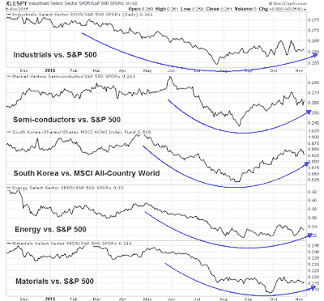
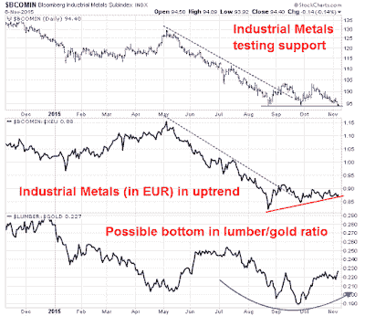

<!--yml
category: 未分类
date: 2024-05-18 03:13:38
-->

# Humble Student of the Markets: Global reflation = Buy risk (and cyclicals)

> 来源：[https://humblestudentofthemarkets.blogspot.com/2015/11/global-reflation-buy-risk-and-cyclicals.html#0001-01-01](https://humblestudentofthemarkets.blogspot.com/2015/11/global-reflation-buy-risk-and-cyclicals.html#0001-01-01)

**Trend Model signal summary**

Trend Model signal: Neutral

Trading model: Bullish

The Trend Model is an asset allocation model which applies trend following principles based on the inputs of global stock and commodity price. In essence, it seeks to answer the question, "Is the trend in the global economy expansion (bullish) or contraction (bearish)?"

My inner trader uses the trading model component of the Trend Model seeks to answer the question, "Is the trend getting better (bullish) or worse (bearish)?" The history of actual out-of-sample (not backtested) signals of the trading model are shown by the arrows in the chart below.

**Update schedule**

: I generally update Trend Model readings on

[my blog](http://humblestudentofthemarkets.blogspot.com/)

on weekends and tweet any changes during the week at @humblestudent.

**Global reflation**

As long time readers are aware, the Trend Model uses commodity and global equity prices to spot market trends. The trading model component of the Trend Model was fortunate to have turned bullish in late September, which coincided with the start of the rally (see my post 

[A choppy bottom](http://humblestudentofthemarkets.blogspot.com/2015/09/a-choppy-bottom.html)

). Today, those trends of global reflation are becoming more evident, which is a more definitive signal that the path of least resistance for stocks is up.

[Gavyn Davies](http://blogs.ft.com/gavyndavies/2015/11/01/global-growth-malaise-but-no-recession/)

described the global economy as having dodged the recession bullet:

> In this month’s regular report card on global activity growth rates, we conclude that the downward momentum identified by our “nowcasts” a month ago seems to have been arrested during October. The risk of a global recession has therefore declined recently, but growth in the emerging markets remains well below trend, and global spare capacity is continuing to rise.
> 
> Furthermore, the growth rate in activity in the US has dropped since mid year, and is now slightly below trend. Other advanced economies, especially the euro area, continue to record reasonably healthy, above trend growth rates, with some signs of a recent acceleration.
> 
> Overall, we therefore conclude that the risk of a global hard landing has diminished in the past month. However, while not in recession, the global economy does appear to be in the midst of a growth malaise, in which the “miracle” of the 2000s in the emerging world is unraveling, and productivity growth in the advanced economies has maintained its long term downtrend.

Remember how the market fretted about slowing growth in China and Europe in August? Now those fears can be laid to rest. We can see that from this chart of stock market averages, which show American and European stocks in solid uptrends.

The Greater China markets of China and her Asian trading partners are also in solid recovery modes. The Shanghai market is in an uptrend and all regional markets are above their 50 dma. Late Friday,

[China reported its FX reserves rose in the month](http://www.bloomberg.com/news/articles/2015-11-07/china-s-foreign-exchange-reserves-post-first-rise-in-six-months)

, which alleviated much of the angst over capital flight in China.

The upturn is starting to show up in economic statistics.

[Ambrose Evans-Pritchard](http://www.telegraph.co.uk/finance/economics/11970990/Global-recession-scare-fades-as-stimulus-revives-manufacturing.html)

pointed out that global PMIs are rising.

...with improvements in US ISM Manufacturing new orders, with ISM Manufacturing. while weak, beat market expectations:

...an upside surprise in eurozone M-PMI:

...and signs of a bottom in China:

More helpful are signs of the Chinese economy rebalancing towards the household sector as Services PMI is outperforming Manufacturing PMI (via

[Callum Thomas](https://twitter.com/Callum_Thomas/status/661721120970706944)

):

On top of that, we had the blowout US Employment Report, which confirmed a trend of improving fundamentals. The Citigroup Economic Surprise Index, which measures whether high frequency economic releases are missing or beating expectations, is trending up:

On a bottom-up basis, the Street displayed its optimism for the future by raising forward EPS for a second week, according to figures from

[John Butters](http://www.factset.com/websitefiles/PDFs/earningsinsight/earningsinsight_11.6.15)

of Factset:

**A bullish setup for commodities**

At a sector level, equities have seen cyclical sectors and groups start to bottom and turn up. The chart below shows the market relative performance of cyclicals, starting with mid-cycle sectors such as industrial and semi-conductor stocks, as well as the globally sensitive Korean market. The bottom two panels show the late cycle commodity cyclical sectors, energy and materials, which appear to be basing but haven't turned up yet on a relative basis.

My bullish call on commodities last week seems to be premature (see

[How to energize returns even as momentum fades](http://humblestudentofthemarkets.blogspot.com/2015/11/how-to-energize-returns-even-as.html)

). In retrospect, it could be better characterized as a trade setup rather than an actual trade. Nevertheless, I believe that this bullish setup remains valid. Here is the updated version of the chart I showed last week of the USD (inverted scale, top panel) and the relative performance of energy and materials sectors (US=black, Europe=green).

One technician admonished me about jumping the gun on commodities, "What you have is a setup. Wait for the breakout or some signs of a reversal before committing to the trade."

I was overly eager and I stand corrected. Nevertheless, the weight of the evidence, based on the behavior of cyclical sectors and the confirmation of bottoming formation from Europe, all suggests to me that I am on the right track.

There are two components to the bullish commodity call, a currency element, which is facing headwinds from a strong USD, and a cyclical element, which is more bullish. The upside surprise in Friday`s Employment Teport raised expectations that the Fed would hike rates in December. This caused the USD to rally hard and created significant headwind for commodity prices. However, I believe that the market is giving little weight to the global reflation, which raises commodity demand,

The currency element of the commodity trade can be measured by what happens to inflationary expectations. Inflation is starting to tick up. 

[Business Insider](http://www.businessinsider.com/average-hourly-wages-october-2015-2015-11)

highlighted the fact that the NFP report showed that average hourly earnings rose to 2.5%:

Another measure of inflationary expectations is gold and gold stocks. Gold stocks appear to be setting for a rally as well as breadth is appearing to be constructive. The silver-gold ratio (in green) shows high-beta precious metal silver outperforming gold. As well, the bottom panel showing % of bullish stocks is bottoming and turning up.

One way of measuring the cyclical element of commodity prices is to separate their cyclical factors from their currency influence. The top panel of the chart below shows the highly cyclical industrial metals in USD, which is a chart many analysts look at. while the next two panels focuses on the cyclical element of commodity prices. A conventional analysis of industrial metals show them to have rallied out of a downtrend and in the process of testing support. The middle panel filters out much of the effects of USD strength by showing industrial metal prices in euros, indicating a minor uptrend with a series of higher lows and higher highs (in red) after rallying out of a downtrend. The bottom panel shows lumber prices, which is highly dependent on the cyclical sensitive housing sector, to gold prices, which is mainly perceived as an alternative currency to the USD. The lumber-gold ratio appears to be making a rounded bottom, which is also constructive.

As global growth rises, the cyclical dimension of the commodity trade will start to assert itself. As well, better non-US growth will also serve to push the USD downwards, which will also be commodity bullish. My inner trader is inclined to take a partial position should either energy or material stocks move to the bottom of their market relative trading range and buy a full position on a relative breakout.

**The week ahead**

Looking to the week ahead,  a period of consolidation and pullback is likely at hand, though any weakness is likely to be shallow and should be bought. Both the SPX and its RSI(14) have breached short-term uptrends. A logical downside support target would be the 2055-2060 area, which is the site of the 200 dma and a gap that likely needs to get filled. However, breadth metrics such as the SPX advance-decline line remains constructive as it made a new high last week.

The dual downside support consisting of the trading gap and 200 dma is graphically even more evident in the chart of the NASDAQ Composite.

I am near-term cautious. Last week's market action dispalyed the signs of an extended market reversing itself from its overbought condition, which is a corrective signal.

[Quantifiable Edges](http://quantifiableedges.com/what-thursdays-solid-vix-rise-suggests-about-the-next-few-days/)

showed what happened under the unusual condition of when both the VIX Index and stock prices rose, in this case to a 50-day high:

My inner investor remains bullishly positioned, in both the energy sector and in the broad market. My inner trader took profits in long positions in energy stocks last

[Wednesday](https://twitter.com/HumbleStudent/status/661949080147390468)

and in the SPX

[Thursday](https://twitter.com/HumbleStudent/status/662310137143496704)

. He is in cash in anticipation of a pullback and lower prices next week and buy hopes to buy into positive seasonality for the remainder of the year.

The week ahead is likely to be volatile, stay tuned for any mid-week updates on Twitter at @humblestudent.