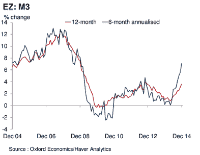
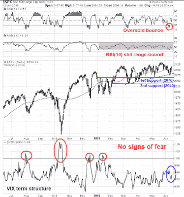

<!--yml
category: 未分类
date: 2024-05-18 03:19:57
-->

# Humble Student of the Markets: Global risk-off = More downside for stocks

> 来源：[https://humblestudentofthemarkets.blogspot.com/2015/06/global-risk-off-more-downside-for-stocks.html#0001-01-01](https://humblestudentofthemarkets.blogspot.com/2015/06/global-risk-off-more-downside-for-stocks.html#0001-01-01)

The Trend Model is an asset allocation model which applies trend following principles based on the inputs of global stock and commodity price. In essence, it seeks to answer the question, "Is the trend in the global economy expansion (bullish) or contraction (bearish)?"

My inner trader uses the trading model component of the Trend Model seeks to answer the question, "Is the trend getting better (bullish) or worse (bearish)?" The history of actual out-of-sample (not backtested) signals of the trading model are shown by the arrows in the chart below. In addition, I have a trading account which uses the signals of the Trend Model. The last report card of that account can be found 

.

I've been saying for several weeks that US equities were ready to fall on an intermediate term basis and it seems that the decline is beginning. I had struggled to find a fundamental bearish trigger, but as stock prices began to retreat, two concerns were weighing on the market:

What we saw last week was a global risk-off mood gripping the markets. Let`s take a quick tour around the world and you will see my point.

In the US, stock prices were dragged down by a declining risk appetite in the credit markets. The chart below shows the relative performance of high-yield and emerging market bonds slump against their equivalent-duration Treasuries (top panel). Equity breadth continued to deteriorate, as the equal-weighted SPX continued to underperform against the float-weighted SPX (green line, middle panel). As well, the percentage of stocks above the 200 day moving average fell to a low as it broke a "support" level, possibly indicating that the bears had taken control of the tape with negative price momentum (bottom panel). The SPX ended the week below its 50 dma, which is another sign of failing price momentum.

I am also seeing similar signals from the commodity markets. China remains the biggest marginal consumer of many commodities but commodities remain under pressure, despite the pullback in the USD, which is inversely correlated to commodity prices. The top two panels of the chart below shows the prices of industrial metals (top panel) and the CRB Index (second panel). To filter out the effects of the USD, I have shown the cyclically sensitive industrial metal prices in euros (third panel) and Australian Dollars (fourth panel). Stated simply, commodities are showing weakness, regardless of the underlying currency.

Stock prices in Europe are under pressure as well. The chart below compares the SPX, the UK FTSE 100, the Euro STOXX 50 and the Athens General Index. All major European indices have fallen below their 50 dma, indicating that negative momentum has taken hold. Paradoxically, Greek stocks appear to be bottoming out and they seem to have staged a rally out of a downtrend (more on Greece below).

From a global risk appetite and an inter-market analytical perspective, these are worrisome signs in that they paint a picture of a broad-based risk-off trend. Such an environment can`t be good for stock prices.

One of the more bearish signs for risky assets is the rising correlation between stock and bond prices. At the end of April, bond prices began to fall and bond yields backed up. Stocks also staged a minor retreat, but recovered. And now, bond yields are rising again across the globe and stock prices are weakening as well.

The apparent cause of the fright in the bond market has been rising inflationary expectations, both in Europe and the US. After several years of low to zero interest rates, the market got into a crowded long by chasing yield.

[Ambrose Evans-Pritchard](http://www.telegraph.co.uk/finance/comment/ambroseevans_pritchard/11666355/Bond-crash-across-the-world-as-deflation-trade-goes-horribly-wrong.html)

writes that the dramatic unwind of this trade caused a crash in the eurozone bond market:

> The bond crash has been an accident waiting to happen for months. Money supply aggregates have been surging all this year in Europe and the US, setting a trap for a small army of hedge funds and 'prop desks' trying to squeeze a few last drops out of a spent deflation trade. "We we're too dogmatic," confessed one bond trader at RBS.
> 
> Data collected by Gabriel Stein at Oxford Economics shows that 'narrow' M1 money in the eurozone has been growing at a rate of 16.2pc (annualized) over the last six months. You do not have to be monetarist expert to see the glaring anomaly.
> 
> Broader M3 money has been rising at an 8.4pc rate on the same measure, a pace not seen since 2008\.

> Economic historians will one day ask how it was possible for €2 trillion of eurozone bonds - a third of the government bond market - to have been trading at negative yields in the early spring of 2015 even as the reflation hammer was already coming down with crushing force.
> 
> "It was the greater fool theory. They always thought there would be some other sucker to buy at an even higher price. Now we are returning to sanity," said Mr Stein.

Across the Atlantic, US growth is also rising and so are inflationary expectations:

> M3 growth in the US has been running at an 8pc rate this year, roughly in line with post-war averages. The growth scare earlier this year has subsided, as was to be expected from the monetary data.
> 
> The economy has weathered the strong dollar shock and seems to have shaken off a four-month mystery malaise. It created 280,000 jobs in May. Bank of America's GDP 'tracker' is running at a 2.9pc rate this quarter.

Everyone got into crowded long and the reversal, when it came, was very unpleasant:

> Funds thought they were on to a one-way bet as the European Central Bank launched quantitative easing, buying €60bn of eurozone bonds each month at a time when fiscal retrenchment was causing fresh supply to dry up. They expected Bunds to vanish from the market altogether as Berlin increases its budget surplus to €18bn this year and retires debt.
> 
> Instead they have discovered that the reflationary lift from QE overwhelms the 'scarcity effect' on bonds. Contrary to mythology - and a lot of muddled statements by central bankers who ought to know better - QE does not achieve its results by driving down yields, at least not if conducted properly and if assets are purchased from outside the banking system. It works through money creation. This in turn lifts yields.

Despite the soothing rhetoric from the Federal Reserve about being cautious and moving slowly on monetary policy, bond market vigilantes may very well tighten for the Fed by pushing up bond yields at the longer end of the yield curve.

Recent high frequency economic releases have been steadily improving and should lead to rising interest rates. The rising growth trend is exemplified by the Atlanta Fed`s 

[GDPNow](https://www.frbatlanta.org/cqer/research/gdpnow.aspx)

 has now spiked to 1.9%, up from 0.6% about a month ago. These signs of renewed growth should solidify a September interest rate liftoff - watch the FOMC statement next week.

I am watching to see if the commentary to shift from a fear of rising interest rates to a fear that the Fed is behind the curve on raising rates, which would send the bond market into further conniptions. As an example, Jim Paulsen of Wells Capital Management more or less said the same thing as he openly worried about an inflation shock in the US (via

[Bloomberg](http://www.bloomberg.com/news/articles/2015-06-10/undercooked-u-s-economy-risks-overheating-as-demand-tops-supply?cmpid=twtr1)

):

> For the first time in 15 years, demand in the world’s largest economy is outpacing supply. The result could be an inflation shock that roils financial markets, according to Wells Capital Management Inc.
> 
> “Regardless of its overall speed, an economic recovery is at risk of overheating whenever demand grows faster than supply,” Jim Paulsen, the Minneapolis-based firm’s chief investment strategist, told clients in a report this week. “Since most investors are not anticipating any serious overheating evidence, we are concerned a potential inflation scare, could produce a significant change in financial-markets pricing.”
> 
> By combining labor supply and the weakest productivity for any expansion since World War II, Paulsen reckons U.S. supply -- or an economy’s capacity to produce goods and services -- has grown just 2 percent since the recession ended six years ago. That’s so slow that it’s even being surpassed by otherwise disappointing demand, something investors have failed to appreciate, he said.

**A volatility divergence**

Notwithstanding the fact that stock and bond markets are inter-connected, here is the key reason why I believe that a bond market sell-off is likely to negatively affect equities. This chart below shows the history of realized stock and bond market volatility going back to 1980\. Historically, bond market vol has been lower than stock market vol. Most recently, however, bond market volatility has spiked but stock volatility has remained stable. How long before equity vol catches up to bond vol?

This chart from

[Thomson-Reuters](http://alphanow.thomsonreuters.com/2015/06/the-month-in-charts-volatility-stalks-markets-greece-continues-to-make-headlines/)

tells a similar story. Not only has fixed income volatility risen, but currency (FX) volatility has spiked as well, while equity volatility remains tame.

The option market has already reacted to this anomaly by buying a lot of VIX calls compared to VIX puts in anticipation of a rise in stock market volatility. In the short-term,

[Bloomberg](http://www.bloomberg.com/news/articles/2015-06-12/you-can-t-keep-the-panic-out-of-stocks-forever-vix-traders-say)

reported that the spike in VIX call buying may be traders positioning for the FOMC meeting next week:

> “This is people getting ahead of the Fed, buying equity volatility because it has been low relative to rates and FX volatility,” said Pravit Chintawongvanich, a New York-based derivatives strategist at Macro Risk Advisors. “Equities have been in a very tight range lately and people feel like something has got to give.”

Longer term, however, the disparity in fixed income (and FX) volatility compared to equity vol sticks out like a sore thumb. As the VIX Index tends to be inversely correlated to stock prices, a spike in fixed income (or FX) volatility that spreads would be highly negative to equity markets.

These cross-asset concerns have led the Societe Generale`s strategy team to make a call to de-risk portfolios (via

[Bloomberg](http://www.bloomberg.com/news/articles/2015-06-09/societe-generale-it-s-time-to-increase-cash-and-reduce-your-risk)

):

> Correlations have significantly increased between asset classes and it therefore becomes difficult to naturally protect portfolios through asset class diversification: for the first time in a long time we recommend raising the cash allocation (+4 point to 11%) to better manage portfolio risk...
> 
> We reduce our equity and bond allocation by 2 points (to respectively 45% and 36%). To enhance risk diversification, we upgrade our weightings in alternative investments (now 8%), including commodities (up 3 points).

Risk off, indeed!

**The market`s big fat Greek bet**

I wrote earlier that the behavior of Greek stocks suggested that a crowded short had developed in Greece. The inability of the Athens General Index to fall in response to bad news indicated that much of the negative news was already in the market. So that should be bullish, right?

The answer to that question is a "yes, but..." for a couple of reasons. First of all, just because the market does not or will not respond to bad news doesn't mean that bad things, such as a Greek default, can't happen. More importantly, negative events like a default will also affect the rest of Europe - and the market doesn't seem to be prepared for such an eventuality. In fact, a crowded long seems to have formed in European equities, which may be problematical should events spiral out of control next week and too many investors try to rush for the exits at the same time.

The latest BoAML Fund Manager Survey indicates that global managers are overweight eurozone equities to a crowded long reading. Up until recently, the general consensus among institutional managers was that Greece would come to a "kick the can down the road" agreement with its creditors and put off the day of reckoning yet one more time.

As well,

[Ryan Detrick](http://www.seeitmarket.com/what-are-etf-and-mutual-fund-flows-trends-telling-investors-now-14449/)

showed that American individual investors have been selling out of US stocks and piling into international stocks through both mutual funds and ETFs (annotations in red are mine):

While international equity flows do not necessarily mean that they have gone into Europe, I would expect that European equities have received more than its fair share of these fund flows. A negative resolution of the Greek crisis has the potential to create a sudden shock to these over-long holders of eurozone equities and cause a panicked rush for the exits.

**Greece on the brink, again!**

As I write these words, Greece is on the brink yet one more time. I have written about what I believe to be the key issues in the Greek crisis so I won't repeat them here (see

[What behavioral finance tell us about the Greek negotiations](http://humblestudentofthemarkets.blogspot.com/2015/06/what-behavioral-finance-tell-us-about.html)

and

[What happens after a "Speech of Hope"?](http://humblestudentofthemarkets.blogspot.com/2015/06/what-would-happen-after-speech-of-hope.html)

). Now consider the latest developments in the Greek crisis:

There have been many stories about the drop-dead deadlines for the talks between Greece and the EU-IMF. June 30 has been mentioned a number of times, but that seemed to be unrealistic as any deal would require approval by other eurozone parliaments before June 30\. A more realistic drop-dead deadline seems to be the Eurogroup meeting of finance ministers next Thursday on June 18.

The most shocking development of the negotiation process occurred last on Thursday, June 11\. The Greeks had been in discussions with the EU and talks appeared to be proceeding smoothly when the

[IMF dropped the bomb that it was withdrawing its negotiating team](http://www.reuters.com/article/2015/06/11/us-eurozone-greece-idUSKBN0OR19T20150611)

, citing insufficient progress. ECB officials left as well, leaving only the EU leg of the troika in talks. The departure of the IMF team from the negotiating table was a stunner and

[dramatically dropped the odds of concluding a deal](http://www.telegraph.co.uk/finance/economics/11670632/Greek-deal-unimaginable-without-departed-IMF-warns-Jeroen-Dijsselbloem.html)

.

[The Guardian](http://www.theguardian.com/business/2015/jun/12/greece-running-out-of-time-to-avoid-default-leaders-concede)

reported that the EU is now preparing for a Greek default, which had been an unthinkable option until now, at least officially (emphasis added):

> Greece has less than a week to strike a deal with its eurozone creditors to avoid defaulting on its massive debts and perhaps being kicked out of the single currency area, with ***German leaders and top European Union officials now conceding that default is the likeliest outcome***...
> 
> ***Merkel was said to have resigned herself to a Greek default***, and at a meeting on Thursday night in Bratislava, ***eurocrats preparing for the Luxembourg talks included the default scenario in their discussions for the first time***.
> 
> Until Friday EU executives have refused to countenance the prospect of default and the issue has not been discussed at any official level.

The Germans had been preparing for such an eventuality:

> According to German media reports on Friday, Berlin has also begun contingency planning for Greek default scenarios. The plans were said to include the introduction of capital controls in Greece, closure of the banks, and the government’s issuing of IOUs to finance its public sector.
> 
> There is no exit plan for any country to leave the euro, but economists have suggested that such IOUs could then become a pseudo-currency, but they would circulate only within Greece. They would be impossible to use for international trade.
> 
> “The chancellor now knows that there is not enough time left,” one of Merkel’s aides told German mass-circulation newspaper Bild-Zeitung.

Part of the problem is the IMF has different priorities than the EU. IMF chief economist Olivier Blanchard laid it out in a

[blog post](http://blog-imfdirect.imf.org/2015/06/14/greece-a-credible-deal-will-require-difficult-decisions-by-all-sides/)

. Greece has to commit to a credible restructuring program that crosses Syriza`s red lines of pension and wage reductions (emphasis added):

> On the one hand, the Greek government has to offer truly credible measures to reach the lower target budget surplus, and it has to show its commitment to the more limited set of reforms. We believe that even the lower new target cannot be credibly achieved without a comprehensive reform of the VAT – involving a widening of its base – and a further adjustment of pensions. ***Why insist on pensions? Pensions and wages account for about 75% of primary spending; the other 25% have already been cut to the bone.*** Pension expenditures account for over 16% of GDP, and transfers from the budget to the pension system are close to 10% of GDP. We believe a reduction of pension expenditures of 1% of GDP (out of 16%) is needed, and that it can be done while protecting the poorest pensioners. We are open to alternative ways for designing both the VAT and the pension reforms, but these alternatives have to add up and deliver the required fiscal adjustment.

The EU has to agree to writing off part of the debt, which is very difficult for eurozone governments to swallow. Given the political constraints that the face value of the debt cannot be written down, Blanchard indicated that debt restructuring the debt by writing down its NPV is the answer (e.g. if I owe you $1 million but can't pay, I could pay it off at $1 a year for the next million years):

> On the other hand, the European creditors would have to agree to significant additional financing, and to debt relief sufficient to maintain debt sustainability.We believe that, under the existing proposal, debt relief can be achieved through a long rescheduling of debt payments at low interest rates. Any further decrease in the primary surplus target, now or later, would probably require, however, haircuts.

So what happens if Greece were to default? The

[WSJ](http://www.wsj.com/articles/ecbs-weidmann-says-risk-of-greek-insolvency-increasing-daily-1434010691)

reported that ECB Governing Council Jens Weidmann stated that while the effects of a Greek default are largely firewalled, they would not be totally benign (emphasis added):

> Mr. Weidmann said at an event in London that “there is a strong determination to help Greece improve its public administration, remove barriers to growth and put public finances on a sustainable path.” Furthermore, “taxpayers from other euro-area countries have provided substantial funds to support the unavoidable adjustment processes.”
> 
> “But time is running out, and the risk of insolvency is increasing by the day,” he said.
> 
> ***He said the contagion effects of such a scenario “are certainly better contained than they were in the past, though they should not be underestimated.”***

**"Margin clerk market" risks rising**

Now imagine if Greece were to be unable to reach an agreement next week and decides to default on its payments to the IMF. As I write these words,

[weekend talks ended with no agreement](http://www.bloomberg.com/news/articles/2015-06-14/eu-commission-says-greek-brussels-talks-end-without-success)

 and there are

[rumblings of an Greek default plan based on the Icelandic model](http://www.telegraph.co.uk/finance/11673989/Syriza-Left-demands-Icelandic-default-as-Greek-defiance-stiffens.html)

. I outlined the negative consequences to Europe last week, as Italy would be most exposed to a Greek default (see 

[Bears wake up, but they're not out of the woods](http://humblestudentofthemarkets.blogspot.com/2015/06/bears-wake-up-but-theyre-not-out-of.html)

). Peripheral bond yields would blow out against bunds and chaos would ensue. Add the crowded long in European equities on top of that and the elements of a market panic would be in place.

In conclusion, the equities are vulnerable to a pullback but there are a number of event risks that could turn any orderly pullback into a panic. A jittery bond market and a Greek default are both possible negative catalysts that could spark a rout should too many investors try to head for the exits at the same time. I can easily envisage a "margin clerk market", where the combination of margin calls and haywire risk estimates from VaR models force the liquidation of positions, any position, as all asset prices fall and asset correlations converge to 1.

**Waiting for the buying opportunity**

Should a disorderly sell-off materialize in the days or weeks to come, I would urge investors not to panic. So what if the "animal spirits" have taken over? The US economy remains robust and there are no signs of a recession, which is the ultimate bull market killer, on the horizon. I agree with Bill McBride of

[Calculated Risk](http://www.calculatedriskblog.com/2015/06/update-predicting-next-recession.html)

in his assessment that the odds of a recession in 2015 and 2016 is low.

The latest update from

[John Butters](http://www.factset.com/websitefiles/PDFs/earningsinsight/earningsinsight_6.12.15)

of Factset indicates that forward EPS growth remains strong, which should be supportive of higher equity prices should markets panic and fall for technical reasons.

This likely correction is most likely a mid-cycle pause as the SPX hasn't seen a 10% correction since 2011\. This chart from BoAML shows the returns of US stocks before, during and after Fed tightening cycles. Historically, the biggest downside has been seen in the time leading up to the first rate hike, which is the period we are in now. Equities have performed well over the tightening cycle, largely because the economy and earnings growth are accelerating.

Barring signs of an imminent recession, my inner investor is inwardly rubbing his hands with glee should a market correction occur as it would present an opportunity to buy stocks at a discount.

**The week ahead**

In summary, the intermediate term condition of the US equity market is bearish. Market internals and momentum metrics are all rolling over. That does not mean, however, that stocks can't rally next week. Notwithstanding aforementioned "margin clerk market" risks, this chart of net 5-day high-lows from

[IndexIndicators](http://www.indexindicators.com/indicators/breadth/)

show that the market is neither overbought or oversold on a short-term basis, though the momentum is negative.

Longer term breadth and momentum indicators also tell the same story. The readings are neutral but the momentum is negative.

In addition, a review of this chart of the SPX shows that it reached an oversold condition on RSI(5), which is a good swing trading indicator with a 2-3 day time horizon, and bounced last week. However, RSI(14) remains range-bound and hasn't seen an overbought or oversold reading this year. Option based sentiment models, such as the VIX/VXV ratio that measures the VIX term structure, is showing benign conditions and no signs of fear.

Based on these near-term assessments of the technical condition of the equity market, even if we were to follow the 2015 narrative of a wimpy-bull-wimpy-bear range-bound market, the short-term momentum for stocks is down next week. Combined with the bearish intermediate term conditions, I can only conclude the path of least resistance for the SPX is down. Initial support can be found at the rising (dotted) trendline at 2085, with further support at 2070 and then at 2040\. Should the market rally and decisively break through resistance at its 50 dma, a test of the all-time highs is possible.

My inner investor remains cautious but not panicked. My inner trader is short the market as the risk-reward is tilted to the downside.

**Disclosure:**

Long SPXU