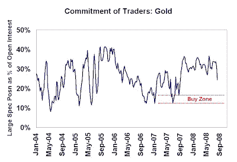
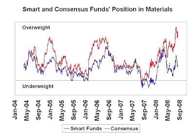

<!--yml
category: 未分类
date: 2024-05-18 01:06:24
-->

# Humble Student of the Markets: Gold correction has further to run

> 来源：[https://humblestudentofthemarkets.blogspot.com/2008/08/gold-correction-has-further-to-run.html#0001-01-01](https://humblestudentofthemarkets.blogspot.com/2008/08/gold-correction-has-further-to-run.html#0001-01-01)

With gold below $800 and investor sentiment

[surveys](http://www.sentimentrader.com/subscriber/charts/WEEKLY/SURVEY_GOLD.htm)

in the bearish zone (contrarian bullish), one might think that we may be close to a turnaround on bullion.

Not so fast!

**Average bear down 34% in 18 months** 

Bespoke Investment Group’s

[report](http://bespokeinvest.typepad.com/bespoke/2008/08/bear-market-gol.html)

on typical gold market behavior suggests that there is further downside. The average bear market in gold is down 34% over a period of 18 months and we are only down about 21% right now.

**Watch what they do: The selling is not over yet**

Sentiment surveys are interesting but they don’t tell the whole picture. While readings are low enough to spark a temporary oversold rally, investors haven’t sold enough of their positions to warrant a call for an intermediate term bottom.

The latest data from CFTC’s Commitment of Traders

[report](http://www.cftc.gov/marketreports/commitmentsoftraders/index.htm)

show that large speculators (read: hedge funds) have begun to liquidate their gold long positions. However, they haven’t gone short yet and so readings aren’t sufficiently bearish to see a sustainable up move.

I reverse engineered the positions of the average mutual fund using the technique shown in the sidebar titled *Reverse Engineering a Manager's Macro Exposure*. Consensus mutual funds, which consist of 22 large cap blend funds managed by the largest mutual fund complexes, have also started to liquidate their overweight positions in the S&P 500 Materials Index. However, they remain overweight the sector and have further selling to go.

****Some reasons to stay long-term bullish** 

Not all is lost for the gold bulls. The above analysis shows that the

[smart funds](http://humblestudentofthemarkets.blogspot.com/2008/02/smart-money-postured-for-recession.html)

, by contrast, remain stubbornly overweight the Materials sector indicating that they haven’t given up on their commodity bet. Moreover, some of the smarter commentators such as the Aden sisters, who have adroitly navigated the gold bull and bear markets over the years,

[remain bullish](http://www.marketwatch.com/news/story/adens-still-commodious-commodities/story.aspx?guid=%7BB56B68A4%2D5EB4%2D4C86%2DBBB4%2D9CD072232161%7D)

on bullion.**