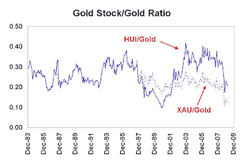
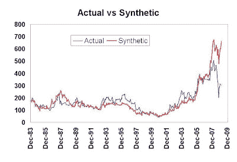
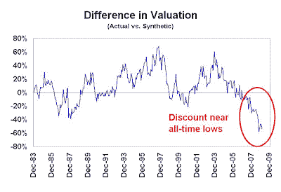

<!--yml
category: 未分类
date: 2024-05-18 00:57:30
-->

# Humble Student of the Markets: Gold stock mystery

> 来源：[https://humblestudentofthemarkets.blogspot.com/2009/03/gold-stock-mystery.html#0001-01-01](https://humblestudentofthemarkets.blogspot.com/2009/03/gold-stock-mystery.html#0001-01-01)

Further to my last post

[Bullish signs for the inflation trade](http://humblestudentofthemarkets.blogspot.com/2009/03/bullish-signs-for-inflation-trade.html)

, I would also like to point out that Warren Buffett, in the latest

[Berkshire Hathaway letter to shareholders](http://www.berkshirehathaway.com/letters/2008ltr.pdf)

, also indicated that inflation is likely the effect of the macro policy response to the financial crisis [emphasis mine]:

> This debilitating spiral has spurred our government to take massive action. In poker terms, the Treasury and the Fed have gone “all in.” Economic medicine that was previously meted out by the cupful has recently been dispensed by the barrel. ***These once-unthinkable dosages will almost certainly bring on unwelcome aftereffects. Their precise nature is anyone’s guess, though one likely consequence is an onslaught of inflation.***

**Why are gold stocks underperforming?**

The most obvious way to hedge against inflation and rising inflationary expectations is with gold and gold equities. However, gold stocks are not performing up to their potential in light of the relatively buoyant market for bullion.

The chart below shows the monthly ratio of the PHLX Gold & Silver Index (XAU) to the London PM gold fix. I also linked the Amex Gold Bugs Index (HUI) to the XAU price series to show the difference between HUI and XAU. While HUI has outperformed XAU, both gold stock indices have been lagging the price of bullion in the past few years. More importantly, gold stocks have not shown the same upside potential as they have in the past relative to gold.

Analysts have advanced several interpretations of the relationship as shown by gold stock to gold ratio. The simplest explanation is that gold equities are cheap relative to bullion and that they should be bought now.

**Loss of leverage and speculative appeal?** Another possible explanation is that as gold prices advanced, gold stocks have lost much of their speculative appeal as levered vehicles to play the rise of the yellow metal.

When gold prices were $300 an ounce about a decade ago and production costs of the senior miners were in the $200-250 range, gold stocks were in effect call options on gold with a strike price in the $200-250 area. As gold prices rose, gold equities became deep in the money options and their leverage to gold declined. Speculators who wanted to play the rise in the gold price lost interest, especially with the introduction of very liquid gold ETFs around the world.

**Synthetic gold stock is still undervalued**
While the loss of leverage thesis does hold some water, the numbers don’t make sense. About a year ago I wrote a [posting](http://humblestudentofthemarkets.blogspot.com/2008/03/how-cheap-are-gold-stocks-relative-to.html) on a synthetic gold mining stock model that I built in 2006 using a series of gold call options. When I revisit that synthetic gold mining stock valuation today, the synthetic still looks very cheap.

**To briefly summarize the model**: Conceptually a mine can be thought of as a series of call options on the underlying commodity, with the exercise price as the cost of production. If the commodity price falls below the cost of production, the mine operator has the option to either close or mothball the mine until prices improve. I created a synthetic gold stock by building a model based on these principles. Key features of the model are:

*   A series of eight deep-in-the-money call options on the price of gold, with terms of 1, 2, 3 … 8 years, which models a mine with an eight year life, a common estimate of long-lived gold mines;
*   An exercise price equal to cash production cost of $250, rising each year by the current inflation rate. ($250 appeared to be a common estimate of cash costs for existing gold stocks in 2006);
*   Equal amount of gold mined each year; and
*   The position is rolled forward once a year at a cost of 1.5%.

The chart below shows the value of the synthetic compared to the gold equity index. The valuations started to diverge in early 2007 and the gap has been steadily widening since.

The chart below, which shows the difference in valuation between the synthetic and actual gold stocks, indicates that the discount of gold equities to the synthetic is near all-time lows:

**Why the discount?**
The prolonged valuation gap is a mystery to me. To be sure, there are differences between the model behind the synthetic and actual gold stocks, but I believe the difference are relatively minor in magnitude:

*   Gold mining companies have exploration upside, operational risk (strikes, fires, etc.) and political risk, which the synthetic gold stock does not;
*   Gold mining companies may hedge the gold price with forward sales and other derivatives (but most don’t these days other than for the purposes to lock in a price to develop a new property);
*   Actual gold mines can somewhat manage the cost of production by high-grading when gold prices are low and mining a lower grade of ore when prices are high. The synthetic gold stock’s assumed cost is inflexible.
*   Many ore bodies do not yield only gold, but other byproducts (e.g. silver, copper, etc.) The synthetic assumes that the mine only produces gold.
*   The synthetic model only describes the asset side of the balance sheet for gold companies. If the company is financed with debt then the behavior of the equities would be different from the one forecast by the synthetic (but most gold miners don't have a lot of debt).

Some questions to ponder:

*   Are gold stocks just cheap relative to bullion? If so, why the prolonged mis-pricing?
*   Is there a conceptual error behind the synthetic gold model? Does the market just not think about gold stocks this way?
*   Could a PE fund buy out a gold producers or mine and use the synthetic model to arbitrage the difference in value?
*   Are production costs spiraling out of control at gold miners that investors are discounting the prices of their equities?
*   Have gold mining companies, as a group, not re-invested their cash flows in a way that has enhanced shareholder value and therefore investors are marking down their share prices?
*   Has the stock market been so beaten up that gold stocks are underperforming their potential? (This explanation doesn't make sense as the discount began in early 2007, well before the market break.)

I would be especially interested to hear any response from mining analysts. You can either respond directly in the comment section of email me at cam at hbhinvestments dot com.