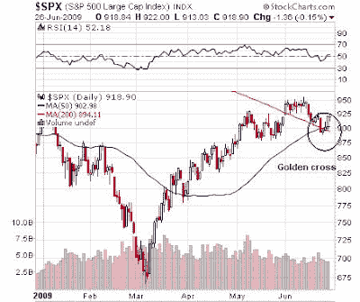
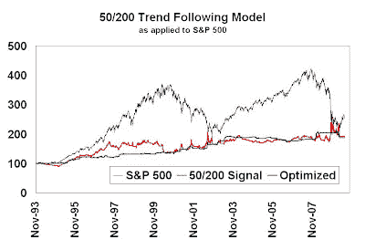
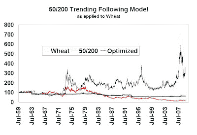

<!--yml
category: 未分类
date: 2024-05-18 00:50:59
-->

# Humble Student of the Markets: Golden cross on the S&P 500

> 来源：[https://humblestudentofthemarkets.blogspot.com/2009/06/golden-cross-on-s-500.html#0001-01-01](https://humblestudentofthemarkets.blogspot.com/2009/06/golden-cross-on-s-500.html#0001-01-01)

There has been a bit of buzz generated by the appearance of the golden cross, where the 50-day moving average crosses the 200-day moving average, experienced by the S&P 500.

**Be contrarian? Or sheep?**

The talk is that such golden cross events are bullish for the market. The premise is based on trend following models, which depend on persistence of price trends.

<param name="movie" value="//www.youtube.com/v/jVygqjyS4CA&amp;hl=en&amp;fs=1&amp;"><param name="allowFullScreen" value="true"><param name="allowscriptaccess" value="always"><embed src="//www.youtube.com/v/jVygqjyS4CA&amp;hl=en&amp;fs=1&amp;" type="application/x-shockwave-flash" allowscriptaccess="always" allowfullscreen="true">

The question is, do you want to be a contrarian or do you want to a sheep (and jump on the bandwagon)?

**Do price trends persist?**

To state the obvious, if these trend following systems are to work, then price trends have to persist. In quantitative terms, these strategies are only profitable if there is auto-correlation in price movements.

To test those ideas, I analyzed the daily correlations of the returns of the S&P 500 with the previous day’s return to for the persistence of price momentum for the period from 1993 to the present. While the median correlation of one-day S&P 500 returns was -0.08, indicating a tendency for price reversion, I found that indeed there were periods of strong momentum. An optimized solution that forecasts those periods based on indicators of autocorrelation turned out to produce better risk-adjusted returns.

The chart below shows the results. The dark blue line shows the cumulative long-only returns of the S&P 500 from 1993\. The red line shows the returns of a 50-200 day moving average crossing system, where the signals are defined as:

**Long:**

50 day MA > 200 day MA and the 50 day MA acts as trailing stop

**Short:**

50 day MA < 200 day MA and the 50 day MA acts as trailing stop

When a signal is generated, the action is taken the next day based on the next day’s closing price. There are no frictional costs and when the system generates no signal, a return of 0% is assumed.

The green line shows the optimized strategy, where it will only use the 50/200 day MA trend following model if the S&P 500 is indicated to be trending.

Looking at these results, it is clear that trend following models can make money and reduce risk compared to a long-only position. Comparing the results of the 50/200 day system (red line) to a long-only investment (blue line), the trend following system is generally upward sloping and has far fewer draw-downs than long-only. The chart also shows that the optimized system (green line) yields similar returns when compared to the un-optimized system (red line) but the optimized system exhibits far lower levels of volatility and draw-downs.

**What if there was no trend?**

The S&P 500 shown in the analysis above generally trending during the study period, which enables a trend following system to be profitable. What if a trend following system is applied to an underlying price stream that was generally trendless?

The chart below shows the same 50/200 day moving average trend following system applied to wheat futures for the period from 1959 to the present. During much of that time, wheat prices were relatively flat and trendless.

The trend following system (red line) performed poorly in such an instance. An investment of $100 in 1959 would net you roughly $17 today. The optimized system (the green line) also lost money, but it did performed better and with lower levels of volatility.

An investment of $100 in 1959 in the optimized system would net you $62 today, which is ahead of the simple 50/200 day moving average trend follower.

**Understand your assumptions: build a meta-model**

The moral of this story is to

[understand the assumptions behind your models](http://humblestudentofthemarkets.blogspot.com/2009/06/financial-modelers-need-to-thimk.html)

. Once you understand the assumptions, analyze the market environment. You may be able to build a meta-model to forecast the performance of your model and optimize your model’s performance based on market conditions.

**About that golden cross…**

What about the golden cross on the S&P 500? Was that a good signal?

The optimized reading flipped from a trending signal to a non-trending signal at the close on Thursday June 25th. Moreover, the 50-day moving average trailing stop is not that far away at 903.

Model readings are volatile and the stop loss is not that far away. Trade carefully.