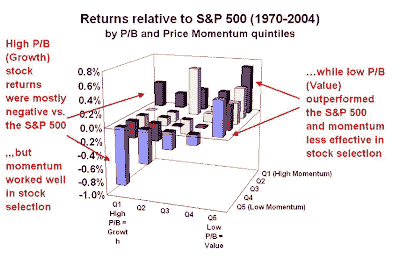

<!--yml
category: 未分类
date: 2024-05-18 01:08:32
-->

# Humble Student of the Markets: Good Analysis = Technique + Common Sense

> 来源：[https://humblestudentofthemarkets.blogspot.com/2008/06/good-analysis-technique-common-sense.html#0001-01-01](https://humblestudentofthemarkets.blogspot.com/2008/06/good-analysis-technique-common-sense.html#0001-01-01)

In the past I have hammered away at the problems of quantitative investing. I did not mean to be so harsh on quants. The point I want to emphasize is

***Good Analysis = Technique + Common Sense***

.

Here are two examples that recently came across my desk. The first is an academic study that I was asked to review and summarize that shows the shortcomings of research without market common sense. The second concerns Wall Street research that shows what the lack of quantitative rigor can do to an investment process.

**The academic study***Interaction of Stock Return Momentum with Earnings Measures*

by Ilya Figelman was published in the May/June 2007 edition of the

[Financial Analyst Journal](http://www.cfapubs.org/toc/faj/2007/63/3)

(subscription required). In the study, Figelman examined the cross-sectional relative returns of stock price momentum with a variety of single variables: ROE, earnings quality, P/E and P/B. For the study, he used the S&P 500 as his stock universe for the period 1970-2004.

To make a long story short, he found that price momentum worked much better for stock selection in the high ROE, high P/E, high P/B and low earnings quality groups than the low ROE, low P/E, low P/B and high earnings quality groups. Results were usually statistically significant at the 90% confidence or better. In addition, average excess returns in the low ROE, P/B, P/E and high earnings quality groups (Value) were much better than the average excess returns in the high ROE, P/B, P/E and low earnings quality groups (Growth).

**Problems with the study**

I have summarized one portion of Figelman’s study by charting his data below:

There are two problems with the study. First, Figelman found that price momentum worked better in stock selection in Growth than Value. This is a well-documented effect: Growth investors find a “growth story stock” and jump on or off the “story” based on the news coming from the company and the industry. This results in a herding effect that manifests itself as price momentum.

Second, he found that during the 1970-2004, Value stocks outperformed Growth stocks. That is also a well-documented effect. Anyone who invests on this conclusion needs a long time horizon, as the market has gone through several cycles of where Value outperforms Growth and vice versa. What would have been a more interesting study would have been to see how price momentum worked as a selection technique during different periods: when Value was dominant and when Growth was dominant. Otherwise, anyone investing based on the conclusions of this study may have to be prepared for several years of severe underperformance and have to write “you have to be patient” client letters like this

[one](http://www.leggmason.com/individualinvestors/documents/insights/D6053-Miller_shareholder_1Q08_report.pdf)

.

**Proper techniques lacking in Wall Street research**

Academic and quantitative research can be lacking in market common sense. Market common sense is one quality that is generally not lacking in Wall Street research. However, I do sometimes find that Wall Street analytical techniques can be lacking in quantitative rigor.

A case in point is a report on Solar Power stocks (Solar Wave – June-08 edition, sorry no link available but if you are interested email me), written by a team of analysts from Merrill Lynch. Here is an excerpt:

> We’re so often asked how to value solar stocks or is there any rationality to solar valuations that we thought it would be a good idea to take a systematic look at how the market values growth, margins, incremental margin, and profit growth for solar companies. The answer was surprising – there are no statistically significant relationships between price/earnings valuation on any profit or growth metric. The only statistically significant relationships we turned up were between EV/salesvaluations and profit margins.

In other words, the author(s) regressed current EV/sales to profit margins and found a current relationship. Combining EV/sales and profit margins together you get a ratio like EV/EBITDA or EV/EBIT. However, this analysis doesn’t say anything about whether such a ratio is valid for selecting stocks within the Solar Power industry. There is no backtest, just a statement of a current relationship.

Does that mean that you can outperform using EV/EBITDA as a characteristic to pick stocks in this group? Who knows?

**Insight from the other Bill Miller**

This brings me to the

[story](http://oldprof.typepad.com/a_dash_of_insight/2008/06/a-lesson-from-dad.html)

that I read about the other Bill Miller (not the fund manager). His son writes about his recently deceased father (Bill Miller):

> Dad went to war instead of to college. Growing up in the Detroit area, he understood engines. The principles are simple: Fuel, Oxygen, Ignition.
> 
> It is amazing how people can get this wrong. As a sailor on his first ship he found himself in an interesting situation. The engines had been overhauled, but would not start. Experienced machinists could not figure out the problem. Officers were hovering and complaining. The young sailor asked if he could try something. There was a lot of skepticism, but he was given his chance. He knew that the fuel and air were OK, so he removed the spark plug and tapped it on the deck, narrowing the gap. When the plug was replaced, the engines started!

In other words,

***Good Analysis = Technique + Common Sense!***