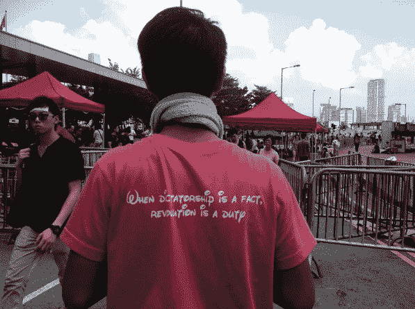

<!--yml
category: 未分类
date: 2024-05-18 03:32:27
-->

# Humble Student of the Markets: HK tail-risk is rising

> 来源：[https://humblestudentofthemarkets.blogspot.com/2014/09/hk-tail-risk-is-rising.html#0001-01-01](https://humblestudentofthemarkets.blogspot.com/2014/09/hk-tail-risk-is-rising.html#0001-01-01)

In yesterday's post (see

[The Big Kahuna Korrection, or buy Yom Kippur?](http://humblestudentofthemarkets.blogspot.com/2014/09/the-big-kahuna-korrection-or-buy-yom.html)

), I wrote that, based on my interpretation of sentiment indicators, the US stock market appeared to be getting close to a bottom. However, there is a chance that the market could fall further if a bearish catalyst were to appear.

One of the possible catalysts I cited was political unrest in Hong Kong (also see stories by

[CNN](http://t.co/W83ory6h6r)

.and 

[Bloomberg](http://t.co/kBTOfjm2QL)

):

> Over in Asia, how will Beijing react to the latest developments in Hong Kong's Occupy Central pro-democracy campaign? Could China institute a crackdown in a way that would spook the markets. (See my previous post [Big trouble in little Hong Kong](http://humblestudentofthemarkets.blogspot.com/2014/09/big-trouble-in-little-hong-kong.html) for the key quote: "The fact that you are allowed to stay alive, already shows the country's inclusiveness").

Since I wrote those words, the Occupy Central pro-democracy movement has clashed repeatedly with police.

While images like this appear to be iconic:

...and seemingly cute to a western audience who is naturally supportive of democracy:

On the other hand, sentiments like the one expressed by this T-shirt represent a direct challenge to Beijing's authority and steers the pro-democracy movement down a very risky road.

|  |
| **When dictatorship is a fact, Revolution is a duty** |

**The good and bad news**

The good news, for now, is that the HK Police is dealing with the protesters and the PLA has not taken control. The scenes from the protests are reminiscent of the recent US riots in Ferguson, but the Ferguson riots did not directly challenge Washington's authority while the HK protests represent an existential threat to the Party. Such dissent will not be tolerated.

[George Magnus](https://twitter.com/georgemagnus1/status/516270377694400512?refsrc=email)

tweeted the following comment and it illustrates the vast gulf of perception between the pro-democracy protesters and Beijing:

As an example, the news that the HK High Court acceded to a petition of 

*habeas corpus *

and 

[ordered the release of student protest leader Joshua Wong](http://www.scmp.com/news/hong-kong/article/1603471/scholarisms-joshua-wong-released-high-court-judges-instruction)

 provided a temporary victory to the pro-democarcy movement. On the other hand, it undoubtedly added to Beijing's discomfort and probably increased its resolve to tighten political control of Hong Kong.

I am seeing the eerie echoes of the Tiananmen Square protests here. The wildcard is how Beijing reacts. Already,

[concerns are rising of a mini-Tiananmen moment](http://www.scmp.com/news/hong-kong/article/1603453/likelihood-mini-tiananmen-worries-government-regina-ip-says)

:

> The potential for a "mini-Tiananmen" movement to evolve from pro-democracy class boycotts at local secondary schools and universities worries the government, a former chief of the Security Bureau says.
> 
> Suspicions have also been aroused in the corridors of power that the students are becoming a tool for Occupy Central to boost its fight for genuine universal suffrage, because it has failed to mobilise support from the middle class, according to executive councillor Regina Ip Lau Suk-yee.
> 
> But she doubts the pressure will succeed in making Beijing cave in and retract a reform framework laid down on August 31 - ruling out a genuine choice of candidates for voters in the 2017 chief executive poll - despite the political tensions weighing on the Hong Kong government.

As the government`s paranoia mounts, the question of foreign interference will rise (emphasis added):

> Ip told the South China Morning Post of prevailing sentiments in the government last week while the class boycotts were in full swing, ahead of the formal launch of Occupy's first operation yesterday.
> 
> "On the face of it, the students are voicing their demands for democracy and self-determination," Ip said.
> 
> "I think the worry on the part of the Hong Kong government is, what if it becomes a mini-Tiananmen? ***Who is behind it?***"

If there is a crackdown that involves mass bloodshed, the markets will freak out. Risk aversion will go through the roof and China`s growth outlook will tank. At that point, we will then truly see how serious the financial linkages the Chinese financial system have with the West.

**What to watch**

I am trying not to sound alarmist as events may resolve themselves peacefully. However, to monitor events, I am watching for

[live updates from the South China Morning Post](http://www.scmp.com/topics/occupy-central)

, whose Occupy Central coverage is outside their pay wall.

As well, I am monitoring the AUDCAD exchange rate cross, as Australia is a more China-sensitive commodity producing country than Canada. The AUDCAD has already violated a key support zone and it is showing downward momentum. Watch if the support that I marked holds.

I am also watching the behavior of the EM bond market to see if global risk aversion spikes:

Stay tuned and brace for volatility. The events in Hong Kong have the potential to overshadow the ECB meeting and the US Employment report this week.

***Breaking*:**

The

[HK government has blinked and has taken riot police off the streets](http://www.nytimes.com/2014/09/30/world/asia/hong-kong-protests.html)

. A statement asks the demonstrators to disperse and go home.

While this may be viewed as a positive development, I see this as potentially more serious because the issue of the protesters' challenge to Xi's authority has not been resolved. If the HK police cannot or will not deal with the protesters, how long before the PLA steps in?