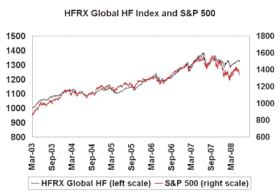

<!--yml
category: 未分类
date: 2024-05-18 01:08:46
-->

# Humble Student of the Markets: Hedge fund shakeout continues

> 来源：[https://humblestudentofthemarkets.blogspot.com/2008/06/it-all-seemed-so-easy.html#0001-01-01](https://humblestudentofthemarkets.blogspot.com/2008/06/it-all-seemed-so-easy.html#0001-01-01)

It all seemed so easy. If you had a decent record, all you had to hang out your shingle and start a hedge fund; charge 2% and 20%; and get enormously wealthy. Many did.

I have written in the

[past](http://humblestudentofthemarkets.blogspot.com/2007/11/what-exactly-are-hedge-funds-hedging.html)

that the hedge fund industry didn’t make sense to me. Returns seemed too correlated to equities and they didn’t offer value given their fee structure.

Then the shakeout began. Hedge funds blew up or started to close left and right (see

[this](http://hf-implode.com/)

).

There is a recent

[WSJ article](http://online.wsj.com/article/SB121364877315978651.html)

about the continuing shakeout in the hedge fund industry. Key quote from one commentator: “We used to invest in hedge funds because we got stocklike returns with bondlike volatility. Now we're getting bondlike returns with stocklike volatility."

The problem was expectations were too high, hedge funds got over-sold and the field got too crowded. Here is a

[study](http://worldbeta.blogspot.com/2008/06/sharpe-ratios-of-managers.html)

of well-known managers (John Neff at Windsor Fund, Warren Buffett at Berkshire Hathaway, George Soros and Jimmy Rogers at Quantum, Julian Robertson at Tiger, Ford Foundation) showing the Sharpe ratio of these top investors were no better than 1.0\. In retrospect, some of those hedge fund marketing claims of high returns with Sharpe ratios of 2.0 or more seem overblown.

Today, the justification for hedge fund investing continues to be out of whack. Note this quote from the WSJ article:

> Overall, the $1.9 trillion hedge-fund industry is holding up. The average fund is flat this year, through May, according to Hedge Fund Research. That beats the decline of 3.80% in the Standard & Poor's 500 in that period, though it's below the gain of 0.94% in the Lehman Brothers bond index. Last year, the average hedge fund gained 10%, compared with returns of 5.5% for the S&P 500 and 7.8% for the Lehman index.

An institution invests in alternative vehicles because they offer attractive risk-return characteristics, usually returns that are similar to their other asset classes but at a lower level of correlation. Today we have an industry delivering returns that are highly correlated to equities, but their justification for keeping their jobs is that they outperformed the S&P500??? If that the case, how about institutional equity-like fees (say 50 basis points)?