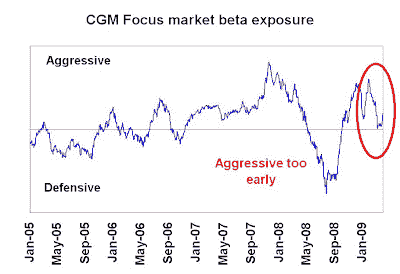
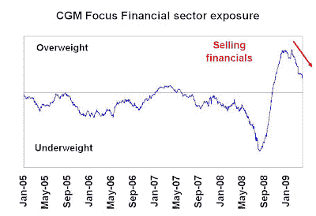

<!--yml
category: 未分类
date: 2024-05-18 00:55:52
-->

# Humble Student of the Markets: Heebner zigs but the market zags

> 来源：[https://humblestudentofthemarkets.blogspot.com/2009/04/heebner-zigs-but-market-zags.html#0001-01-01](https://humblestudentofthemarkets.blogspot.com/2009/04/heebner-zigs-but-market-zags.html#0001-01-01)

Ken Heebner’s

[CGM Focus Fund](http://quicktake.morningstar.com/FundNet/TotalReturns.aspx?Country=USA&Symbol=CGMFX)

has had a superb long term record, but this year Heebner has been struggling. The fund is -13.7% to April 6 YTD, which is 6.9% behind the S&P 500.

**Bullish too early?**

When I reverse engineer Heebner’s macro exposures, it seems that he got bullish too early and is now in the process of reversing course. As an example, the chart below shows his beta exposure to the S&P 500\. He raised his market exposure early and as the market tanked he pulled back, just in time for the bear market rally.

Drilling down to his sector exposures, we can see that he got long the financials a little early and is now selling:

We are also seeing a similar story on cyclical exposure:

Ken Heebner has a bottom-up driven investment process but takes big macro bets as a result of his bottom-up analysis. This style can work well when the economy is showing a trend, but I believe that Heebner tried to call the turning point a little early and got hurt.

**The CTA curse?**

I wrote

[before](http://humblestudentofthemarkets.blogspot.com/2009/03/cta-performance-is-another-sign-of.html)

that trend following CTAs are also struggling as the macro backdrop is trying to find its footing as the economy stabilizes. However, stabilization is not equal an upturn and a bull market revival is not yet in sight. In a nutshell, that may be Heebner’s problem.

In a future post, I will highlight a venerable old fund that is showing signs of revival.