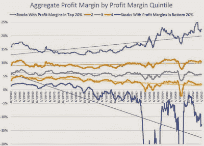

<!--yml
category: 未分类
date: 2024-05-18 03:22:01
-->

# Humble Student of the Markets: Hidden gems in this market cycle's leading theme

> 来源：[https://humblestudentofthemarkets.blogspot.com/2015/05/hidden-gems-in-this-market-cycles.html#0001-01-01](https://humblestudentofthemarkets.blogspot.com/2015/05/hidden-gems-in-this-market-cycles.html#0001-01-01)

[Philosophical Economics](http://www.philosophicaleconomics.com/2015/05/profit-margins-in-a-winner-take-all-economy/)

wrote a terrific post yesterday about how the "Winner take all" economy is affecting companies and the competitive environment. He observed that net margins have been elevated in the last few years. Generally, when margins are high, an industry attracts new entrants who come in and eventually drive down margins. One explanation advanced is that in a "winner take all" economy, there are substantial barriers to entry:

> The possibility that increased barriers to entry represent the primary causal factor behind the observed profit margin increase is supported by the fact that the increase has not been broad-based, as would be expected if it were a simple consequence of weak labor bargaining power, low interest rates, or some other generic factor associated with the corporate cost structure. Rather, it is concentrated in specific [sectors](http://www.philosophicaleconomics.com/2015/01/explosion/)–especially the technology sector–and in specifically dominant individual [large cap, blue-chip names](http://www.millennialinvest.com/blog/2015/1/26/more-on-profit-margins).
> 
> Now, there is a clever way to test the hypothesis, which brings us to the theme of this piece. If a “Winner Take All” economy, where increased barriers to entry–first-mover barriers, network barriers, patent barriers, size barriers, tax-advantage barriers, regulatory barriers, and so on–have allowed an increasingly concentrated group of dominant companies to earn substantially higher profit margins and push up on the aggregate profit margin, is the main driver of the aggregate profit margin increase, then we should expect the following. If we separate the market into different tiers of profitability, we should expect the higher-tier companies to have seen larger increases in their profitability than the lower-tier companies. Increases in their profitability–at the expense of the lower tiers–would represent the “Winner” gradually “Taking All.”

He found an interesting way to test this hypothesis:

> I recently asked my favorite blogger, the brilliant Patrick O’Shaughnessy of O’Shaugnessy Asset Management (Twitter: @millennial_inv, Blog: [http://www.investorfieldguide.com](http://www.investorfieldguide.com/)), to put the hypothesis to the test. So he separated the market into five different bins by profit margin, and then charted the profit margins of each bin from 1963 to 2015\. Lo and behold, the results ended up fitting perfectly with the prediction. The profit margin increase of the last 20 years has not been broad-based, shared by all bins, but rather has been concentrated in the highest profit-margin bins. The dominant companies in those bins have seen their profit margins explode, while the companies in the lower-tier bins have seen little if any increase–and for some bins, an outright reduction.
> 
> The following chart, taken from Patrick’s recent blog post, “[The Rich Get Richer](http://investorfieldguide.com/the-rich-are-getting-richer/)”, beautifully illustrates the point:

> Notice that the profit margins of the various bins moved roughly commensurately up until the late 1980s and early 1990s. At that point, something happened. The profit margins of the top bin proceeded to explode, rising by over 1000 basis points. The profit margins of the next two highest bins stayed roughly flat. And the profit margins of the two lowest bins actually fell–even as their labor and interest costs were supposedly reduced. Overall, the dispersion of profit margins grew dramatically–which is the hallmark sign of a “Winner Take All” economy.

The analysis went on to show that much of the bifurcation in margins occurred in "new economy" sectors like Technology and Financials, but not in commodity-related price-taking sectors like Energy and Materials, or regulated sectors like Utilities.

In the past, I had openly wondered about the effects of Knowledge Based Capital (KBC) on the economy and the operating environment of US companies (see

[How I learned to stop worrying and love the missing CapEx](http://humblestudentofthemarkets.blogspot.com/2015/04/how-i-learned-to-stop-worrying-and-love.html)

). In my post, I postulated that the reason CapEx had not come back strongly during the current recovery was because of the dominant effect of KBC in the economy. The latest post from Philosophical Economics more or less confirms that hypothesis.

It seems that every market cycle has its own leadership theme. The last cycle featured the asset-rich commodity producers, before that, Technology-Media-Telecom (TMT) was the dominant them. This cycle may feature the KBC, or intellectual property, companies.

When we think about companies whose assets are mainly intellectual property, companies like Facebook and Apple normally come to mind. However, there is one hidden gem in the KBC investment theme that many may have missed - that's the biotechnology stocks. As the chart below shows, the biotechs have been in a multi-year relative uptrend against the market.

I have no idea how long this market cycle will last, but should my KBC thesis be correct, then the biotech stocks may have a lot further to run than anyone expects.