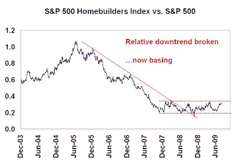

<!--yml
category: 未分类
date: 2024-05-18 00:48:00
-->

# Humble Student of the Markets: Housing bottoming but recovery still uncertain

> 来源：[https://humblestudentofthemarkets.blogspot.com/2009/08/housing-bottoming-but-recovery-still.html#0001-01-01](https://humblestudentofthemarkets.blogspot.com/2009/08/housing-bottoming-but-recovery-still.html#0001-01-01)

Bloomberg recent reported that

[Homebuilders are buying land after years of inventory cuts](http://bloomberg.com/apps/news?pid=20601109&sid=aDMMCMqlof.g)

. Coupled with

[a buoyant new home sales report](http://www.marketwatch.com/story/us-new-home-sales-jump-nearly-10-in-july-2009-08-26)

, some investors have concluded that housing has bottomed and is poised to rebound.

**Wait for the relative breakout**

The chart below shows the S&P 500 Homebuilders Index relative to the S&P 500\. Relative to the S&P 500, the Homebuilding group is currently undergoing a basing process but calls for an upturn may be premature. Technically, the group needs to break out of its relative trading before we can definitely call for a recovery.

My gut feel tells me that sentiment isn’t quite washed out for an upturn. We need a magazine cover style capitulation, or for the popular media to really jump on the story. Here is an example from Britain’s housing bust from the 1980s:

<param name="movie" value="//www.youtube.com/v/azxNL-T3IFQ&amp;hl=en&amp;fs=1&amp;"><param name="allowFullScreen" value="true"><param name="allowscriptaccess" value="always"><embed src="//www.youtube.com/v/azxNL-T3IFQ&amp;hl=en&amp;fs=1&amp;" type="application/x-shockwave-flash" allowscriptaccess="always" allowfullscreen="true">**Bottoms are a process**

This form of relative analysis isn't new. I posted on the bottoming process undergone by the group last

[August](http://humblestudentofthemarkets.blogspot.com/2008/08/time-to-cover-housing-shorts.html)

and again in

[January](http://humblestudentofthemarkets.blogspot.com/2009/01/some-signs-of-spring-for-homebuilders.html)

. I suggest that investors shouldn’t get overly enthusiastic in anticipation of a rebound. We need to watch and wait for the relative breakout before sounding the all-clear.