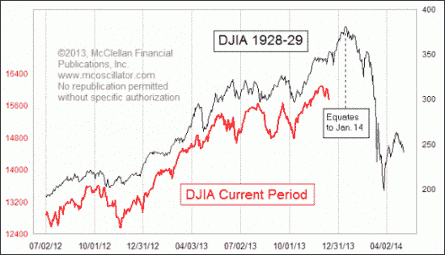

<!--yml
category: 未分类
date: 2024-05-18 03:43:46
-->

# Humble Student of the Markets: How 2014 could be like 1929

> 来源：[https://humblestudentofthemarkets.blogspot.com/2014/02/how-2014-could-be-like-1929.html#0001-01-01](https://humblestudentofthemarkets.blogspot.com/2014/02/how-2014-could-be-like-1929.html#0001-01-01)

There has been a lot written about how the current stock market pattern looks like 1929, especially since

[Mark Hulbert](http://www.marketwatch.com/story/scary-1929-market-chart-gains-traction-2014-02-11)

highlighted it in a columns. Most of the commentary is overly alarmist. One of the most balanced perspectives on the issue comes from Cullen Roche of

[Pragmatic Capitalism](http://pragcap.com/about-that-1929-chart-the-details-matter)

. The most important point here is that McClellan isn't expecting a 1929-style market crash, but a far more muted decline [my emphasis in red]:

> This chart first appeared late last year when [Tom McClellan posted it to his site](http://www.mcoscillator.com/learning_center/weekly_chart/1929_analog/). I post Tom’s material here at Pragcap on occasion and find it to be of consistently high quality. I didn’t post that original piece because I thought some people might misinterpret the 1929 chart and believe that it was fear mongering. That’s exactly what happened. And after a bit of controversy followed the original post Tom [posted a follow-up](http://pragcap.com/a-review-of-analogs) which explained the chart in more detail. It was a very useful explanation that cleared up much of the confusion. But the confusion has continued today primarily because some other people have picked up on the chart and used it to imply that we could be on the verge of that 40%+ crash. ***The thing is, Tom never implied this.*** He was simply pointing out that the market pattern was similar. In other words, the chart below very clearly shows that the potential downside risk to the Dow is about the 14,000 level. Therefore, the ***downside risk according to Tom’s analysis is 12.5%. NOT 40%+.***

**Analyzing market analogs**

Let me make my position clear. There is little basis to expect a stock market crash and I place a low level of importance in the usefulness of market analogs. But history does rhyme and I am open to the possibility that the 1929 pattern can repeat itself with a 10-15% downdraft in stock prices. Tom McClellan offered the following caveat about analogs in a 

[follow-up comment](http://www.mcoscillator.com/learning_center/weekly_chart/a_review_of_analogs/)

 [emphasis added]:

> I attracted a lot of attention, and a lot of derision, when I wrote about the resemblance of the current market's price pattern to that which occurred back in 1929\. This week's chart updates that relationship, and we can see that the relationship has not broken correlation yet. ***For as long as the correlation continues, it is interesting and potentially useful. But anyone who endeavors to employ such an analytical tool should understand that all such pattern analog relationships break correlation eventually, so they should always be viewed with skepticism alongside the fascination we have for the pattern correlation and its (potential) message about the future.***

He went on to justify his use of pattern recognition as part of the technical analyst's toolkit.

> Why do price pattern analogs ever work at all? My answer is that human populations tend to fall into similar and repeating patterns of human emotional response, and this gets reflected in repeating patterns of price action. This is the entire basis for classical bar chart pattern analysis. Even though 2 different triangles might look different in some ways, or 2 different head and shoulders structures, the driving psychology behind the formation of such structures is largely the same, and tends to result in similar outcomes.

I would tend to agree with these comments. Technical analysis is a form of behavioral finance and that's why patterns can repeat themselves (see my previous post 

[Technical analysis as behavioral finance](http://humblestudentofthemarkets.blogspot.com/2013/05/technical-analysis-as-behavioral-finance.html)

).

McClellan went on and defended the difference in the magnitude of the decline in the 1929 analog in this way:

> [L]et me offer a case history to illustrate how price magnitude is not really the important factor in governing the way that prices behave, and whether or not an analog is valid. Most modern traders have at least heard of the big crash of 1987, but few remember the little micro-crash of 1994\. The total price damage in 1994, top to bottom, was just 9.9%, and yet the pattern itself strongly resembles what happened in 1987\. The magnitude of the 1987 event was much greater, both in terms of the volatility before the top and the severity of the actual crash. And yet the "dance steps" look an awful lot like what happened in 1994\.

With those caveats in mind, I offer a couple of the most likely catalysts for a mini repeat of the 1929 pattern, albeit of a much reduced magnitude:

*   US growth scare
*   Rising China tail-risk

By monitoring these fundamental triggers, we can determine whether the pattern is continuing or breaking down.

**US growth scare**

At the end of 2013 and the start of 2014, it seemed that the US economy was undergoing a growth acceleration. However, recent economic releases have thrown cold water on that notion as high-frequency releases have generally come in below Street expectations. This chart of the Citigroup US Economic Surprise Index shows how economic momentum has started to roll over, though levels are not catastrophically negative:

The loss of momentum is confirmed by

[Gallup's daily tracking poll](http://www.gallup.com/poll/122840/gallup-daily-economic-indexes.aspx)

of economic confidence and employment. Note the downtick in February in the chart below:

Last week's ugly retail sales number prompted Neil Dutta of Renaissance Macro to question the divergence between retail sales and retail employment (via

[Business Insider](http://www.businessinsider.com/retail-jobs-going-up-sales-going-down-2014-2)

), Which figure gives us the "true" picture of retail? Something has to give here:

**Retail sales vs. Retail employment**

[Business Insider](http://www.businessinsider.com/worrisome-january-internet-sales-drop-2014-2)

also highlighted a second worrying data point about retail sales, which is nonstore retail sales, which are mostly online sales which are not subject to weather effects, fell 0.6% month/month in January. The disappointing data points prompted a number of Street economists and strategists to downgrade their US GDP growth forecast (via

[Zero Hedge](http://www.zerohedge.com/news/2014-02-14/sell-side-starts-its-mass-gdp-downgrades)

):

**EPS estimates are falling**

Could an economic growth scare trigger a 10-15% slide in stock prices? One of the key metrics to watch is the direction in which consensus EPS estimates are being revised. With most of Q4 Earnings Season complete,

[Zacks](http://www.zerohedge.com/news/2014-02-14/sell-side-starts-its-mass-gdp-downgrades)

reports that negative guidance is prompting the Street to lower EPS estimates, which is worrisome for the bulls:

> Guidance has overwhelmingly been negative in recent quarters and the trend has largely remained in place in the Q4 reporting season as well. As a result, estimates for 2014 Q1 and beyond have been coming down as the earnings season has unfolded.

Citi Research reports that negative earnings guidance has skyrocketed while positive guidance has collapsed (via

[Zero Hedge](http://www.zerohedge.com/news/2014-02-16/self-reinforcing-speculation-fragile-instability)

):

[Brian Gilmartin](http://fundamentalis.com/?p=3291)

, who keeps a close eye on earnings estimates, more or less told the same story of falling estimates and expected growth rates [emphasis added]:

> Per Thomson Reuters, the “forward 4-quarter” EPS estimate for the SP 500 **slipped $0.25 this past week to $119.33 versus last week’s $119.58.**
> 
> The p.e ratio on the forward estimate rose to 15.4(x) and the PEG ratio rose a smidge last week to 2.49(x).
> 
> The earnings yield on the SP 500 is 6.49% as of Friday, 2/14/14.
> 
> The growth rate of the forward 4-quarter estimate *fell last week to 6.19% from the prior week’s 6.38%.*
> 
> With about 400 of the SP 500 having reported q4 ’13 financial results, the +9.5% year-over-year growth rate for the index is the best growth rate since late 2011.
> 
> Excluding Financials, the earnings growth rate is closer to 6%. However there is always “something” to be excluded from each quarter’s earnings which reduces the growth rate: in early 2012, some pundits were removing AAPL’s results from the earnings growth rate and looking at the percentage change ex-APPL. (Long AAPL)
> 
> We are keeping an eye on 2014′s full-year SP earnings growth rate, *which currently stands at +9.2%, vs. the +10.8% on Jan 1, ’14.* The only sector to see higher expected earnings growth for full-year 2014, this week vs. Jan 1 ’14 is Telecom, which has seen expected full-year growth expand from +13.5% to +15.9%.

**Just one chart to watch...**

If you want one quick-and-dirty key indicator to watch, I would focus on how cyclical stocks are performing relative to the market. For now, the Morgan Stanley Cyclical Index remains in a relative uptrend against the market - but just barely.

You can get a live update of this chart

[here](http://scharts.co/1bzS4yG)

. If the relative uptrend breaks down, then the risk of a market downturn rises.

**Rising China tail-risk**

The other key risk to stock market stability is the re-emergence of financial tail-risk from China. Just when the problems of a possible default of the "2010 China Credit / Credit Equals Gold #1 Collective Trust Product" was papered over with a backdoor rescue,

[The Standard (HK)](http://www.thestandard.com.hk/news_detail.asp?we_cat=2&art_id=142483&sid=41562037&con_type=1&d_str=20140213&fc=4)

reported last week that two more wealth management products are in serious trouble:

> Two investment products worth nearly 1.3 billion yuan (HK$1.66 billion) that were distributed by China Construction Bank (0939) and Ping An Insurance (2318) are on the verge of default.
> 
> The first - a high-yield product that saw 289 million yuan raised from clients of China Construction Bank - was created by Jilin Province Trust and backed by a loan to coal firm Shanxi Lianmeng Energy...
> 
> The second saw three funds backed by Beijing Roll- in Investment Management fail to repay investors after maturity. Capital plus interest on the product has reached one billion yuan, 21cbh.com reported.

More alarming is a

[Quartz report](http://qz.com/176968/get-ready-a-large-portion-of-chinas-1-8-trillion-in-trust-products-may-be-headed-for-default-this-year/)

which indicates that a large portion of China's $1.8 trillion trust products may be headed for default this year:

> [E]pisodes like Credit Equals Gold and Opulent Blessing Project are just the beginning, says Mike Werner, senior analyst at Bernstein Research, in a note today.
> 
> One reason is that more than 43% of the 10.9 trillion yuan ($1.8 trillion) worth of outstanding trust products come due in 2014\. (Trust companies manage client investments through such products, providing an alternative credit source for companies that can’t convince commercial banks to lend to them.)

> Werner argues that rising interest rates on the interbank market reflect the Chinese government’s crackdown on shadow (a.k.a. off-balance-sheet) credit and have already taken their toll on the trust industry. While assets managed by China’s trust firms are up 46% from the end of 2012, that growth is less than the 73% year-on-year growth in Q2 2013\. Rising rates will make it hard for bankrupt companies to find the cash to pay back investors, he says.

Many of these trust and wealth management products were issued or marketed by state-owned banks and carried implicit guarantees by these same state-owned banks. The key issues are whether the government will allow defaults to occur and, if so, whether to rescue them through the backdoor (see my previous posts 

[How resilient is China?](http://humblestudentofthemarkets.blogspot.com/2014/01/how-resilient-is-china.html)

 and

[Chinese inequality and the growth imperative](http://humblestudentofthemarkets.blogspot.com/2014/02/chinese-inequality-and-growth-imperative.html)

).

Stresses are starting to show up in my so-called "Chinese canaries", which are mainland banks listed in HK. While readings are not at the panic levels seen during the heights of the 2011 eurozone crisis, risk levels do appear to be elevated.

As with the possible US growth scare trigger, there is one easily accessible key chart to watch. Focus on how

[dim sum bonds](http://www.investopedia.com/terms/d/dim-sum-bond.asp)

(DSUM), which are yuan denominated bonds issued in HK, are performing against US Treasuries (IEF). This ETF pair is currently testing its relative uptrend, just as the CYC vs. SPX relative chart above:

You can get a live update of this chart 

[here](http://stockcharts.com/h-sc/ui?s=DSUM:IEF&p=D&yr=2&mn=0&dy=0&id=p57639486933)

 to monitor the risk of rising Chinese financial turmoil, which could cause trouble for global financial markets.

**How to play along at home**

In conclusion, I do not believe that we are on the verge of a 1929 style market meltdown. However, market patterns can repeat themselves and we could see a 10-15% hiccup in stock prices in the near term.

I have outlined two likely causes of such a downdraft, namely a US growth scare and rising Chinese tail-risk. For now, the charts show that the markets remain on the precipice on these two key triggers. For readers who want to play along at home, just watch these two charts (

[CYC vs SPX](http://scharts.co/1bzS4yG)

 and 

[DSUM vs IEF](http://stockcharts.com/h-sc/ui?s=DSUM:IEF&p=D&yr=2&mn=0&dy=0&id=p57639486933)

) to see if the pattern could repeat itself.

As things stand now, the bears shouldn't get overly excited about the prospect of a steep drop-off in stock prices. Unless the two key indicators decisively break their relative uptrends in an unambiguous fashion, I am inclined to give the bull case the benefit of the doubt.

*Cam Hui is a portfolio manager at [Qwest Investment Fund Management Ltd.](http://www.qwestfunds.com/) (“Qwest”). The opinions and any recommendations expressed in the blog are those of the author and do not reflect the opinions and recommendations of Qwest. Qwest reviews Mr. Hui’s blog to ensure it is connected with Mr. Hui’s obligation to deal fairly, honestly and in good faith with the blog’s readers.”**None of the information or opinions expressed in this blog constitutes a solicitation for the purchase or sale of any security or other instrument. Nothing in this blog constitutes investment advice and any recommendations that may be contained herein have not been based upon a consideration of the investment objectives, financial situation or particular needs of any specific recipient. Any purchase or sale activity in any securities or other instrument should be based upon your own analysis and conclusions. Past performance is not indicative of future results. Either Qwest or I may hold or control long or short positions in the securities or instruments mentioned.*