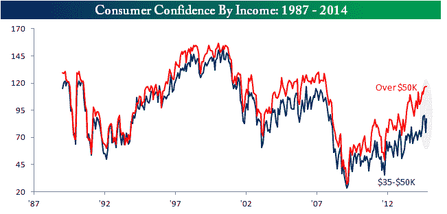

<!--yml
category: 未分类
date: 2024-05-18 03:30:27
-->

# Humble Student of the Markets: How France is better than America

> 来源：[https://humblestudentofthemarkets.blogspot.com/2014/10/how-france-is-better-than-america.html#0001-01-01](https://humblestudentofthemarkets.blogspot.com/2014/10/how-france-is-better-than-america.html#0001-01-01)

If you asked the typical American if they would rather be French, the answer would likely be one of horror. Conventional wisdom indicates that France is now becoming the

[new sick man of Europe](http://www.businessinsider.com/afp-france-faces-eu-budget-showdown-2014-10)

, while the US leads the developed economies in medium term outlook. On the other hand, the life of a typical American citizen is worse compared to the typical French citizen.

Let`s go to the numbers.

**A bifurcated US recovery**

The economic recovery in the US has been highly bifurcated. Consider, for example, the consumer confidence figures released on Tuesday, which blew past expectations with a reading of 94.5 vs. an expected 87.0\.

[Bespoke](http://www.bespokeinvest.com/thinkbig/2014/10/28/confidence-inequality.html)

broke down consumer confidence for consumers earning above $50K and between 35-50K:

> The chart below compares Consumer Confidence for US consumers based on income with the red line showing confidence for consumers with annual incomes greater than $50K and the blue line showing confidence levels for consumers with incomes between $35K and $50K. While the two consistently tracked each other relatively closely, in the current recovery the confidence gap has been steadily widening. We have highlighted this trend numerous times over the years, but as the recovery has progressed, the gap has only widened.

> The final chart shows the spread in confidence levels using a six-month rolling average to smooth out month to month moves. At a current average spread of 30.8, the gap is now less than half a point less than its all-time record high of 31.17 reached in June. One would expect that as we get deeper and deeper into the economic recovery, the rising tide would start to lift all boats, but for lower income Americans the pickup in confidence has been under pressure. Anyone reading the papers in the last several months has read about the widening gap between the rich and poor, and these numbers show how it has impacted confidence.

Indeed,

[CNBC](http://www.cnbc.com/id/102123665)

reports that a recent Harris poll finds Middle America to be highly pessimistic:

> Optimism may be harder to come by these days. More than half of Americans surveyed in a Harris poll released Tuesday identified themselves as being lower-middle class or working class with low economic security. And 75 percent said they're being held back financially by roadblocks like the cost of housing (24 percent), health care (21 percent) and credit-card debt (20 percent).
> 
> And that's not the kicker.
> 
> "The most disappointing aspect is that 45 percent think they'll never get their finances back to where they were before the financial crisis," said Ken Rees, CEO of the Elevate credit service company, which commissioned the survey. "And a third are losing sleep over it."

In short, the typical American is worn out and discouraged.

[Josh Brown](http://thereformedbroker.com/2014/10/30/chart-o-the-day-massive-misinformed-pessimism/)

 recently highlight analysis from Quartz indicating that the typical American thinks that the unemployment rate is 32%:

[Wall Street Cheat Sheet](http://wallstcheatsheet.com/personal-finance/7-things-the-middle-class-cant-afford-anymore.html/)

pointed to seven things that the American middle class can`t afford anymore:

*   Vacations
*   New vehicles
*   Pay off debt
*   Emergency savings
*   Retirement savings
*   Medical care
*   Dentistry

Dire straits indeed!

**The well-off French**

Now consider the situation in France. In conjunction with the ECB's AQR tests for eurozone banks, researchers have also examined the position of European households to financial shocks. The biggest surprise is that the French are in much better shape than the Germans (via

[FT Alphaville](http://ftalphaville.ft.com/2014/10/23/2016772/the-ecb-has-good-news-for-french-households/)

, emphasis added):

> The European Central Bank is set to release the results of its latest stress tests on euro area banks this Sunday. Those more interested in the fragility and resilience of euro area households should focus instead on a new [working paper](http://www.ecb.europa.eu/pub/pdf/scpwps/ecbwp1737.en.pdf) from ECB researchers.
> 
> The economists first looked at income after taxes, debt service, and basic living costs across and within countries. As long as this number is positive, a household is not in distress. Even when it is negative, people with sufficient liquid savings are not considered to be in trouble as long they can hold out for a certain amount of time. And even some households that don’t have enough emergency cash may avoid defaulting on their debts for various reasons.
> 
> After taking all of this into account, the economists modeled default probabilities and losses under several different scenarios combining three distinct sources of stress: a 3 percentage point increase in interest rates, a 20 per cent decline in house prices, or a 5 percentage point increase in the unemployment rate. (The economists take into account cross-country variations in the share of fixed vs floating-rate debts, the generosity of unemployment benefits, and other relevant factors when running their calculations.)
> 
> ***The most interesting finding from this research is that French households are the most financially resilient while German ones are surprisingly fragile***.

This is explained by the greater use of fixed rate mortgages (lower risk) and more liquid savings among the French:

> What explains this? First, relatively few French households have adjustable-rate mortgages, which insulates borrowers from rate hikes. Second, French borrowers have low debt-to-asset (loan-to-value) ratios...
> 
> And finally, the typical French household tends to have more liquid savings than the rest of the euro area.

**American households living on the edge**

The Europeans are universally better off than Americans:

> Of course, almost all Europeans are in better shape on this score [liquid savings] than Americans, [two-thirds of whom](http://ftalphaville.ft.com/2014/08/07/1921822/federal-reserve-finds-us-households-are-unwell/) lack sufficient savings to cover three months of expenses, according to Federal Reserve survey data.

The latest 

[Credit Suisse global wealth study](https://publications.credit-suisse.com/tasks/render/file/index.cfm?fileid=25EC6CF2-0407-67D9-AAEAAE8BDFEDE378)

confirms this observation. While the average American household wealth is slightly higher than the French, they are not all that different. What`s different is the median French adult has 2.6 times the wealth of the median American!

Such a large difference between the average and median indicates that wealth is more concentrated in America compared to France. Indeed, the table shows that there are far fewer poor people in France compared to the US.

**Americans are more driven**

To be sure, American business culture is far more dynamic. Here are the results of a

[Pew Centre Research survey](http://www.pewglobal.org/2014/10/09/emerging-and-developing-economies-much-more-optimistic-than-rich-countries-about-the-future/#education-and-hard-work-seen-as-the-keys-to-moving-up)

that asks residents of different countries the best way to get ahead in life:

> When asked to rate on a scale of 0 to 10 how important a range of characteristics are to getting ahead in life, most global publics say having a good education (global median of 60% rating this “10 – very important”) and working hard (50%) are very important. Knowing the right people (37%), being lucky (33%), coming from a wealthy family (20%), being born a male (17%) and giving bribes (5%) are seen as less essential to doing well.

As the table shows, both the French and Americans believed that "working hard" is the most important quality to getting ahead. Both ranked "having a good education" as second. However, the magnitude of the answers are also telling, as Americans gave "working hard" a rank of 73 compared to 25 for the French. Similarly, the respective ranks for "having a good educating" were 71 and 24.

These figures demonstrate that the American Dream is still alive and Americans are more driven to succeed than the French, though the payoffs indicate otherwise.

Lies, damned lies and statistics - interpret them any way you want. But these numbers indicate that the typical American adult would likely have a much better quality of life as a French citizen.

Just don`t be too rich in France, though. The taxes are horrendous and the growth outlook for investors is awful.