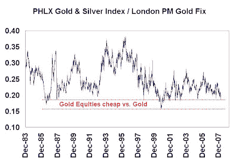
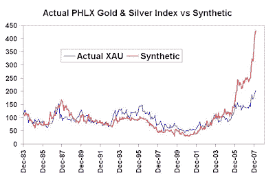

<!--yml
category: 未分类
date: 2024-05-18 01:11:58
-->

# Humble Student of the Markets: How cheap are gold stocks relative to bullion?

> 来源：[https://humblestudentofthemarkets.blogspot.com/2008/03/how-cheap-are-gold-stocks-relative-to.html#0001-01-01](https://humblestudentofthemarkets.blogspot.com/2008/03/how-cheap-are-gold-stocks-relative-to.html#0001-01-01)

My recent post entitled

[“A short term warning for US Dollar bears and commodity bulls”](http://humblestudentofthemarkets.blogspot.com/2008/03/short-term-warning-for-us-dollar-bears.html)

must have struck a nerve. I received a torrent of responses regarding gold, gold stocks and how the US economy was going down the tank.

In response, I analyzed the question of the relative value of gold stocks compared to gold bullion. The above chart shows the ratio of the PHLX Gold & Silver Index (XAU), which has a longer history than the popular Amex Gold Bugs Index (HUI), to gold bullion. Since the line is near the bottom of its historical range, it suggests that gold stocks are a bargain compared to gold.

**A synthetic gold stock tells a different story: Rising production costs**
Back in 2006 I wrote a research report (*How to Watch for Signs that the Gold Correction is Ending, 15 March 2006;* if you are interested in the full details email me and I will send it to you) detailing how to make a synthetic gold stock.

Conceptually a mine can be thought of as a series of call options on the underlying commodity, with the exercise price as the cost of production. If the commodity price falls below the cost of production, the mine operator has the option to either close or mothball the mine until prices improve. I created a synthetic gold stock by building a model based on these principles. Key features of the model are:

*   A series of eight deep-in-the-money call options on the price of gold, with terms of 1, 2, 3 … 8 years, which models a mine with an eight year life, a common estimate of long-lived gold mines;
*   An exercise price equal to cash production cost of $250, rising each year by the current inflation rate. ($250 appeared to be a common estimate of cash costs for existing gold stocks in 2006);
*   Equal amount of gold mined each year; and
*   The position is rolled forward once a year at a cost of 1.5%.

Of course, there are some important differences between the synthetic gold stock and the actual gold stocks themselves:

*   Gold miners have exploration upside and operational risk, which the synthetic gold stock does not;
*   Gold mining companies may hedge the gold price with forward sales and other derivatives;
*   Actual gold mines can somewhat manage the cost of production by high-grading when gold prices are low and mining a lower grade of ore when prices are high. The synthetic gold stock’s assumed cost is inflexible.

 **Production costs are rising** The synthetic tracked the actual index reasonably well until 2006 (which was, of course, the out of sample period) when the synthetic began vastly outperforming the actual index. Delving further into the model, I found that the price divergence was explained by rising production costs of shown by the actual gold miners. Recent [analysis](http://www.caseyresearch.com/displayArticle.php?id=1899) by David Galland of Casey Research confirms this trend of rising costs at major producers Barrick and Newmont.

****So what’s the answer? Are gold stocks cheap or not?**
Gold miners are experiencing higher costs than historical experience, which deflates the case that gold stocks are cheap compared to bullion because their margins are lower. However, higher costs can be explained either by companies mining a lower grade of ore in the current high price environment in order to preserve their reserves and asset value (which is bullish), or costs escalating out of control and squeezing bottom lines (which is bearish).

The truth probably lies somewhere in between the two explanations. Given the recent experience of [NovaGold](http://www.novagold.com/section.asp?pageid=5414) at Galore Creek, I would lean towards the latter as a more likely explanation of higher costs.**

****Here is a stupid question:** rather than agonizing which is the correct explanation for rising production costs, why not just buy the synthetic? That way an investor can customize and control his desired risk profile and exposure to gold.**

**(Warning for individual investors - don't try this at home. The synthetic is a highly sophisticated instrument that even professionals can get wrong if implemented incorrectly.)**