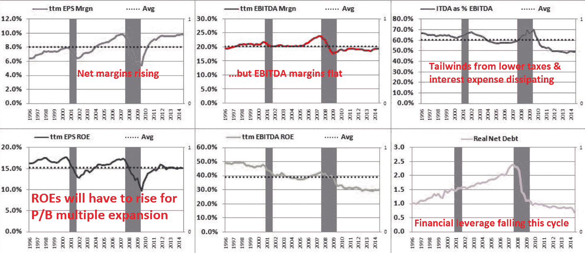

<!--yml
category: 未分类
date: 2024-05-18 03:28:52
-->

# Humble Student of the Markets: How cheap are stocks? (growth investor edition)

> 来源：[https://humblestudentofthemarkets.blogspot.com/2014/11/how-cheap-are-stocks-growth-investor.html#0001-01-01](https://humblestudentofthemarkets.blogspot.com/2014/11/how-cheap-are-stocks-growth-investor.html#0001-01-01)

It's that time of year again, when Wall Street strategists and other pundits give their forecasts for 2015\. This is not an unusual year in that we have seen some bullish, bearish and middle-of-the-road forecasts for the stock market. For me, it leaves the perennial question unanswered, "How cheap are stocks?"

On one hand, you have the likes of Henry Blodgett of

[Business Insider](http://www.businessinsider.com.au/stocks-are-expensive-2014-11)

, who points to the Shiller CAPE and say that the market is overvalued. Though he is not selling his equity positions, Blodgett says that the degree of over-valuation suggests that investors should lower their long-term expectations for equity returns.

On the other hand, you have the likes of former bear David Rosenberg who believe that US equities are fairly valued to cheap when compared to other asset classes like 10-year Treasuries and cash (see interview

[here](http://www.bnn.ca/Video/player.aspx?vid=499381)

).

Who is right? What's the real story?

**A value investor`s perspective**

Rather than get into a debate about the validity of the Shiller CAPE ratio, one way of getting some perspective is to simply consider the EPS and EBITDA multiples of the SPX (via the excellent work done at 

[Philosophical Economics](http://www.philosophicaleconomics.com/2014/11/valuation-from-all-angles-sp-500-russell-2000-and-the-10-gics-sectors/)

). From those perspectives, US equities don't look very expensive at all:

Here is the P/B ratio, the conclusion is the same:

It could be argued, however, that the time horizon for these valuation multiples were too short as the above charts only goes back to the mid-1990's. Here is a very long term chart of the SPX P/E ratio. A very different conclusion can be drawn from this chart: Stock prices appear to be elevated on a P/E basis on a 100-year+ time horizon:

One problem with the P/E ratio is the "E" in the P/E can be noisy as earnings will fluctuate depending on the cyclical effects of the economic cycle. One alternative way to address some of the cyclical noise is to study the P/B ratio, because book value tends to be a more stable figure. While this chart is also a little dated and not directly comparable because it shows the Dow`s P/B ratio (and the current ratio is slightly higher at 3.1), the conclusion is roughly the same as the long-term P/E analysis. Current stock market valuations are above average, though they cannot be characterized as crazy nosebleed levels.

**A growth investor's viewpoint**

The aforementioned valuation metrics suggest that US equities are overvalued, but a growth investor would scoff at the discussion and asks, "Forget valuations, does the market have earnings visibility?" In the short run, valuations do not matter very much for growth investors, but it is earnings momentum that matters to growth investors. Indeed, as this chart from

[Factset](http://www.factset.com/websitefiles/PDFs/earningsinsight/earningsinsight_11.21.14)

shows, the SPX has been highly correlated with consensus forward 12 month EPS estimates.

Instead of focusing on pure earnings momentum of the growth-at-any-price approach, I prefer the a growth-at-a-reasonable-price (GARP) framework of, "How much am I willing to pay for a certain level of growth?"

To answer that question, we turn to the PB-ROE model, where:

> P/E = P/B X ROE

If we were to decompose the elements of ROE and analyzing their past trends and future projections, we have a better understanding whether the market P/B multiple is likely to rise or fall. Here, we turn to the Dupont formula, where:

> ROE = (net income / sales) * (sales / assets) * (assets / equity)
>          = Net margins * Asset turnover * Financial leverage

Thus, the three elements of the Dupont formula are:

1.  **Net margin**, which is a function of operating margin, tax rate and interest expense;
2.  **Asset turnover**; and
3.  **Financial leverage.**

The analysis at 

[Philosophical Economics](http://www.philosophicaleconomics.com/2014/11/valuation-from-all-angles-sp-500-russell-2000-and-the-10-gics-sectors/)

 showed many of Dupont formula components of ROE for the SP 500 for the last 20 years: First. we start our analysis by focusing on the ROE chart on the bottom left hand corner, where ROE has moved up and down with past cycles. Nevertheless, ROE will have to rise in order to see P/B multiple expansion. The question then becomes, how possible is that in the near future?

Now consider the Dupont formula components of ROE. The top left chart shows the net margin history of the SP 500\. As the chart shows, net margins have been rising since 1996, though with cyclical hiccups. The top middle chart, however, shows a history of the operating, or EBITDA. margin. It indicates that EBITDA margins have been largely flat over this period. As I have pointed out before on this blog, the rise in net margins has largely been attributable to lower interest expense and lower effective tax rates. The top right chart shows ITDA, which is a measure of interest expense and tax retention rates, as a percentage of EBITDA for the last 20 years and it indicates that the tailwind from these factors have been steadily dissipating.

If we were to assume that the US is roughly in the mid-cycle of its economic expansion and, based on that assumption, EBITDA margins could rise for cyclical reasons over the next year as they have in the past at similar points of the cycle. However, that positive cyclical effects could be offset by the negative effects of rising interest rate and net tax rates. If I were to project the likely growth outlook for net margins for the next year, I would rank it as roughly neutral.

Another Dupont formula component of ROE is financial leverage. As the bottom right hand chart shows, financial leverage has been steadily falling this expansion cycle. Rank the growth outlook for financial leverage as neutral to negative.

The analysis from Philosophical Economics does not directly show history of the third component of the Dupont formula, but we can more or less back out the direction of change from the other two components. When I eyeball the progress in ROE (bottom left chart) and compare it to net margins (top left) and financial leverage (bottom right), I deduce that asset turnover has been roughly flat to down this expansion cycle.

Flat to falling asset turnover is not surprising, given the dismal record of capital expenditures during this recovery. This analysis is suggests that the world is suffering from a lack of demand, which is restraining the level of CapEx among companies, though the results are not necessarily conclusive.

Unfortunately, the stated level of CapEx may actually be exaggerated. Analysis from Francisco Blanch of BoAML shows that most of the CapEx seen this cycle has come from energy sector. Given the recent fall in oil prices, the outlook for CapEx acceleration is bleak (via

[Business Insider](http://www.businessinsider.com/most-important-charts-in-the-world-q4-2014-10?op=1)

).

**Large vs. small cap valuation**

The mediocre outlook for the major components of ROE suggests that large cap stocks are no bargains for growth investors. Another way of thinking about the SP 500 is to look at the profitability and valuation metrics of the small cap Russell 2000.

This analysis from

[Principal Global](http://www.principalglobal.com/us/download.aspx?id=105519)

shows that the P/B ratio for the large cap Russell 1000 and Russell 2000 have tracked each other relatively closely, except for the Tech Bubble of the late 1990`s. Viewed in that context, P/B ratio of the Russell 2000 is elevated and it is near the cycle peaks of the last bull market. However, the market remained at those P/B valuation levels for about three years before the bear market began in 2007\. I conclude that while these valuation levels might be cause for concern, this level of P/B ratio for small caps does not represent a sell signal. even if we were to use the Russell 2000 P/B as a large cap valuation proxy.

Here is the chart showing the relative performance of the Russell 1000 relative to the Russell 2000 showing the huge outperformance of the large caps during the Tech Bubble which prompted the divergence in P/B valuation shown in the above chart.

Given the P/E and P/S ratios of the markets, 

[Principal Global](http://www.principalglobal.com/us/download.aspx?id=105519)

 also backed out the implied net margins of large and small cap stocks. This chart shows the outlook to be neutral to slightly negative. The implied net margin for large caps have been rising, but net margins for small caps have started to roll over. Given the earnings headwinds posed by a strong USD to large cap multi-national companies, large cap net margins are more likely to follow the path of small cap margins than the other way around.

**Don't panic, stocks won't crash**

In conclusion, US equities look expensive from both a value and growth investor`s perspective. Valuation multiples appear elevated historically based on a P/B and P/E basis. From a growth perspective, it`s hard to see how much earnings visibility and momentum the stock market can show on an aggregate basis in the absence of a positive surprise.

On the other hand, these market levels are no cause for panic. Sure, stocks prices are elevated, but they are not at danger levels that a crash is imminent.