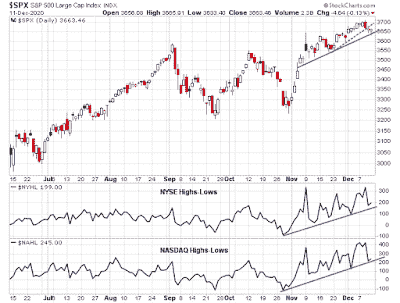

<!--yml
category: 未分类
date: 2024-05-18 02:07:38
-->

# Humble Student of the Markets: How far can stocks pull back?

> 来源：[https://humblestudentofthemarkets.blogspot.com/2020/12/how-far-can-stocks-pull-back.html#0001-01-01](https://humblestudentofthemarkets.blogspot.com/2020/12/how-far-can-stocks-pull-back.html#0001-01-01)

**Preface: Explaining our market timing models**

We maintain several market timing models, each with differing time horizons. The "

**Ultimate Market Timing Model**

" is a long-term market timing model based on the research outlined in our post,

[Building the ultimate market timing model](https://humblestudentofthemarkets.com/2016/01/26/building-the-ultimate-market-timing-model/)

. This model tends to generate only a handful of signals each decade.

The

**Trend Asset Allocation Model**

is an asset allocation model which applies trend following principles based on the inputs of global stock and commodity price. This model has a shorter time horizon and tends to turn over about 4-6 times a year. In essence, it seeks to answer the question, "Is the trend in the global economy expansion (bullish) or contraction (bearish)?"

My inner trader uses a

**trading model**

, which is a blend of price momentum (is the Trend Model becoming more bullish, or bearish?) and overbought/oversold extremes (don't buy if the trend is overbought, and vice versa). Subscribers receive real-time alerts of model changes, and a hypothetical trading record of the email alerts are updated weekly

[here](https://humblestudentofthemarkets.com/trading-track-record/)

. The hypothetical trading record of the trading model of the real-time alerts that began in March 2016 is shown below.

The latest signals of each model are as follows:

*   Ultimate market timing model: Buy equities*
*   Trend Model signal: Bullish*
*   Trading model: Bullish*

** The performance chart and model readings have been delayed by a week out of respect to our paying subscribers.* **Update schedule**

: I generally update model readings on my 

[site](https://humblestudentofthemarkets.com/)

 on weekends and tweet mid-week observations at @humblestudent. Subscribers receive real-time alerts of trading model changes, and a hypothetical trading record of those email alerts is shown

[here](https://humblestudentofthemarkets.com/trading-track-record/)

.

Subscribers can access the latest signal in real-time 

[here](https://humblestudentofthemarkets.com/my-inner-trader/)

.

**The ketchup effect**

The bulls suffered a setback when the S&P 500 violated a minor rising uptrend (dotted line), though secondary uptrend support (solid line) is holding at 3640\. Before anyone panics, the uptrends in the S&P 500 and breadth indicators are intact. In all likelihood, the market is just undergoing a period of consolidation since the start of December.

The Swedes call it *ketchupeffekt*, or the ketchup effect. It's what happens when you try to pour ketchup on food. Nothing happens for a long time, then it all happens at once. The market weakness of last week is a display of *ketchupeffekt*. Suddenly, all the bad news is happening at once. If this is indeed the start of a pullback, how bad can it get?

Let's explore the downside scenarios.

The full post can be found

[here](https://humblestudentofthemarkets.com/2020/12/13/how-far-can-stocks-pull-back/)

.