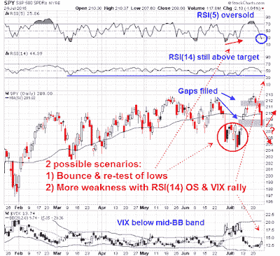

<!--yml
category: 未分类
date: 2024-05-18 03:18:06
-->

# Humble Student of the Markets: How the USD explains and predicts stock prices

> 来源：[https://humblestudentofthemarkets.blogspot.com/2015/07/how-usd-explains-and-predicts-stock.html#0001-01-01](https://humblestudentofthemarkets.blogspot.com/2015/07/how-usd-explains-and-predicts-stock.html#0001-01-01)

**Trend Model signal summary**

Trend Model signal: Neutral

Trading model: Bullish (upgrade)

The Trend Model is an asset allocation model which applies trend following principles based on the inputs of global stock and commodity price. In essence, it seeks to answer the question, "Is the trend in the global economy expansion (bullish) or contraction (bearish)?"

My inner trader uses the trading model component of the Trend Model seeks to answer the question, "Is the trend getting better (bullish) or worse (bearish)?" The history of actual out-of-sample (not backtested) signals of the trading model are shown by the arrows in the chart below. In addition, I have a trading account which uses the signals of the Trend Model. The last report card of that account can be found

[here](http://humblestudentofthemarkets.blogspot.com/2015/07/june-trend-model-report-card-back-on.html)

.

**Trend Model signal history**

**Update schedule**

: I generally update Trend Model readings on

[my blog](http://humblestudentofthemarkets.blogspot.com/)

on weekends and tweet any changes during the week at @humblestudent.

**Choppy until September**

I've been thinking a lot about how US Dollar strength has affected the markets. 

[New Deal democrat](http://community.xe.com/blog/xe-market-analysis/strong-us-and-shallow-industrial-recession)

wrote an intriguing post last week indicating that the strength of the USD explains the combination of a weak industrial recession and a robust consumer. If we were to accept that currency-based explanation of the US economy and markets, then USD strength is in effect doing some of the Fed's job of tightening. At about the same time,  

[Jim Paulsen](http://ig.cdn.responsys.net/i4/responsysimages/str2/__RS_CP__/20150721_EMP2.pdf)

of Wells Capital Management expressed some concern that the financial markets may be in for a rude awakening when the Fed finally raises rates.

In the meantime, Trend Model readings have improved from "risk-off" to "neutral", largely on the back of a better eurozone growth outlook and the reduction of Greek tail-risk. When I put it all together, it suggests that US equity markets are likely to chop around in a range-bound pattern for a little longer until the Fed finally starts to raise rates, which will probably be in September. That could be the signal for the negative breadth divergences to resolve themselves into a long awaited correction.

***However, I would view the current bullish trading signal purely as a tactical call and in the context of the formation of an intermediate term top ***

(see my previous post 

[Why I am bearish (and what would change my mind)](http://humblestudentofthemarkets.blogspot.com/2015/05/why-i-am-bearish-and-what-would-change.html)

).

**The USD theory of everything**

Last week, 

[New Deal democrat](http://community.xe.com/blog/xe-market-analysis/strong-us-and-shallow-industrial-recession)

 highlighted a fascinating

[New York Fed study](http://libertystreeteconomics.newyorkfed.org/2015/07/the-effect-of-the-strong-dollar-on-us-growth.html)

of the effects of USD appreciation. In that study, they modeled the GDP growth effects of a 10% appreciation in the USD.

Here is 

[New Deal democrat](http://community.xe.com/blog/xe-market-analysis/strong-us-and-shallow-industrial-recession)

:

> Of course, appreciation of the US$ doesn't happen in isolation, but the effect is significant enough that it can tip an otherwise soft economy into recession.
> 
> As the below graph shows, the recent appreciation of the US$ was about 12% against all trading partners, and it took place over 3 quarters rather than one (red, left scale), but the decline in industrial production that began last November (blue, right scale) is in accord with the NY Fed's analysis:

These effects are consistent with the shallow industrial recession that he has been observing, whose negative effects have been offset by a strong consumer.

> So why hasn't the US tipped into recession? Because, in part due to a steep decline in gas prices, consumer spending, which is 70% of the US economy, has powered right along:

Market action has certainly been consistent with this hypothesis. A glance at the market leadership show that cyclical stocks have been lagging the market, which is reflective of a shallow industrial recession. The chart below depicts the market relative performance of cyclically sensitive industrial, semiconductor and resource stocks relative to SPX, as well as the relative performance of the DJ Transports to the DJ Industrials. All of these groups are underperforming.

By contrast, the market leaders have been Consumer Discretionary stocks, high-beta glamour stocks (which I warned about last week as being extended, see

[A warning for growth investors](http://humblestudentofthemarkets.blogspot.com/2015/07/a-warning-for-growth-investors.html)

) and financials. Consumer Discretionary outperformance is no surprise under the circumstances. High-beta leadership is a little worrisome, especially in light of its narrow breadth. The outperformance of financials appear to be related to the expectation of better margins from higher interest rates. The chart below shows the relative performance of the financial sector, which are mainly large banks, and the relative performance of broker-dealer stocks. If the bulls were truly in charge of the tape, then we would see the leadership of financial stocks accompanied by its high-beta group, the broker-dealers. In this case, the broker-dealers have not participated in the relative rally in the last couple of months and they have performed in-line with the market in that period instead.

One important point of the

[New York Fed study](http://libertystreeteconomics.newyorkfed.org/2015/07/the-effect-of-the-strong-dollar-on-us-growth.html)

 is that it demonstrated the contractionary effects of a rising exchange rate through the trade channel. American consumers and importers share the benefits of cheaper imports when the USD rises:

> A stronger dollar makes U.S. imports relatively cheaper than domestically produced goods, which pushes consumers to substitute towards imported goods and provides firms with relatively cheaper inputs from abroad. Though both consumers and importing firms benefit from lower import prices, the data show that the extent of the benefit is limited because exchange rate movements are not fully passed through into prices seen by U.S. buyers. We estimate that a 10 percent rise in the dollar results in a 3.8 percent decline in nonoil import prices. Instead of adjusting prices charged to U.S. consumers by the full exchange rate change, firms exporting to the United States adjust their profit margins. Because import prices do not adjust by the full extent of the appreciation, the increase in demand for import quantities in response to the appreciation is moderated. The New York Fed trade model suggests a 10 percent appreciation of the U.S. dollar in one quarter (which then persists) results in 0.9 percent increase in real import values, as shown in the table below.

On the other hand, exporters get hurt because their margins get squeezed:

> On the export side, a stronger dollar makes the price of U.S. exports more expensive when converted into foreign currency terms, reducing U.S. export growth. In order to try to maintain competitiveness, U.S. firms adjust their markups rather than pass on the full exchange rate appreciation into foreign prices. That is, U.S. exporters take a hit on their profit margins in order to maintain market shares. The New York Fed trade model suggests that a 10 percent appreciation of the U.S. dollar is associated with a 2.6 percent drop in real export values over the year. Consequently, the net export contribution to GDP growth over the year is 0.5 percentage point lower than it would have been without the appreciation and a cumulative 0.7 percentage point lower after two years.

In other words, a rising USD has a similar effect as raising interest rates. The strengthening exchange rate has, in effect, done some of the Fed`s tightening work for it. If it were to raise interest rates this year, the US economy would suffer the double whammy from the effects of rising currency and rates. Moreover, the divergent path taken by the Federal Reserve compared to the other major central banks of the world would put further upward pressure on the US Dollar.

**Markets vulnerable to rising rates** [Jim Paulsen](http://ig.cdn.responsys.net/i4/responsysimages/str2/__RS_CP__/20150721_EMP2.pdf)

 of Wells Capital Management expressed concerns that, unlike previous episodes when the Fed raised rates, the markets may be caught off-guard this time.

> Several aspects surrounding today’s stock market make it appear abnormally vulnerable as the Fed begins the process of finally raising interest rates. First, the current price/earnings (P/E) multiple is among the highest of any Fed initiation cycle. Second, investor sentiment is probably a bit too calm since the stock market has not experienced a correction for more than 900 trading days, the third longest in post-war history. Third, the Fed begins this tightening cycle from the lowest unemployment rate of any post-war recovery. Finally, tightening begins when corporate profit margins are near historic highs and while earnings growth is already well past its best growth rates of the recovery.
> 
> Perhaps the stock market will be little affected by the Fed finally lifting interest rates from zero. However, these notable vulnerabilities suggest at least some period of stock market turbulence as the Fed begins to normalize monetary policy.

You would think that a September rate hike has been well telegraphed and priced into the markets, but 

[Marc Chandler](http://www.marctomarket.com/2015/07/us-data-is-key-for-dollar.html)

made the following observation:

> Surveys suggest that a little more than 80% of the economists expect the Federal Reserve to hike rates in September. The September Fed funds futures, the most direct market instrument, has only about a 50% chance discounted.

In addition, there have been numerous warnings about the possible emerging market contagion effects from rising US rates. The IMF fretted about this issue in a publication, 

[Spillovers from Dollar Appreciation](http://www.imf.org/external/pubs/ft/pdp/2015/pdp1502.pdf)

 (emphasis added):

> The recent strong and sustained appreciation of the U.S. dollar (USD) raises questions about possible financial spillovers to emerging markets (EMs). The global economy is steering away from the Great Recession, but the recovery is still uneven, with marked divergences in the pace of growth among major economies. Specifically, the U.S. economy has gathered strength, suggesting a normalization of Federal Reserve monetary policy in the next few months. In contrast, growth in the euro area and Japan is still subdued, and their monetary policies are easing further. Reflecting these divergences in the outlook and expected monetary policies, the USD has appreciated considerably against most major currencies, especially the euro and the yen, over the past year. The USD has also strengthened vis-à-vis most emerging market currencies, particularly those of commodity-exporting economies. ***Historically, periods of sharp USD appreciation have been associated with an increased number of external crises in emerging markets—hence a key concern relates to possible spillovers from a sustained period of USD appreciation on the financial stability of EMs, specifically through effects on global capital flows, exchange rates, and EMs’ balance-sheet exposures.***

The most glaring problem is the USD carry trade that will have to be unwound. In my previous post

[The key tail-risk that the FOMC missed (and you should pay attention to)](http://humblestudentofthemarkets.blogspot.com/2015/02/the-key-tail-risk-that-fomc-missed-and.html)

, I had highlighted a

[Bloomberg](http://www.bloomberg.com/news/articles/2015-02-13/-9-trillion-question-is-how-tighter-fed-will-impact-world)

report indicating that there was about $9 trillion in offshore USD loans sloshing around the global financial system (emphasis added):

> When Group of 20 finance ministers this week urged the Federal Reserve to “minimize negative spillovers” from potential interest-rate increases, they omitted a key figure: $9 trillion.
> 
> That’s the amount owed in dollars by non-bank borrowers outside the U.S., up 50 percent since the financial crisis, according to the Bank for International Settlements. Should the Fed raise interest rates as anticipated this year for the first time since 2006, higher borrowing costs for companies and governments, along with a stronger greenback, may add risks to an already-weak global recovery.
> 
> ***The dollar debt is just one example of how the Fed’s tightening would ripple through the world economy. From the housing markets in Canada and Hong Kong to capital flows into and out of China and Turkey, the question isn’t whether there will be spillovers -- it’s how big they will be, and where they will hit the hardest.***

[FT Alphaville](http://ftalphaville.ft.com/2015/02/05/2114071/about-that-9-trillion-global-non-bank-credit-exposure/)

 pointed out that these loans are offshore loans are beyond the control of  the Federal Reserve;

> But we’re now at a point where, unless all those external debtors have an organic way to keep dollars flowing into their coffers — i.e. without dependence on financing from non-US dollar pool sources — the value of all those loans, as well as the external US dollar pool itself, could quite abruptly and violent collapse in value.

To summarize the case for how the USD drives markets. The strength in the USD has had a negative effect on US growth (NY Fed) The markets may not be fully prepared for when the Fed actually raises rates because of high valuation, excessive investor complacency and the fact that the Fed may be behind the curve (Paulsen) . In addition, there is a vast USD 9 trillion in offshore USD loans to EM credits that create a high degree of vulnerability with unknown contagion effects (IMF and others).

**A Trend Model score upgrade**

Despite all these potential negatives, the Trend Model has improved from a "risk-off" reading to "neutral", largely because of an improving Europe. As the chart of the STOXX 600 shows, European stocks rallied on the news of a resolution of the Greek impasse and the index remains above both the 50 and 200 dma. These signs of market strength shifted the composite model from negative to neutral.

From a macro viewpoint, the growth outlook in Europe is improving.

[Callum Thomas](https://twitter.com/Callum_Thomas/status/623585771228794880/photo/1)

pointed out that the recent ECB bank loan survey is suggestive that the eurozone may grow as fast as 3-4%, which is an astounding rate for the region.

[Thomas](https://twitter.com/Callum_Thomas/status/623409635202981888/photo/1)

also highlighted that of all the different regions, Europe stands out the most in forecast 2016 EPS growth:

The Trend Model signal has also been aided by stability and slight improvements in the US outlook. The latest update from

[John Butters](http://www.factset.com/websitefiles/PDFs/earningsinsight/earningsinsight_7.24.15)

of Factset indicates that this earnings season is turning out to be a fairly typical one. With 37% of the SPX components reporting, the earnings beat rate is slightly above average and the revenue beat rate is slightly below average.

The most important metric is the evolution of the forward 12 month EPS estimates, which is rising again after experiencing a minor hiccup last week. As the 10-year history of the chart shows, stock prices are highly correlated with forward EPS (annotations are mine).

The combination of an improving Trend Model reading, which translate into a trading buy signal, and possible tail-risk from Fed tightening suggests a scenario where US equities are likely to be choppy and range-bound until the likely September FOMC interest rate liftoff meeting.

I would caution, however, that the bullish view is only a trading and not an investment call, I continue to believe that US equities are forming an intermediate term top. 

[Doug Ramsay of Leuthold Group](http://finance.yahoo.com/news/tired--narrow-market-could-be-nearing-a-top--leuthold-s-ramsey-144843740.html)

 is the latest of many to call for a market top because of poor breadth and narrow leadership. The chart below is only one example of the abysmal market breadth which was evident for most of 2015 and accelerated to the downside in the past couple of week.

Under the circumstances, traders should be tactically focused on trading overbought and oversold readings until the intermediate term market direction is resolved.

**The week ahead**

Last week, the trading model flashed a sell signal after a short-lived buy signal (see

[From oversold to overbought to...](http://humblestudentofthemarkets.blogspot.com/2015/07/from-oversold-to-overbought-to.html)

). Little did I expect that stock prices would flip back to an oversold condition after registering overbought readings a week ago.

I

[tweeted](https://twitter.com/HumbleStudent/status/624666111884132352)

 Friday afternoon that I had taken profits and covered all of my short positions. The following two charts from

[IndexIndicators](http://www.indexindicators.com/indicators/breadth/)

 show the market`s technical conditions with varying time frames. Shorter (1-3 day horizon) indicators such as the percentage of stocks above their 10 dma reveal an oversold reading, which suggests that a bounce,

Longer term (5-10 day horizon) indicators such as the net 20-day highs - lows, however, show that readings are barely in oversold territory and stock prices could move lower before seeing a durable bottom.

My inner trader realized some profits last week and he is staying flexible in the week to come. I have two likely scenarios in  mind for the coming week, which are shown by the annotations in the chart below. An assessment of market conditions indicate that 1) trading gaps have been filled; and 2) stocks are sufficiently oversold on RSI(5) that a bounce is highly likely. However, the lack of even a 2015-style mild oversold reading on RSI(14) and the inability of the VIX Index to rally above its 20 dma suggests that there may be some limited downside to this market.

My first and preferred scenario calls for a brief 1-2 day rally, followed by a decline and re-test of the lows set on Friday. The template for this action (remember that history rhymes but doesn't repeat) is the market action in late June and early July, where the market fell to an initial low (as it did on Friday), rallied and weakened again to test the previous low, but saw non-confirmation on momentum indicators such as RSI(5) on the re-test. The second but less likely scenario would see the market continue to fall on Monday to make a durable V-shaped bottom. Both of these scenarios would be followed by a rally to a possible test of the old highs.

The main reason for the choppy outlook because sentiment has deteriorated to a crowded short reading. As an example, the

[CNN Money Fear and Greed Index](http://money.cnn.com/data/fear-and-greed/)

is already at an extreme reading. It would be difficult to envisage a major bearish impulse starting from these levels. I would like to see sentiment improve to at least a neutral reading before a corrective phase could begin in earnest.

My inner investor`s asset allocation remains at policy targets. He continues to hope for a market downdraft so that he can buy stocks at much cheaper prices.

**Disclosure:**

No positions